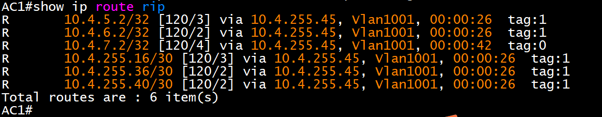
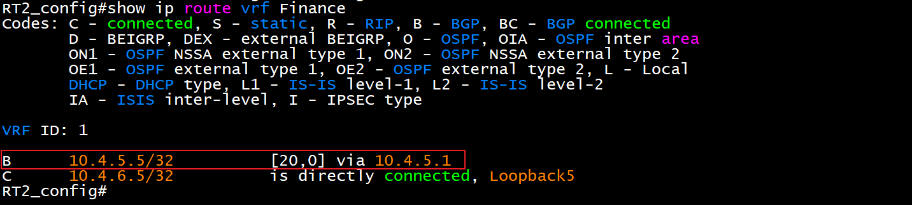

# 三、路由调试

## 1小题
1.配置所有设备主机名，名称见“网络拓扑”。启用所有设备的 ssh 服 务，用户名和明文密码均为 admin；配置所有设备 ssh 连接超时为 9 分钟，console 连接超时为 30 分钟。

```plain
路由器RT1/RT2
hostname + 主机名

ip sshd enable  #启用ssh
aaa authentication login default local #配置aaa登录认证方式为本地用户信息认证，默认已配置
aaa authentication enable default none #配置aaa登录进入enable认证方式为不认证，默认已配置

username admin password 0 admin #配置用户名密码，默认已配置

ip sshd timeout 540 #连接超时540秒=9分钟

line console 0 #配置console 0
exec-timeout 1800 #连接超时1800秒=30分钟

防火墙FW1/FW2
ssh timeout 9 
console timeout 30


交换机和AC SW1/SW2/SW3/AC
ssh-server enable 
ssh-server timeout 540 #ssh连接超时

ip http server
username admin privilege 15 password 0 admin #默认已配置

authentication line console login local #这个可以不用配置
exec-timeout 30 #console超时
```

## 2小题
2.配置所有设备的时区为 GMT+08:00。调整 SW1 时间为实际时间，SW1 配置为 ntp server，其他设备为 ntp client，请求报文时间间隔 1 分钟，用 SW1 Loopback1 IPv6 地址作为 ntp server 地址。

```plain
一、SW1
clock timezone GMT add 8 0 #设置时区，add为加 GMT为时区名
show clock #查看当前日期及时间
clock set 时:分:秒 年.月.日 #修改当前系统日期及时间，注：特权模式下输入
ntp enable #启用NTP服务
ntp-service refclock-master 1 #设置本地时钟作为NTP主时钟，所处的层数为1，数字越小准确度越高

二、SW2/SW3/AC
clock timezone GMT add 8 0 
ntp enable #启用ntp服务
ntp server 2001:10:4:1::1 #设置NTP服务器为2001:10:4:1::1
ntp syn-interval 60 #同步时间的间隔，某些版本的AC输入ntp syn-interval 00:01:00

三、FW1/FW2
clock zone china #时区设置
ntp enable
ntp server 2001:10:4:1::1
ntp query-interval 1
ntp max-adjustment 0   最大调整设置为0否则防火墙同步状态会错误

四、RT1/RT2
time-zone GMT 8 0
ntp source loopback 1
ntp server 10.4.1.1
ntp server 2001:10:4:1::1
ntp query-interval 60

date  #查看时间,全局下
```

## 3小题
3.配置接口 IPv4 地址和 IPv6 地址，互联接口 IPv6 地址用本地链路 地址。FW1 和 FW2 接口仅启用 ping 功能以及 Loopback1 的 ssh 功能。 

```plain
int loopback1
ip address 10.4.1.1 255.255.255.255
ipv6 address 2001:10:4:1::1/128

int loopback2
ip address 10.4.1.2 255.255.255.255
ipv6 address 2001:10:4:1::2/128

int vlan11
ip address 10.4.11.1 255.255.255.0
ipv6 address 2001:10:4:11::1/64

int vlan12
ip address 10.4.12.1 255.255.255.0
ipv6 address 2001:10:4:12::1/64

int vlan13
ip address 10.4.13.1 255.255.255.0
ipv6 address 2001:10:4:13::1/64

int vlan14
ip address 10.4.14.1 255.255.255.0
ipv6 address 2001:10:4:14::1/64

int vlan15
ip address 10.4.15.1 255.255.255.0
ipv6 address 2001:10:4:15::1/64

int vlan1019
ip address 10.4.255.14 255.255.255.252

int vlan1020
ip address 10.4.255.5 255.255.255.252

int vlan1023
ip address 10.4.255.1 255.255.255.252

int vlan1024
ip address 10.4.255.1 255.255.255.252
```

```plain
int loopback1
ip address 10.4.2.1 255.255.255.255
ipv6 address 2001:10:4:2::1/128

int vlan21
ip address 10.4.21.1 255.255.255.0
ipv6 address 2001:10:4:21::1/64

int vlan22
ip address 10.4.22.1 255.255.255.0
ipv6 address 2001:10:4:22::1/64

int vlan23
ip address 10.4.23.1 255.255.255.0
ipv6 address 2001:10:4:23::1/64

int vlan24
ip address 10.4.24.1 255.255.255.0
ipv6 address 2001:10:4:24::1/64

int vlan25
ip address 10.4.25.1 255.255.255.0
ipv6 address 2001:10:4:25::1/64

int vlan1019
ip address 10.4.255.22 255.255.255.252

int vlan1020
ip address 10.4.255.9 255.255.255.252

int vlan1023
ip address 10.4.255.2 255.255.255.252

int vlan1024
ip address 10.4.255.2 255.255.255.252
```

```plain
int loopback1
ip address 10.4.3.1 255.255.255.255
ipv6 address 2001:10:4:3::1/128

int vlan31
ip address 10.4.31.1 255.255.255.0
ipv6 address 2001:10:4:31::1/64

int vlan32
ip address 10.4.32.1 255.255.255.0
ipv6 address 2001:10:4:32::1/64

int vlan33
ip address 10.4.33.1 255.255.255.0
ipv6 address 2001:10:4:33::1/64

int vlan34
ip address 10.4.34.1 255.255.255.0
ipv6 address 2001:10:4:34::1/64

int vlan1019
ip address 10.4.255.6 255.255.255.252

int vlan1020
ip address 10.4.255.10 255.255.255.252

int loopback2
ip address 10.4.3.2 255.255.255.255
ipv6 address 2001:10:4:3::2/128

int vlan110
ip address 10.4.110.1 255.255.255.0
ipv6 address 2001:10:4:110::1/64

int vlan120
ip address 10.4.120.1 255.255.255.0
ipv6 address 2001:10:4:120::1/64

int vlan1015
ip address 10.4.255.30 255.255.255.252

int vlan1017
ip address 200.200.200.1 255.255.255.252

int vlan1018
ip address 200.200.200.5 255.255.255.252
```

```plain
int loopback1
ip address 10.4.4.1 255.255.255.255
ipv6 address 2001:10:4:4::1/128

int loopback2
ip address 10.4.4.2 255.255.255.255
ipv6 address 2001:10:4:4::2/128

int loopback3
ip address 10.4.4.3 255.255.255.255
ipv6 address 2001:10:4:4::3/128
exit

vlan 130;140;150
vlan 1001
switchport interface ethernet 1/0/1

int vlan1001
ip address 10.4.255.46 255.255.255.252

int vlan130
ip address 10.4.130.1 255.255.255.0
ipv6 address 2001:10:4:130::1/64

int vlan140
ip address 10.4.140.1 255.255.255.0
ipv6 address 2001:10:4:140::1/64

int vlan150
ip address 10.4.150.1 255.255.255.0
ipv6 address 2001:10:4:150::1/64
```

```plain
int loopback1
ipv6 enable
ip address 10.4.5.1 255.255.255.255
ipv6 address 2001:10:4:5::1/128

int loopback2
ipv6 enable
ip address 10.4.5.2 255.255.255.255
ipv6 address 2001:10:4:5::2/128

int loopback3
ipv6 enable
ip address 10.4.5.3 255.255.255.255
ipv6 address 2001:10:4:5::3/128

int loopback4
ipv6 enable
ip address 10.4.5.4 255.255.255.255
ipv6 address 2001:10:4:5::4/128

int loopback5
ipv6 enable
ip address 10.4.5.5 255.255.255.255
ipv6 address 2001:10:4:5::5/128

int g0/0
ipv6 enable
ip address 10.4.255.33 255.255.255.252

int g0/1
ipv6 enable
ip address 10.4.255.18 255.255.255.252

int g0/2
ipv6 enable
ip address 10.4.255.21 255.255.255.252

int g0/3
ipv6 enable
ip address 10.4.255.25 255.255.255.252

int s1/0
ipv6 enable
ip address 10.4.255.37 255.255.255.252

int s1/1
ipv6 enable
ip address 10.4.255.41 255.255.255.252
```

```plain
int loopback1
ip address 10.4.6.1 255.255.255.255
ipv6 enable
ipv6 address 2001:10:4:6::1/128

int loopback2
ip address 10.4.6.2 255.255.255.255
ipv6 enable
ipv6 address 2001:10:4:6::2/128

int loopback3
ip address 10.4.6.3 255.255.255.255
ipv6 enable
ipv6 address 2001:10:4:6::3/128

int loopback4
ip address 10.4.6.4 255.255.255.255
ipv6 enable
ipv6 address 2001:10:4:6::4/128

int loopback5
ip address 10.4.6.5 255.255.255.255
ipv6 enable
ipv6 address 2001:10:4:6::5/128

int tunnel4
ipv6 enable
ip address 10.4.255.50 255.255.255.252

int g0/0
ipv6 enable
ip address 10.4.255.34 255.255.255.252

int g0/1
ipv6 enable
ip address 10.4.255.45 255.255.255.252

int g0/2
ipv6 enable
ip address 200.200.200.6 255.255.255.252

int s1/0
ipv6 enable
ip address 10.4.255.42 255.255.255.252

int s1/1
ipv6 enable
ip address 10.4.255.38 255.255.255.252
```

```plain
interface loopback1
zone trust
ip address 10.4.7.1 255.255.255.255
ipv6 enable
ipv6 address 2001:10:4:7::1/128

interface loopback2
zone trust
ip address 10.4.7.2 255.255.255.255
ipv6 enable
ipv6 address 2001:10:4:7::2/128

interface loopback3
zone trust
ip address 10.4.7.3 255.255.255.255
ipv6 enable
ipv6 address 2001:10:4:7::3/128

interface loopback4
zone trust
ip address 10.4.7.4 255.255.255.255
ipv6 enable
ipv6 address 2001:10:4:7::4/128

interface tunnel4
zone VPNHub
ipv6 enable
ip address 10.4.255.49 255.255.255.252

interface e0/1
zone trust
ipv6 enable
ip address 10.4.255.13 255.255.255.252

interface e0/2
zone trust
ipv6 enable
ip address 10.4.255.17 255.255.255.252

interface e0/3
zone untrust
ipv6 enable
ip address 200.200.200.2 255.255.255.252
```

```plain
interface loopback1
zone trust
ip address 10.4.8.1 255.255.255.255
ipv6 enable
ipv6 address 2001:10:4:8::1/128

interface e0/1
zone dmz
ipv6 enable
ip address 10.4.255.26 255.255.255.252

interface e0/2
zone trust
ipv6 enable
ip address 10.4.255.29 255.255.255.252
```

<font style="color:#DF2A3F;">注意：IP配置完之后划端口，接线</font>

## 4小题
4.<font style="color:#DF2A3F;">SW2 配置 DHCPv4 和 DHCPv6，分别为 Vlan11、Vlan21、Vlan130、 Vlan140、Vlan150 分配地址。DHCPv4 地址池名称分别为 PC1、PC2、 AP1、POOLv4-VLAN11、POOLv4-VLAN21、POOLv4-VLAN130、POOLv4- VLAN140、POOLv4-VLAN150，排除网关，DNS 为 10.4.210.101 和 10.4.220.101</font>。

<font style="color:#664900;">DHCPv6 地址池名称分别为 POOLv6-VLAN11、POOLv6- VLAN21、POOLv6-VLAN130、POOLv6-VLAN140、POOLv6-VLAN150，DHCPv6 地址池用网络前缀表示,排除网关，DNS 为 2400:3200::1</font>。

<font style="color:#5C8D07;">PC1 保留地 址 10.4.11.9（DHCPv4 地址池名称为 PC1）和 </font><font style="color:#DF2A3F;">2001:10:4:11::9</font><font style="color:#5C8D07;">，PC2 保留地址10.4.21.9（DHCPv4 地址池名称为 PC2）和</font><font style="color:#DF2A3F;">2001:10:4:21::9</font><font style="color:#5C8D07;">， AP1 保 留 地 址 10.4.130.9 （ DHCPv4 地 址 池 名 称 为 AP1 ） 和 </font><font style="color:#DF2A3F;">2001:10:4:130::9</font>。

<font style="color:#117CEE;">SW1、AC1 中继地址为 SW2 Loopback1 地址。SW1 启用 DHCPv4 和 DHCPv6 snooping 功能，如果 E1/0/1 连接 DHCPv4 服 务器，则关闭端口，恢复时间为 10 分钟</font>。 

```plain
全局下配置
service dhcp #启动DHCP服务器
service dhcpv6 #启动dhcpv6服务器

VLAN11 配置
ip dhcp pool POOLv4-VLAN11
network-address 10.4.11.0 255.255.255.0
default-router 10.4.11.1
dns-server 10.4.210.101 10.4.220.102
exit

VLAN21 配置
ip dhcp pool POOLv4-VLAN21
network-address 10.4.21.0 255.255.255.0
default-router 10.4.21.1
dns-server 10.4.210.101 10.4.220.102
exit

VLAN130 配置
ip dhcp pool POOLv4-VLAN130
network-address 10.4.130.0 255.255.255.0
default-router 10.4.130.1
dns-server 10.4.210.101 10.4.220.10
exit

VLAN140 配置
ip dhcp pool POOLv4-VLAN140
network-address 10.4.140.0 255.255.255.0
default-router 10.4.140.1
dns-server 10.4.210.101 10.4.220.102
exit

VLAN150 配置
ip dhcp pool POOLv4-VLAN150
network-address 10.4.150.0 255.255.255.0
default-router 10.4.150.1
dns-server 10.4.210.101 10.4.220.102
exit

排除网关
ip dhcp excluded-address 10.4.11.1
ip dhcp excluded-address 10.4.21.1
ip dhcp excluded-address 10.4.130.1
ip dhcp excluded-address 10.4.140.1
ip dhcp excluded-address 10.4.150.1
```

```plain
VLAN11 配置
ipv6 dhcp pool POOLv6-VLAN11
network-address 2001:10:4:11::1 64
static-binding 2001:10:4:11::9 00-68-eb-9d-bb-7e
dns-server 2400:3200::1
excluded-address 2001:10:4:11::1
exit

VLAN21 配置
ipv6 dhcp pool POOLv6-VLAN21
network-address 2001:10:4:21::1 64
static-binding 2001:10:4:21::9 98-0e-24-c4-00-e1
dns-server 2400:3200::1
excluded-address 2001:10:4:21::1
exit

VLAN130 配置
ipv6 dhcp pool POOLv6-VLAN130
network-address 2001:10:4:130::1 64
static-binding 2001:10:4:130::9 00-03-0f-8a-1f-d0
excluded-address 2001:10:4:130::1
dns-server 2400:3200::1
exit

VLAN140 配置
ipv6 dhcp pool POOLv6-VLAN140
network-address 2001:10:4:140::1 64
excluded-address 2001:10:4:140::1
dns-server 2400:3200::1
exit

VLAN150 配置
ipv6 dhcp pool POOLv6-VLAN150
network-address 2001:10:4:150::1 64
excluded-address 2001:10:4:150::1
dns-server 2400:3200::1
exit

SW2配置
int vlan 21
ipv6 dhcp server POOLv6-VLAN21
no ipv6 nd suppress-ra 
ipv6 nd managed-config-flag
ipv6 nd other-config-flag

int vlan 1023
ipv6 dhcp server POOLv6-VLAN11
int vlan 1019
ipv6 dhcp server POOLv6-VLAN130
ipv6 dhcp server POOLv6-VLAN140
ipv6 dhcp server POOLv6-VLAN150

备注
no ipv6 nd suppress-ra #关闭禁止IPv6路由器公告
这条命令禁止路由器抑制发送路由广告（RA）消息。路由广告是由路
由器发送给网络中的设备，用于通知设备有关IPv6网络配置的重要信息，比如路由器的地址、前缀长度
等。通过禁止抑制路由广告，设备可以获得来自路由器的网络配置信息。

ipv6 nd managed-config-flag #这条命令设置设备的NDP管理配置标志。当设备收到路由广告消
息时，如果这个标志被设置为1，设备将使用DHCPv6来获取IPv6地址配置。这意味着设备将向DHCP
v6服务器发送请求以获取IPv6地址，而不是通过自动配置获取。

ipv6 nd other-config-flag #无地址配置时主机应使用DHCPv6协议
这条命令设置设备的NDP其他配置标志。当设备收到路由广告消息时，如果这个标志被设置为1，设备将
使用DHCPv6来获取除IPv6地址之外的其他配置，比如DNS服务器地址、NTP服务器地址等。这样，设备可
以通过DHCPv6服务器获取完整的IPv6网络配置。

SW1配置
int vlan 11
no ipv6 nd suppress-ra #禁止IPv6路由器公告
ipv6 nd managed-config-flag #地址配置时主机应使用DHCPv6协议
ipv6 nd other-config-flag #无地址配置时主机应使用DHCPv6协议

AC配置
int vlan 130
no ipv6 nd suppress-ra
ipv6 nd managed-config-flag
ipv6 nd other-config-flag

int vlan 140
no ipv6 nd suppress-ra
ipv6 nd managed-config-flag
ipv6 nd other-config-flag

int vlan 150
no ipv6 nd suppress-ra
ipv6 nd managed-config-flag
ipv6 nd other-config-flag
```

```plain
AP保留 配置
ip dhcp pool AP1
host 10.4.130.9 255.255.255.0
hardware-address 00-03-0F-d9-bc-00
default-router 10.4.130.1
dns-server 10.4.210.101 10.4.220.101
exit

PC1保留 配置
ip dhcp pool PC1
host 10.4.11.9 255.255.255.0
hardware-address 00-68-EB-9D-BB-7E
default-router 10.4.11.1
dns-server 10.4.210.101 10.4.220.101
exit

PC2保留 配置
ip dhcp pool PC2
host 10.4.21.9 255.255.255.0
hardware-address 98-0E-24-C4-00-E1
default-router 10.4.21.1
dns-server 10.4.210.101 10.4.220.101
exit
```

```plain
dns-server 2400:3200::1 #配置dns
```

```plain
SW1 中继配置
ip forward-protocol udp bootps #转发67号端口udp报文
service dhcp
service dhcpv6 

int vlan 11
ip helper-address 10.4.2.1 #指定中继地址
ipv6 dhcp relay destination 2001:10:4:2::1 #指定dhcpv6中继地址
exit

SW1 dhcp snooping 配置
ip dhcp snooping enable #全局启用dhcp侦听

savi enable
ipv6 dhcp snooping remote-id option    
ipv6 dhcp snooping subscriber-id option

int e1/0/1
ip dhcp snooping action shutdown recovery 600

int e1/0/23  #因为这个端口是通过地址池所对应网络的端口
ip dhcp snooping trust
ipv6 dhcp snooping trust


AC 中继配置
ip forward-protocol udp bootps #转发67号端口udp报文
service dhcp
service dhcpv6 

int vlan 130
ip helper-address 10.4.2.1
ipv6 dhcp relay destination 2001:10:4:2::1

int vlan 140
ip helper-address 10.4.2.1
ipv6 dhcp relay destination 2001:10:4:2::1

int vlan 150
ip helper-address 10.4.2.1
ipv6 dhcp relay destination 2001:10:4:2::1
```

```plain
no ip dhcpd enable  #关闭RT1和RT的默认dhcp功能，不然AP会获取不到地址
```

<details class="lake-collapse"><summary id="uc8d222b7"><span class="ne-text">释义</span></summary><p id="u20aba26e" class="ne-p"><span class="ne-text">1、dhcp中继</span></p><p id="ubf9ae128" class="ne-p"><span class="ne-text">当DHCP 客户机和DHCP服务器不在同一个网段时，由DHCP中继传递DHCP报文。增 加DHCP中继功能的好处是不必为每个网段都设置DHCP服务器，同一个DHCP服务器可以 为很多个子网的客户机提供网络配置参数，既节约了成本又方便了管理。  </span></p><p id="ua5bb8291" class="ne-p"><span class="ne-text">2、dhcp snooping</span></p><p id="u39998c8f" class="ne-p"><span class="ne-text">DHCP侦听功能，指交换机监测DHCP CLIENT通过DHCP协议获取IP的过程。它通过设置信任端口和非信任端口，来防止 DHCP 攻击及私设 DHCP SERVER。 </span><span class="ne-text" style="color: #DF2A3F">注：dhcp snooping需要在客户端所连接的设备配置，不是dhcp server </span></p><p id="u5dbfddb2" class="ne-p"><span class="ne-text" style="color: #DF2A3F">配置思路：</span></p><p id="ufd484fcc" class="ne-p"></p></details>
## 5小题
<font style="color:#DF2A3F;">5.整体要求：SW1、SW2、SW3、RT1 以太链路、RT2 以太链路、FW1、FW2、AC1 之 间运行 OSPFv2 和 OSPFv3 协议（路由模式发布网络用网络地址，按照 IP 地址从小到大的顺序发布。每个 prefix-list 的序号从 5 开始， 按照 IP 地址从小到大的顺序递增 5；route-map 的序号从 10 开始， 递增 10，route-map 名称与 prefix-list 名称相同。每个 ACL 序号从10 开始，按照 IP 地址从小到大的顺序递增 10）。</font>

```plain
1、启动OSPFv3协议
router IPv6 ospf 1 
```

<details class="lake-collapse"><summary id="u69725cb2"><span class="ne-text" style="color: #DF2A3F">ospf释义</span></summary><p id="u9e4c558e" class="ne-p"><span class="ne-text" style="color: #E746A4">1、OSPF协议：即“开放最短路径优先协议”。它是一种基于链路状态的自治系统内部的动态路由协议，它通过三层交换机间交换链路状态信息来组成一个链路状态数据库，然后基于这个数据库用最短路径优先算法生成路由表。  </span></p><p id="ua592e69c" class="ne-p"><span class="ne-text" style="color: #E746A4">2、OSPFv3协议：即“开放最短路径优先协议”第三版，是OSPF协议 的IPv6版本。</span></p></details>
<details class="lake-collapse"><summary id="u9e3322e1"><span class="ne-text" style="color: #DF2A3F">IP路由策略释义</span></summary><p id="udb459024" class="ne-p"><span class="ne-text" style="color: #000000">在DCNOS中提供了route-map、acl、as-path、community-list 和 ip-prefix 五种过滤器</span><span class="ne-text" style="color: #000000; background-color: #FBDE28">供路由协议引用  </span></p><p id="u2867ef14" class="ne-p"><span class="ne-text" style="color: #000000"> 1、route-map：用于控制和改变路由信息，也可以控制路由之间的重新分配。 一个route-map 包含一系列match和set命令，match命令指定需要满足的条件，set命令则指明了当match 条件匹配时要采取的相应动作。    </span></p><p id="ufebb8b6b" class="ne-p"><span class="ne-text" style="color: #000000">2、ACL（访问控制列表）： 交换机实现的一种数据包过滤机制，通过允许或拒绝特定的 数据包进出网络，交换机可以对网络访问进行控制，。用户可以基 于报文中的特定信息制定一组规则（rule），每条规则都描述了对匹配一定信息的数据包所 采取的动作：允许通过（permit）或拒绝通过（deny）。  </span></p><p id="ue676a4ac" class="ne-p"><span class="ne-text" style="color: #000000">3、prefix-list(前缀列表)： 前缀列表ip-prefix 的作用类似于acl，但比它更为灵活，且更易于为用户理解。ip-prefix 在应用于路由信息的过滤时，其匹配对象为路由信息的目的地址信息域。</span></p><p id="u2e49c2cf" class="ne-p"><span class="ne-text" style="color: #000000">4、as-path( 自治系统路径信息访问列表)：</span></p><p id="u57772bcf" class="ne-p"><span class="ne-text" style="color: #000000">5、 community-list (团体属性列表)：</span></p></details>
<font style="color:#5C8D07;">具体要求：</font>

<font style="color:#5C8D07;">(1)、SW1、SW2、SW3、RT1、RT2、FW1 之间 OSPFv2 和 OSPFv3 协议，process 1，area 0，分别发布 Loopback1 地址路由和产品路由，FW1 通告 type1 默认路由。</font>

### <font style="color:#000000;">5.1 area 0 配置</font>
```plain
SW1 OSPFv2配置
router ospf 1
  ospf router-id 10.4.1.1       #router-id用各自loopback1的地址，IP地址分配表里有提到
  network 10.4.1.1/32 area 0    #lop 1网络
  network 10.4.11.0/24 area 0   #vlan 11网络
  network 10.4.255.0/30 area 0  #vlan 1023/1024网络，与SW2相连
  network 10.4.255.4/30 area 0  #vlan 1020网络 与SW3 19相连
  network 10.4.255.12/30 area 0 #vlan 1019网络 与FW1 1口相连

SW1 OSPFv3配置
router ipv6 ospf 1
  router-id 10.4.1.1

interface Loopback1
  ipv6 router ospf area 0 tag 1
int vlan 11
  ipv6 router ospf area 0 tag 1
interface Vlan1019
  ipv6 router ospf area 0 tag 1
interface Vlan1020
  ipv6 router ospf area 0 tag 1
interface Vlan1023
  ipv6 router ospf area 0 tag 1

SW2 OSPFv2配置
router ospf 1
  ospf router-id 10.4.2.1       #loopback1的地址
  network 10.4.2.1/32 area 0    #loopback1的地址
  network 10.4.21.0/24 area 0   #vlan 21网络
  network 10.4.255.0/30 area 0  #vlan 1023/1024网络，与SW1相连
  network 10.4.255.8/30 area 0  #vlan 1020 与SW3 20口相连
  network 10.4.255.20/30 area 0 #vlan 1019 与RT1 2口相连

SW2 OSPFv3配置
router ipv6 ospf 1
  router-id 10.4.2.1

interface Loopback1
  ipv6 router ospf area 0 tag 1
interface vlan21
  ipv6 router ospf area 0 tag 1
interface Vlan1019
  ipv6 router ospf area 0 tag 1
interface Vlan1020
  ipv6 router ospf area 0 tag 1
interface Vlan1023
  ipv6 router ospf area 0 tag 1

SW3 OSPFv2配置
 router ospf 1
 ospf router-id 10.4.3.1       #loopback1的地址
 network 10.4.3.1/32 area 0    #loopback1的网络
 network 10.4.31.0/24 area 0   #vlan 31网络
 network 10.4.255.4/30 area 0  #vlan 1019网络 与SW1 20口相连
 network 10.4.255.8/30 area 0  #vlan 1020网络 与SW2 20口相连

SW3 OSPFv3配置
router ipv6 ospf 1
  router-id 10.4.3.1

interface Loopback1
  ipv6 router ospf area 0 tag 1
interface vlan31
  ipv6 router ospf area 0 tag 1
interface Vlan1019
  ipv6 router ospf area 0 tag 1
interface Vlan1020
  ipv6 router ospf area 0 tag 1
```

```plain
RT1 OSPFv2配置
router ospf 1
  router-id 10.4.5.1                          #lo1地址
  network 10.4.5.1 255.255.255.255 area 0     #lo1地址
  network 10.4.255.16 255.255.255.252 area 0  #g0/1网络，与FW1 2口相连
  network 10.4.255.20 255.255.255.252 area 0  #g0/2网络，与SW2 19口相连
  network 10.4.255.32 255.255.255.252 area 0  #g0/0网络，与RT2 0口相连

RT1 OSPFv3配置
ipv6 unicast-routing #允许配置单播路由

router ospfv3 1
  router-id 10.4.5.1

interface Loopback1
  ipv6 enable #接口转发IPV6数据包
  ipv6 ospf 1 area 0
interface GigaEthernet0/0
  ipv6 enable #接口转发IPV6数据包
  ipv6 ospf 1 area 0
interface GigaEthernet0/1
  ipv6 enable #接口转发IPV6数据包
  ipv6 ospf 1 area 0
interface GigaEthernet0/2
  ipv6 enable #接口转发IPV6数据包
  ipv6 ospf 1 area 0


RT2 OSPFv2配置
router ospf 1
  router-id 10.4.6.1                          #lo1地址
  network 10.4.6.1 255.255.255.255 area 0     #lo1网络
  network 10.4.255.32 255.255.255.252 area 0  #g0/0网络，与RT1 0口相连

RT2 OSPFv3配置
ipv6 unicast-routing
router ospfv3 1
  router-id 10.4.6.1
interface Loopback1
  ipv6 enable #接口转发IPV6数据包
  ipv6 ospf 1 area 0
interface GigaEthernet0/0
  ipv6 enable #接口转发IPV6数据包
  ipv6 ospf 1 area 0
```

```plain
FW1 OSPFv2配置
  ip vrouter trust-vr 
  router ospf 1
    router-id 10.4.7.1                   #lo1地址
    default-information originate type 1 #FW1 通告 type1 默认路由
    network 10.4.7.1/32 area 0           #lo1网络
    network 10.4.255.12/30 area 0        #E0/1网络，与SW1 19口相连
    network 10.4.255.16/30 area 0        #E0/2网络，与RT1 1口相连
    exit
    
FW1 OSPFv3配置
ipv6 router ospf 1                                                                                   
router-id 10.4.7.1                                                                                 
default-information originate type 1 
exit
exit

interface loopback1
ipv6 enable 
ipv6 ospf area 0 
interface e0/1
ipv6 enable
ipv6 ospf area 0 
interface e0/2
ipv6 enable
ipv6 ospf area 0 
```

交换机测试

show ip route ospf

show ipv6 route nsm ospf

路由器、防火墙测试

show ip route ospf

show ipv6 route ospf

<font style="color:#5C8D07;">(2)、</font><font style="color:#ECAA04;">RT2 与 AC1 之间运行 OSPFv2 协议，process 1，area 1 nssa nosummary；AC1 发布 Loopback1 地址路由、管理、产品和营销路由，用 prefix-list 重发布 Loopback3，prefix-list 名称为AC1-Loopback3- IPv4。</font>

 (3)、<font style="color:#0C68CA;">RT2 与 AC1 之间运行 OSPFv3 协议，process 1，area 1 stub nosummary；AC1 发布 Loopback1 地址路由、管理、产品和营销路由。 </font>

### <font style="color:#0C68CA;">5.2-5.3 area 1配置</font>
```plain
RT2 OSPFv2配置
router ospf 1
  network 10.4.255.44 255.255.255.252 area 1
  area 1 nssa no-summary #指定区域1为nssn区域（非完全末梢区域），不发送汇总路由信息到这个区域

RT2 OSPFv3配置
router ospfv3 1
area 1 stub no-summary #指定区域1为stub区域（末梢区域），禁止接受来自其他区域的外部路由汇总信息

int g0/1
ipv6 enable
ipv6 ospf 1 area 1
```

```plain
AC OSPFv2配置
router ospf 1
 ospf router-id 10.4.4.1       #lo1地址
 area 1 nssa no-summary        #区域1不发送聚合LSA到NSSA
 network 10.4.4.1/32 area 1    #lo1网络
 network 10.4.130.0/24 area 1  #vlan 130管理网络
 network 10.4.140.0/24 area 1  #vlan 140产品网络
 network 10.4.150.0/24 area 1  #vlan 150营销网络
 network 10.4.255.44/30 area 1 #vlan 1001互联网络，与RT2 1口相连
 redistribute connected route-map AC1-Loopback3-IPv4 #重发布 Loopback3，prefix-list 名称为AC1-Loopback3- IPv4。
 exit
 ip prefix-list AC1-Loopback3-IPv4 seq 5 permit 10.4.4.3/32 #建立前缀列表，序列号为5，允许lo1通过。
 route-map AC-Loopback3-IPv4 permit 10 #定义route-map，名称和前缀列表相同，序列号为10
  match ip address prefix-list AC-Loopback3-IPv4 #下一条匹配名称为AC-Loopback3-IPv4的前缀列表

 AC OSPFv3配置
router ipv6 ospf 1
  router-id 10.4.4.1
  area 1 stub no-summary #指定区域1为stub区域（末梢区域），禁止接受来自其他区域的外部路由汇总信息
 
 int loop 1
   ipv6 router ospf area 1 tag 1
 int vlan 1001
   ipv6 router ospf area 1 tag 1
 int vlan 130
   ipv6 router ospf area 1 tag 1
 int vlan 140
   ipv6 router ospf area 1 tag 1
 int vlan 150
   ipv6 router ospf area 1 tag 1
```

<font style="color:#5C8D07;">(4)、</font><font style="color:#DF2A3F;">RT1、FW2、SW3 模拟办事处之间运行 OSPFv2 和 OSPFv3 协议，process 2，area 2。SW3 模拟办事处发布 Loopback2、产品和营销路由。FW2 发布 Loopback1 路由。RT1 发布 Loopback4 路由，向该区域通告 type1 默认路由；</font><font style="color:#01B2BC;">RT1 用 prefix-list 匹配 SW3 模拟办事处 Loopback2 和产 品路由、FW2 Loopback1 路由(prefix-list 名称分别为 SW3-FW2-IPv4 和 SW3-FW2-IPv6)、RT1 与 FW2 直连 IPv4 路由(prefix-list 名称为 RT1-FW2-IPv4)，以上路由重发布到 process 1。</font> 

<font style="color:#E746A4;">(5)修改 ospf cost 为 100，实现 SW1 分别与 RT2、FW2 之间 IPv4 和 IPv6 互访流量优先通过 SW1-SW2-RT1 链路转发，SW2 访问 Internet IPv4 和 IPv6 流量优先通过 SW2-SW1-FW1 链路转发。</font>

### 5.4-5.5 area 2配置
```plain
SW3 OSPFv2配置
router ospf 2 vrf Office #在名为Office虚拟路由转发实例中运行ospf，进程号为2
  ospf router-id 10.4.3.2        #办事处lo2地址
  network 10.4.3.2/32 area 2     #lo2网络
  network 10.4.110.0/24 area 2   #vlan 110办事处产品网络
  network 10.4.120.0/24 area 2   #vlan 120办事处营销网络
  network 10.4.255.28/30 area 2  #vlan 1015网络，与FW2 2口相连

SW3 OSPFv3配置
router ipv6 ospf 2 vrf Office
  router-id 10.4.3.2
  exit
int lo2
  ipv6 router ospf area 2 tag 2
int vlan 110
  ipv6 router ospf area 2 tag 2
int vlan 120
  ipv6 router ospf area 2 tag 2
int vlan 1015
  ipv6 router ospf area 2 tag 2
```

show ip route vrf Office #查询VPN实例路由信息

```plain
FW2 OSPFv2配置
ip vrouter trust-vr 
  router ospf 2
    router-id 10.4.8.1                   #lo1地址
    network 10.4.8.1/32 area 2           #lo1网络
    network 10.4.255.24/30 area 2        #E0/1网络，与RT1 3口相连
    network 10.4.255.28/30 area 2        #E0/2网络，与SW3 15口相连
    exit

FW2 OSPFv3配置
ipv6 router ospf 2
  router-id 10.4.8.1 
  exit
  exit

interface loopback1
ipv6 enable
ipv6 ospf 2 area 2
int e0/1
ipv6 enable
ipv6 ospf 2 area 2
interface e0/2
ipv6 enable
ipv6 ospf 2 area 2 
```

```plain
RT1 OSPFv2配置
router ospf 2
  router-id 10.4.5.4 #IP地址分配表中有说明，lo4为办事处与sw3相连
  network 10.4.5.4 255.255.255.255 area 2
  network 10.4.255.24 255.255.255.252 area 2  #g0/3网络，与FW2 1口相连
  default-information originate always metric-type 1 #通告type1默认路由

RT1 OSPFv3配置
router ospfv3 2 #进入OSPFv3进程2
  router-id 10.4.5.4
  default-information originate always metric-type 1
  exit

int lo4
  ipv6 enable
  ipv6 ospf 2 area 2
interface GigaEthernet0/3
  ipv6 enable
  ipv6 ospf 2 area 2

RT1 配置前缀列表
ip prefix-list SW3-FW2-IPv4 seq 5 permit 10.4.3.2/32    #匹配SW3 LO2
ip prefix-list SW3-FW2-IPv4 seq 10 permit 10.4.8.1/32   #匹配FW2 LO1
ip prefix-list SW3-FW2-IPv4 seq 15 permit 10.4.110.0/24 #匹配SW3 产品v110
ip prefix-list RT1-FW2-IPv4 seq 20 permit 10.4.255.24/30 #匹配直连路由

ipv6 prefix-list SW3-FW2-IPv6 seq 5 permit 2001:10:4:3::2/128  #SW3 LO2
ipv6 prefix-list SW3-FW2-IPv6 seq 10 permit 2001:10:4:8::1/128 #FW2 LO1
ipv6 prefix-list SW3-FW2-IPv6 seq 15 permit 2001:10:4:110::/64 #SW3 V110


route-map SW3-FW2-IPv4 10 permit
  match ip address prefix-list SW3-FW2-IPv4
  exit
  
route-map SW3-FW2-IPv6 20 permit
  match ipv6 address prefix-list SW3-FW2-IPv6
  exit
  
route-map RT1-FW2-IPv4 30 permit              
  match ip address prefix-list RT1-FW2-IPv4 
  exit
重发布
router ospf 1
  redistribute ospf 2 route-map SW3-FW2-IPv4  
  redistribute connect route-map RT1-FW2-IPv4
exit
router ospfv3 1
  redistribute ospf 2 route-map SW3-FW2-IPv6
```

```plain
FW1配置
int e0/2
ip ospf cost 100   #cost值越高，优先级越低，默认是1
ipv6 ospf cost 100

RT1配置
int e0/1
ip ospf cost 100
ipv6 ospf cost 100
```

未修改前，开销值一样，优先级也一样


修改后，由于vlan1019的cost值变高，所以只剩cost值低的路径


## 6小题
6.<font style="color:#DF2A3F;">RT1 串行链路、RT2 串行链路、FW1、AC1 之间分别运行 RIP 和 RIPng 协议，分别发布 Loopback2 地址路由（FW1 的 RIPng 发布路由时用接口名称）。</font><font style="color:#2F4BDA;">RT1 配置 offset 值为 3 的路由策略，实现 RT1/S1/0- RT2/S1/1 为主链路，RT1/S1/1-RT2/S1/0 为备份链路，IPv4 的 ACL 名 称为 ACL-RIP-IPv4，IPv6 的 ACL 名称为 ACL-RIP-IPv6。</font><font style="color:#01B2BC;">RT1 的 S1/0 与 RT2 的 S1/1 之间采用 chap 双向认证，用户名为对端设备名称，密码为 Key-1122。</font>

```plain
RT1 配置
aaa authentication ppp default local #设置ppp认证，默认使用本地用户和密码
username RT2 password 0 Key-1122 		 #创建用户，用户名为RT2，密码为Key-1122
interface Serial1/0
  physical-layer speed 2048000
  encapsulation ppp  					 #接口封装协议为ppp协议
  ppp authentication chap  		 #使用chap协议进行认证
  ppp chap hostname RT1				 #设置chap 用户名
  ppp chap password 0 Key-1122 #设置chap 用户名密码

interface Serial1/1
  encapsulation ppp							#不配这个ipv6启动不了
  physical-layer speed 2048000  #不配这个通信不了

RT2配置
aaa authentication ppp default local
username RT1 password 0 Key-1122
interface Serial1/1
physical-layer speed 2048000
encapsulation ppp
  ppp authentication chap 
  ppp chap hostname RT2
  ppp chap password 0 Key-1122

interface Serial1/0
  encapsulation ppp
  physical-layer speed 2048000
```

```plain
ACL配置
ip access-list standard ACL-RIP-IPv4 #创建标准ACL
permit any sequence 10
exit

ipv6 access-list ACL-RIP-IPv6 				#创建ipv6 ACL
permit ipv6 any any sequence 10   		#允许ipv6的任何源前缀到任何目的前缀，序列号为10，待验证，上面不用目的地址，这里为什么用？
exit

RT1 配置RIP
router rip 1 												#启动rip，进程号为1
version 2 													#指定rip的版本为2
no auto-summary										 	#关闭自动汇总
offset Serial1/1 in ACL-RIP-IPv4 3 	#添加RIP路由权值偏移量，应用在s1/1口in方向，acl名称为ACL-RIP-IPv4 偏移量值为3
offset Serial1/1 out ACL-RIP-IPv4 3	#添加RIP路由权值偏移量，应用在s1/1口out方向，acl名称为ACL-RIP-IPv4 偏移量值为3
会比s1/0多3跳，所以路由可以会优先选择s1/0

RT1 配置RIPng
router ripng 1
offset Serial1/1 in ACL-RIP-IPv6 3 
offset Serial1/1 out ACL-RIP-IPv6 3

应用RIP和RIPng到接口
interface Loopback2
ipv6 enable
ip rip 1 enable
ipv6 rip 1 enable

interface Serial1/0
ipv6 enable
ip rip 1 enable     #在端口启用RIP 	进程
 ipv6 rip 1 enable	#在端口启用RIPng 进程
 
interface Serial1/1
ipv6 enable
ip rip 1 enable
ipv6 rip 1 enable

interface GigaEthernet0/1
ipv6 enable
ip rip 1 enable
ipv6 rip 1 enable 
```

```plain
RT2 配置RIP
router rip 1 
version 2
no auto-summary
exit

RT2 配置RIPng
router ripng 1
exit

应用RIP和RIPng到接口

interface Loopback2
ip rip 1 enable
ipv6 rip 1 enable

interface Serial1/0
ipv6 enable
ip rip 1 enable
ipv6 rip 1 enable 

interface Serial1/1
ipv6 enable
ip rip 1 enable
ipv6 rip 1 enable 

interface GigaEthernet0/1
ipv6 enable
ip rip 1 enable
ipv6 rip 1 enable
```

```plain
ip vrouter "trust-vr"
router rip
network 10.4.7.2/32
network 10.4.255.16 255.255.255.252
exit
ipv6 router rip
network loopback2
network ethernet0/2
exit
```

```plain
router rip
network 10.4.4.2/32
network 10.4.255.44/30
exit
router ipv6 rip
exit

interface Loopback2
ipv6 router rip

interface Vlan1001
ipv6 router rip
```

验证





## 7小题
7.RT1 以太链路（物理速率为 2048000）、RT2 以太链路、FW1 之间运 行 ISIS 协议，instance 1，实现 Loopback3 之间 IPv4 互通和 IPv6 互通。RT1、RT2、FW1 的 NET 分别为 10.0000.0000.0005.00、 10.0000.0000.0006.00 、 10.0000.0000.0007.00 ， 路 由 器 类 型 是 Level-2，互联接口网络类型为点到点。

```plain
ISIS协议即中间系统到中间系统，是一种基于链路状态并使用最短路径优先算法进行路由的IGP（内部网关）协议
```

```plain
RT1 配置ISIS路由协议
router isis 1 								 #进入ISIS进程1
  is-type level-2 						 #设置路由器类型为level-2
  net 10.0000.0000.0005.00 		 #设置net
interface GigaEthernet0/0			 #与RT2相连
  ip router isis 1  					 #启动Ipv4 isis 进程1
  ipv6 router isis 1					 #启动Ipv6 isis 进程1
  isis network point-to-point  #设置ISIS的网络类型为点到点

interface G0/1								 #与FW1相连
  ipv6 enable
  ip router isis 1
  ipv6 router isis 1
  isis network point-to-point

interface Loopback3
  ipv6 enable
  ip router isis 1
  ipv6 router isis 1
  
```

```plain
RT2 配置ISIS路由协议
router isis 1 								 #进入ISIS进程1
  is-type level-2 						 #设置路由器类型为level-2
  net 10.0000.0000.0006.00 		 #设置net
interface GigaEthernet0/0			 #与RT1相连
  ipv6 enable
  ip router isis 1  					 #开启Ipv4 isis
  ipv6 router isis 1
  isis network point-to-point  #设置ISIS的网络类型为点到点

interface Loopback3
  ip router isis 1
  ipv6 router isis 1

```

```plain
 ip vrouter "trust-vr"
router isis
    net 10.0000.0000.0007.00
    is-type level-2-only
exit
interface ethernet0/2
  isis enable
  isis ipv6 enable
  isis network point-to-point
  
interface loopback3
  ipv6 enable
  isis enable
  isis ipv6 enable
```

<details class="lake-collapse"><summary id="u3ee73890"><span class="ne-text">验证</span></summary><p id="u21cea5c5" class="ne-p"><strong><span class="ne-text" style="color: #DF2A3F">查看isis的邻居</span></strong></p><p id="uba025b4c" class="ne-p"><strong><span class="ne-text" style="color: #DF2A3F">show isis neighbors</span></strong></p><p id="uca8a1884" class="ne-p"></p><p id="u9cdcc1f4" class="ne-p"></p><p id="ud433ec9e" class="ne-p"></p><p id="u6708a26f" class="ne-p"><strong><span class="ne-text" style="color: #DF2A3F">RT1</span></strong></p><p id="ufbee6d9d" class="ne-p"></p><p id="u902cae53" class="ne-p"></p><p id="u7872422a" class="ne-p"><strong><span class="ne-text" style="color: #DF2A3F">RT2</span></strong></p><p id="uf65f12aa" class="ne-p"></p><p id="u51305cca" class="ne-p"><span class="ne-text"><br /></span><strong><span class="ne-text" style="color: #DF2A3F">FW1</span></strong></p><p id="ud11a7792" class="ne-p"></p><p id="udf32a1e0" class="ne-p"></p></details>


## 8小题
<font style="color:#DF2A3F;">8.SW1、SW2、SW3、RT1、RT2 之间运行 BGP 协议，SW1、SW2、RT1 AS 号 65001、RT2 AS 号 65002、SW3 AS 号 65003。 SW1、SW2、SW3、RT1、RT2 之间通过 Loopback1 建立 IPv4 和 IPv6 BGP 邻居。</font> <font style="color:#000000;">SW1 和 SW2 之间财务通过 Loopback2 建立 IPv4 和 IPv6 BGP 邻居。SW1 和SW2的Loopback2 IPv4互通采用静态路由；IPv6互通采用OSPFv3， process 2，area 2。 </font><font style="color:#4C16B1;">SW1、SW2、SW3 分别只发布营销、法务、人力、财务等 IPv4 和 IPv6  路由；RT1 发布办事处营销 IPv4 和 IPv6 路由到 BGP；RT2 发布分公 司营销 IPv4 和 IPv6 路由到 BGP。</font> <font style="color:#07787E;">SW3 营销分别与 SW1 和 SW2 营销 IPv4 和 IPv6 互访优先在 SW1-SW3 链路转发；SW3 法务及人力分别与 SW1 和 SW2 法务及人力 IPv4 和 IPv6 互访优先在 SW2-SW3 链路转发，主备链路相互备份；在 SW3 上用 prefix-list、route-map 和 BGP 路径属性进行选路，新增 AS 65000。（</font><font style="color:#004347;">SW1 和 SW2 营销路由 prefix-list 名称分别为 SW1-SW2-YX-IPv4 和 SW1-SW2-YX-IPv6、法务及人力路由 prefix-list 名称分别为 SW1- SW2-FWRL-IPv4 和 SW1-SW2-FWRL-IPv6；</font><font style="color:#01B2BC;">SW3 营销路由 prefix-list 名 称分别为SW3-YX-IPv4 和 SW3-YX-IPv6、法务及人力路由prefix-list 名称分别为 SW3-FWRL-IPv4 和 SW3-FWRL-IPv6</font><font style="color:#07787E;">） </font>

<font style="color:#DF2A3F;">红色部分</font>

**<font style="color:#DF2A3F;">方案一</font>**

```plain
SW1
IPV4
router bgp 65001  			#进入BGP，自治系统号为65001，1台设备只能存在一个自治区域
 bgp router-id 10.4.1.1 #设置BGP router-id，IP地址分配表里有说明
 
 neighbor 10.4.2.1 remote-as 65001 					#与SW2建立邻居，邻居地址为题目要求的loop1地址，是对方的loop1地址，65001是对方的AS号
 neighbor 10.4.2.1 update-source Loopback1  #建立邻居的路由更新源为loop1
 neighbor 10.4.2.1 next-hop-self  					#SW1和SW2属于同一自治区域，是IBGP环境，需要手动指定下一跳，不同自治区域是EBGP环境，下一跳会自动指向来源邻居
 
 neighbor 10.4.3.1 remote-as 65003  				#与SW3建立邻居，SW3的自治区域号为65003，这里是EBGP环境
 neighbor 10.4.3.1 ebgp-multihop 255 				#建立Ebgp邻居关系，跳数为最大255，这条命令可以让不同网段之间建立EBGP邻居
 neighbor 10.4.3.1 update-source Loopback1  #指定路由更新源为loop1地址
 
 neighbor 10.4.5.1 remote-as 65001          #与RT1建立邻居，这又是一个IBGP环境
 neighbor 10.4.5.1 update-source Loopback1  #更新源
 neighbor 10.4.5.1 next-hop-self				    #指定下一跳
 
 neighbor 10.4.6.1 remote-as 65002 					#与RT2建立邻居，这是一个EBGP环境
 neighbor 10.4.6.1 ebgp-multihop 255        #建立EBGP邻居关系
 neighbor 10.4.6.1 update-source Loopback1  #更新源

 IPV6
 neighbor 2001:10:4:2::1 remote-as 65001          #与SW2建立IPV6下的Ibgp邻居关系，命令和ipv4一样，只是地址变成了IPV6
 neighbor 2001:10:4:2::1 update-source Loopback1  #更新源
 no neighbor 2001:10:4:2::1 activate              #禁用路由器之间的IPv6 BGP邻居关系

 neighbor 2001:10:4:3::1 remote-as 65003         #与SW3建立IPV6下的Ebgp邻居关系
 neighbor 2001:10:4:3::1 ebgp-multihop 255       #让不同网段之间可以建立EBGP邻居
 neighbor 2001:10:4:3::1 update-source Loopback1 #更新源
 no neighbor 2001:10:4:3::1 activate             #禁用路由器之间的IPv6 BGP邻居关系
 
 neighbor 2001:10:4:5::1 remote-as 65001				 #与RT1建立IPV6下的Ibgp邻居关系 
 neighbor 2001:10:4:5::1 update-source Loopback1 #更新源
 no neighbor 2001:10:4:5::1 activate						 #禁用路由器之间的IPv6 BGP邻居关系
 
 neighbor 2001:10:4:6::1 remote-as 65002				 #与RT2建立IPV6下的Ebgp邻居关系 
 neighbor 2001:10:4:6::1 ebgp-multihop 255       #让不同网段之间可以建立EBGP邻居
 neighbor 2001:10:4:6::1 update-source Loopback1 #更新源
 no neighbor 2001:10:4:6::1 activate						 #禁用路由器之间的IPv6 BGP邻居关系
 
 address-family ipv6 unicast   			   	  #进入IPV6地址族
   neighbor 2001:10:4:2::1 activate       #激活与SW2的ipv6 BGP邻居关系  前面说了，需要在全局禁用IPV6关系，所以我们在地址族里面激活
   neighbor 2001:10:4:2::1 next-hop-self  #指定下一跳，与SW2之间是IBGP环境，IPV6里我们在地址族里面配置
   neighbor 2001:10:4:3::1 activate       #激活与SW2的ipv6 BGP邻居关系
   neighbor 2001:10:4:5::1 activate				#激活与RT1的ipv6 BGP邻居关系
   neighbor 2001:10:4:5::1 next-hop-self  #指定下一跳，与RT1之间是IBGP环境
   neighbor 2001:10:4:6::1 activate				#激活与RT2的ipv6 BGP邻居关系
   exit-address-family                    #退出地址簇配置模式

激活ipv6 BGP邻居关系这条命令在BGP全局模式下和在地址簇配置模式下输入有什么区别？
neighbor 2001:10:4:2::1 activate

区别在于你在BGP全局配置模式下输入，会与所有能连通的IPV6地址建立邻居关系
在地址簇中输入，只会与地址簇中的ipv6地址建立邻居
```

```plain
 SW2：
IPV4 SW1 IBGP
router bgp 65001
 bgp router-id 10.4.2.1
 neighbor 10.4.1.1 remote-as 65001   
 neighbor 10.4.1.1 update-source Loopback1
 neighbor 10.4.1.1 next-hop-self

 #SW3 EBGP
 neighbor 10.4.3.1 remote-as 65003  
 neighbor 10.4.3.1 ebgp-multihop 255
 neighbor 10.4.3.1 update-source Loopback1
 
 #RT1 IBGP
 neighbor 10.4.5.1 remote-as 65001  
 neighbor 10.4.5.1 update-source Loopback1
 neighbor 10.4.5.1 next-hop-self

 #RT2 EBGP
 neighbor 10.4.6.1 remote-as 65002	
 neighbor 10.4.6.1 ebgp-multihop 255
 neighbor 10.4.6.1 update-source Loopback1

 IPV6  
 #SW1 IBGP
 neighbor 2001:10:4:1::1 remote-as 65001
 neighbor 2001:10:4:1::1 update-source Loopback1
 no neighbor 2001:10:4:1::1 activate

 #SW3 EBGP
 neighbor 2001:10:4:3::1 remote-as 65003
 neighbor 2001:10:4:3::1 ebgp-multihop 255
 neighbor 2001:10:4:3::1 update-source Loopback1
 no neighbor 2001:10:4:3::1 activate
 
 #RT1 IBGP
 neighbor 2001:10:4:5::1 remote-as 65001 
 neighbor 2001:10:4:5::1 update-source Loopback1
 no neighbor 2001:10:4:5::1 activate

 #RT2 EBGP
 neighbor 2001:10:4:6::1 remote-as 65002
 neighbor 2001:10:4:6::1 ebgp-multihop 255
 neighbor 2001:10:4:6::1 update-source Loopback1
 no neighbor 2001:10:4:6::1 activate
 
 #ipv6地址簇配置
 address-family ipv6 unicast 
  neighbor 2001:10:4:1::1 activate        #SW1
  neighbor 2001:10:4:1::1 next-hop-self	#下一跳
  neighbor 2001:10:4:3::1 activate				#SW3
  neighbor 2001:10:4:5::1 activate				#RT1
  neighbor 2001:10:4:5::1 next-hop-self  #下一跳
  neighbor 2001:10:4:6::1 activate				#RT2
  exit-address-family										#退出地址簇
```

```plain
SW3：
router bgp 65003
 bgp router-id 10.4.3.1
 neighbor 10.4.1.1 remote-as 65001
 neighbor 10.4.1.1 ebgp-multihop 255
 neighbor 10.4.1.1 update-source Loopback1
 
 neighbor 10.4.2.1 remote-as 65001
 neighbor 10.4.2.1 ebgp-multihop 255
 neighbor 10.4.2.1 update-source Loopback1
 
 neighbor 10.4.5.1 remote-as 65001
 neighbor 10.4.5.1 ebgp-multihop 255
 neighbor 10.4.5.1 update-source Loopback1
 
 neighbor 10.4.6.1 remote-as 65002
 neighbor 10.4.6.1 ebgp-multihop 255
 neighbor 10.4.6.1 update-source Loopback1
 
 neighbor 2001:10:4:1::1 remote-as 65001
 neighbor 2001:10:4:1::1 ebgp-multihop 255
 neighbor 2001:10:4:1::1 update-source Loopback1
 no neighbor 2001:10:4:1::1 activate
 
 neighbor 2001:10:4:2::1 remote-as 65001
 neighbor 2001:10:4:2::1 ebgp-multihop 255
 neighbor 2001:10:4:2::1 update-source Loopback1
 no neighbor 2001:10:4:2::1 activate
 
 neighbor 2001:10:4:5::1 remote-as 65001
 neighbor 2001:10:4:5::1 ebgp-multihop 255
 neighbor 2001:10:4:5::1 update-source Loopback1
 no neighbor 2001:10:4:5::1 activate
 
 neighbor 2001:10:4:6::1 remote-as 65002
 neighbor 2001:10:4:6::1 ebgp-multihop 255
 neighbor 2001:10:4:6::1 update-source Loopback1
 no neighbor 2001:10:4:6::1 activate
 
 address-family ipv6 unicast
  neighbor 2001:10:4:1::1 activate
  neighbor 2001:10:4:2::1 activate
  neighbor 2001:10:4:5::1 activate
  neighbor 2001:10:4:6::1 activate
  exit-address-family
```

```plain
RT1：
router bgp 65001
 bgp router-id 10.4.5.1
 neighbor 10.4.1.1 remote-as 65001 
 neighbor 10.4.1.1 update-source Loopback1
 neighbor 10.4.1.1 next-hop-self
 
 neighbor 10.4.2.1 remote-as 65001 
 neighbor 10.4.2.1 update-source Loopback1
 neighbor 10.4.2.1 next-hop-self
 
 neighbor 10.4.3.1 remote-as 65003 
 neighbor 10.4.3.1 ebgp-multihop 255
 neighbor 10.4.3.1 update-source Loopback1
 
 neighbor 10.4.6.1 remote-as 65002 
 neighbor 10.4.6.1 ebgp-multihop 255
 neighbor 10.4.6.1 update-source Loopback1

 ipv6
 neighbor 2001:10:4:1::1 remote-as 65001 
 neighbor 2001:10:4:1::1 update-source Loopback1
 no neighbor 2001:10:4:1::1 activate
 
 neighbor 2001:10:4:2::1 remote-as 65001 
 neighbor 2001:10:4:2::1 update-source Loopback1
 no neighbor 2001:10:4:2::1 activate
 
 neighbor 2001:10:4:3::1 remote-as 65003 
 neighbor 2001:10:4:3::1 ebgp-multihop 255
 neighbor 2001:10:4:3::1 update-source Loopback1
 no neighbor 2001:10:4:3::1 activate
 
 neighbor 2001:10:4:6::1 remote-as 65002 
 neighbor 2001:10:4:6::1 ebgp-multihop 255
 neighbor 2001:10:4:6::1 update-source Loopback1
 no neighbor 2001:10:4:6::1 activate

 address-family ipv6
  no synchronization
  neighbor 2001:10:4:1::1 activate
  neighbor 2001:10:4:1::1 next-hop-self
  neighbor 2001:10:4:2::1 activate
  neighbor 2001:10:4:2::1 next-hop-self
  neighbor 2001:10:4:3::1 activate
  neighbor 2001:10:4:6::1 activate
  exit-address-family
```

```plain
 RT2：
router bgp 65002
 bgp router-id 10.4.6.1
 neighbor 10.4.1.1 remote-as 65001 
 neighbor 10.4.1.1 ebgp-multihop 255
 neighbor 10.4.1.1 update-source Loopback1
 
 neighbor 10.4.2.1 remote-as 65001 
 neighbor 10.4.2.1 ebgp-multihop 255
 neighbor 10.4.2.1 update-source Loopback1
 
 neighbor 10.4.3.1 remote-as 65003 
 neighbor 10.4.3.1 ebgp-multihop 255
 neighbor 10.4.3.1 update-source Loopback1
 
 neighbor 10.4.5.1 remote-as 65001 
 neighbor 10.4.5.1 ebgp-multihop 255
 neighbor 10.4.5.1 update-source Loopback1
 
 neighbor 2001:10:4:1::1 remote-as 65001 
 neighbor 2001:10:4:1::1 ebgp-multihop 255
 neighbor 2001:10:4:1::1 update-source Loopback1
 no neighbor 2001:10:4:1::1 activate
 
 neighbor 2001:10:4:2::1 remote-as 65001 
 neighbor 2001:10:4:2::1 ebgp-multihop 255
 neighbor 2001:10:4:2::1 update-source Loopback1
 no neighbor 2001:10:4:2::1 activate
 
 neighbor 2001:10:4:3::1 remote-as 65003 
 neighbor 2001:10:4:3::1 ebgp-multihop 255
 neighbor 2001:10:4:3::1 update-source Loopback1
 no neighbor 2001:10:4:3::1 activate
 
 neighbor 2001:10:4:5::1 remote-as 65001 
 neighbor 2001:10:4:5::1 ebgp-multihop 255
 neighbor 2001:10:4:5::1 update-source Loopback1
 no neighbor 2001:10:4:5::1 activate

 address-family ipv6
  neighbor 2001:10:4:1::1 activate
  neighbor 2001:10:4:2::1 activate
  neighbor 2001:10:4:3::1 activate
  neighbor 2001:10:4:5::1 activate
  exit-address-family
```

黑色部分

```plain
交换配置第二小题回顾
SW1 和 SW2 之间利用三条裸光缆实现互通，其中一条裸光缆承载三层 IP 业务(23)、一条裸光缆承
载 VPN 业务(24)、一条裸光缆承载二层业务(22)。 用相关技术分别实现财务 1 段、财务 2 段业务
路由表与其它业务路由表隔离，财务业务 VPN 实例名称为 Finance，RD 为 1:1。

这里要注意，因为前面已经要求我们财务1和2段路由表隔离了，所以这个小要求里的配置都需要与vrf关联
财务1段是SW1的vlan15，财务2段是SW2的vlan25，做交换机第二小题时已经把Finance这个实例关联到
了SW1的vlan15、vlan1024和loopback2、SW2的vlan25、vlan1024和loopback2

ip route vrf Finance 10.4.2.2/32 10.4.255.2 #配置静态路由实现SW1和SW2的loop2的IPv4互通

router ipv6 ospf 2 vrf Finance 							#在VRF实例中运行ospv3进程2（实现IPV6的loop2互通）
  router-id 10.4.1.2												#配置router-id
exit

ipv6 route vrf Finance 2001:10:4:2::2 200
解释：lo1是互通的，因为之前在ospf里面通告过，lo2没有通告，所以需要手动。

interface Loopback2 				  	#进入loo2
  ipv6 router ospf area 2 tag 2 #通告IPv6 的ospf 进程2 tag2
interface Vlan1024						  #进入vlan 1024 这是直连用，所以需要通告
  ipv6 router ospf area 2 tag 2 #通告IPv6 的ospf 进程2 tag2
  exit
router bgp 65001                  		#进入BGP AS65001
  address-family ipv4 vrf Finance 		#进入Ipv4vrf地址族
    network 10.4.15.0/24							#BGP通告财务1段
    neighbor 10.4.2.2 remote-as 65001 #指定邻居为SW2的loop2地址
    neighbor 10.4.2.2 update-source Loopback2 #指定更新源
    exit-address-family
  address-family ipv6 vrf Finance     			#进入IPV6vrf地址族
    network 2001:10:4:15::/64         			#BGP通告财务1段
    neighbor 2001:10:4:2::2 remote-as 65001 #指定邻居为SW2的loop2地址
    neighbor 2001:10:4:2::2 update-source Loopback2 #更新源
    exit-address-family
    exit
```

```plain
ip route vrf Finance 10.4.1.2/32 10.4.255.1
router ipv6 ospf 2 vrf Finance
 router-id 10.4.2.2
exit

interface Loopback2
ipv6 router ospf area 2 tag 2
exit

interface vlan 1024
ipv6 router ospf area 2 tag 2

router bgp 65001
  address-family ipv4 vrf Finance
    network 10.4.25.0/24							#BGP通告财务2段
    neighbor 10.4.1.2 remote-as 65001
    neighbor 10.4.1.2 update-source Loopback2
    exit-address-family
  address-family ipv6 vrf Finance
    network 2001:10:4:25::/64					#BGP通告财务2段
    neighbor 2001:10:4:1::2 remote-as 65001
    neighbor 2001:10:4:1::2 update-source Loopback2
    exit-address-family
```

<details class="lake-collapse"><summary id="uc3d83e7f"><span class="ne-text">测试</span></summary><p id="ued9f1651" class="ne-p"><span class="ne-text">一、SW1测试loo2连通情况<br /></span><span class="ne-text">ping vrf Finance src 10.4.1.2 10.4.2.2<br /></span><span class="ne-text">ping6 vrf Finance src 2001:10:4:1::2 2001:10:4:2::2<br /></span><span class="ne-text">SW2测试loo2连通情况<br /></span><span class="ne-text">ping vrf Finance src 10.4.2.2 10.4.1.2<br /></span><span class="ne-text">ping6 vrf Finance src 2001:10:4:2::2 2001:10:4:1::2<br /><br /></span><span class="ne-text">二、路由学习测试<br /></span><span class="ne-text">show ip route vrf Finance  #SW1和SW2上会有对方财务段的BGP路由</span></p><p id="u078baf0f" class="ne-p"></p><p id="u3f1947c1" class="ne-p"><span class="ne-text"><br /></span></p></details>
<font style="color:#4C16B1;">紫色部分</font>

```plain
router bgp 65001
  network 10.4.12.0/24 				 #通告营销1段网络
  network 10.4.13.0/24 			   #通告法务1段网络
  network 10.4.14.0/24   		   #通告人力1段网络
  address-family ipv6 unicast  #进入IPv6地址簇，通告IPv6只能在地址簇里通告
    network 2001:10:4:12::/64  #通告营销1段网络
    network 2001:10:4:13::/64  #通告法务1段网络
    network 2001:10:4:14::/64  #通告人力1段网络
    exit-address-family        #退出地址簇
```

```plain
router bgp 65001
  network 10.4.22.0/24
  network 10.4.23.0/24
  network 10.4.24.0/24
  address-family ipv6 unicast
    network 2001:10:4:22::/64
    network 2001:10:4:23::/64
    network 2001:10:4:24::/64
    exit-address-family
```

```plain
router bgp 65003
  network 10.4.32.0/24
  network 10.4.33.0/24
  network 10.4.34.0/24
  address-family ipv6 unicast
    network 2001:10:4:32::/64
    network 2001:10:4:33::/64
    network 2001:10:4:34::/64
    SW3没有财务路由，不需要发布
```

```plain
router bgp 65001
  network 10.4.120.0/24 –办事处营销路由
  address-family ipv6
    network 2001:10:4:120::/64
```

```plain
router bgp 65002
  network 10.4.150.0/24 –分公司营销路由
  address-family ipv6
    network 2001:10:4:150::/64
```

测试(展示部分)


<font style="color:#07787E;">绿色部分</font>

```plain
前缀列表名称
营销：SW3-YX-IPv4和SW3-YX-IPv6
法务及人力：SW3-FWRL-IPv4和SW3-FWRL-IPv6

营销路由互访优先从SW1走，法务和人力路由互访优先从SW2走

注意：同一个prefix-list名根据序号不同，可以匹配多个网络；同一个route-map，根据序号不同，可以匹配多个perfix-list
序号递增依据：同一个prefix-list依次递增5，同一个route-map，依次递增10，按前面ospf那个题里的要求来

第一步：IPv4前缀列表配置
ip prefix-list SW1-SW2-YX-IPv4 seq 5 permit 10.4.12.0/24    #SW1营销网络 vlan12
ip prefix-list SW1-SW2-YX-IPv4 seq 10 permit 10.4.22.0/24   #SW2营销网络 vlan22

ip prefix-list SW1-SW2-FWRL-IPv4 seq 5 permit 10.4.13.0/24  #SW1法务网络 vlan13
ip prefix-list SW1-SW2-FWRL-IPv4 seq 10 permit 10.4.14.0/24 #SW1人力网络 vlan14
ip prefix-list SW1-SW2-FWRL-IPv4 seq 15 permit 10.4.23.0/24 #SW2法务网络 vlan23
ip prefix-list SW1-SW2-FWRL-IPv4 seq 20 permit 10.4.24.0/24 #SW2人力网络 vlan24

ip prefix-list SW3-YX-IPv4 seq 5 permit 10.4.32.0/24        #SW3营销网络

ip prefix-list SW3-FWRL-IPv4 seq 5 permit 10.4.33.0/24      #SW3法务网络
ip prefix-list SW3-FWRL-IPv4 seq 10 permit 10.4.34.0/24     #SW3人力网络

第二步：IPv6前缀列表配置
ipv6 prefix-list SW1-SW2-YX-IPv6 seq 5 permit 2001:10:4:12::/64  #SW1营销网络 vlan12
ipv6 prefix-list SW1-SW2-YX-IPv6 seq 10 permit 2001:10:4:22::/64 #SW2营销网络 vlan22

ipv6 prefix-list SW1-SW2-FWRL-IPv6 seq 5 permit 2001:10:4:13::/64  #SW1法务网络 vlan13
ipv6 prefix-list SW1-SW2-FWRL-IPv6 seq 10 permit 2001:10:4:14::/64 #SW1人力网络 vlan14
ipv6 prefix-list SW1-SW2-FWRL-IPv6 seq 15 permit 2001:10:4:23::/64 #SW2法务网络 vlan23
ipv6 prefix-list SW1-SW2-FWRL-IPv6 seq 20 permit 2001:10:4:24::/64 #SW2人力网络 vlan24

ipv6 prefix-list SW3-YX-IPv6 seq 5 permit 2001:10:4:32::/64     #SW3营销网络

ipv6 prefix-list SW3-FWRL-IPv6 seq 5 permit 2001:10:4:33::/64   #SW3法务网络
ipv6 prefix-list SW3-FWRL-IPv6 seq 10 permit 2001:10:4:34::/64  #SW3人力网络

SW3上的prefix-list有四种：sw1-sw2的营销、sw1-sw2的法务和人力、sw3的营销、sw3的法务和人力

第三步：route-map匹配ipv4前缀列表
route-map YX-IPv4 permit 10
 match ip address prefix-list SW1-SW2-YX-IPv4
 exit

route-map YX-IPv4 permit 20
 match ip address prefix-list SW3-YX-IPv4
 exit
 
route-map YX-IPv4 permit 30
 match ip address prefix-list SW1-SW2-FWRL-IPv4  #匹配SW1与SW2 人力法务的前缀列表
 set as-path prepend 65000                      #新增AS65000,会比没新增的多一跳
 exit
 
route-map FWRL-IPv4 permit 10
 match ip address prefix-list SW1-SW2-FWRL-IPv4
 exit
route-map FWRL-IPv4 permit 20
 match ip address prefix-list SW3-FWRL-IPv4
 exit
route-map FWRL-IPv4 permit 30
 match ip address prefix-list SW1-SW2-YX-IPv4
 set as-path prepend 65000
 exit
 
第四步：route-map匹配ipv6前缀列表
route-map YX-IPv6 permit 10
 match ipv6 address prefix-list SW1-SW2-YX-IPv6
 exit
 
route-map YX-IPv6 permit 20
 match ipv6 address prefix-list SW3-YX-IPv6
 exit
 
route-map YX-IPv6 permit 30
 match ipv6 address prefix-list SW1-SW2-FWRL-IPv6
 set as-path prepend 65000
 exit

route-map FWRL-IPv6 permit 10
 match ipv6 address prefix-list SW1-SW2-FWRL-IPv6
 exit
 
route-map FWRL-IPv6 permit 20
 match ipv6 address prefix-list SW3-FWRL-IPv6
 exit
 
route-map FWRL-IPv6 permit 30
 match ipv6 address prefix-list SW1-SW2-YX-IPv6
 set as-path prepend 65000


第五步：bgp中匹配route-map
router bgp 65003
neighbor 10.4.1.1 route-map YX-IPv4 in 
neighbor 10.4.2.1 route-map FWRL-IPv4 in 
address-family ipv6 unicast
neighbor 2001:10:4:1::1 route-map YX-IPv6 in
neighbor 2001:10:4:2::1 route-map FWRL-IPv6 in

做完之后在特权模式下更新一些BGP进程
clear ip bgp * soft 
clear bgp ipv6 * soft
```

测试


show ipv6 route nsm bgp

show bgp ipv6


## 9小题
9.利用 BGP MPLS VPN 技术，RT1 与 RT2 以太链路间运行多协议标签交换、标签分发协议。RT1 与 RT2 间创建财务 VPN 实例，名称为 Finance， RT1 的 RD 值为 1:1，export rt 值为 1:2，import rt 值为 2:1；RT2 的 RD 值为 2:2。通过两端 Loopback1 建立 VPN 邻居，分别实现两端 Loopback5 IPv4 互通和 IPv6 互通。 

<details class="lake-collapse"><summary id="u5370f946"><span class="ne-text">BGP MPLS VPN释义</span></summary><p id="u50fedb62" class="ne-p"><span class="ne-text">MPLS（Multiprotocol Label Switching，多协议标签交换）  <br /></span><span class="ne-text">BGP MPLS VPN 是提供商VPN解决方案中一种基于PE的L3VPN技术，它使用BGP在服务提供商骨干网上发布VPN路由，使用MPLS在服务提供商骨干网上转发VPN报文。 BGP/MPLS VPN 组网方式灵活、可扩展性好，并能够方便地支持MPLS QoS和MPLS TE，因此 得到越来越多的应用。</span></p><p id="u10c92d8d" class="ne-p"><span class="ne-text">BGP/MPLS VPN 模型由三部分组成：CE、PE和P。</span></p><p id="ua35ef85c" class="ne-p"><span class="ne-text">P路由器（Provide Router）：供应商路由器。位于 MPLS 域的内部，P 路由器接收MPLS 报文，交换标签后，输出MPLS 报文。  </span></p><p id="u5a666a4b" class="ne-p"><span class="ne-text">PE路由器（Provide Edge Router）：供应商边界路由器。位于MPLS域的边界，用于 转换IP报文和MPLS报文。  </span></p><p id="u2f52cfb8" class="ne-p"><span class="ne-text">CE路由器（Customer Edge Router）：用户边界路由器。位于用户IP域边界，用于汇聚用户数据，并把用户IP域的路由信息转发到PE路由器。</span></p><p id="u8a2da114" class="ne-p"><span class="ne-text"></span></p><p id="ud87df7a0" class="ne-p"><span class="ne-text">site（站点)： 一个site中的设备可以属于多个VPN，换言之，一个site可以属于多个VPN  ； 一个site可以包含多个CE，但一个CE只属于 一个site。  </span></p><p id="u2e67d124" class="ne-p"><span class="ne-text">set（集合）</span></p></details>
```bash
一、启用MPLS（必须）

二、配置VPN实例（必须）
(1) 创建 VPN 实例，并进入 VPN 实例视图
(2) 配置 VPN 实例的 RD
(3) 配置 VPN 实例的 RT
(4) 配置 VPN 实例与接口关联

三、配置PE-CE间使用EBGP
(1) 配置对端 PE 为公网 VPNv4 邻居
(2) 进入 BGP-VPN 实例视图
(3) 将 CE 配置为 VPN 私网邻居
(4) 发布本端的私网路由
```

```plain
一、启用MPLS
mpls ip   #全局启用mpls
mpls ldp router-id 10.4.5.1
interface GigaEthernet0/0
 mpls ip         #在接口下打开mpls功能
 mpls ldp enable #打开ldp功能

二、配置VPN实例
ip vrf Finance           #新建VPN实例Finance
 rd 1:1
 route-target export 1:2 #输出目标策略属性配置，与对端交叉配置
 route-target import 2:1 #输入目标策略属性配置，与对端交叉配置

ipv6 vrf Finance
 rd 1:1
 route-target export 1:2
 route-target import 2:1

int lo5
ip vrf forwarding Finance
 ip address 10.4.5.5 255.255.255.255
 ipv6 enable
 ipv6 vrf forwarding Finance

三、配置PE-CE间使用EBGP
router bgp 65001
  address-family vpnv4  --进入vpnv4地址族中
    neighbor 10.4.6.1 activate –激活与RT2的VPNv4邻居关系
    exit-address-family
  address-family vpnv6 –进入VPNV6地址族中
    neighbor 10.4.6.1 activate –激活与RT2的VPNV6邻居关系
    exit-address-family
  address-family ipv4 vrf Finance –进入IPV4 vrf地址族中
    network 10.4.5.5/32  --发布loop5地址
    exit-address-family
  address-family ipv6 vrf Finance –进入IPV6 VRF地址族中
    network 2001:10:4:5::5/128 —发布loop5地址
    exit-address-family
```

```plain
一、启用mpls
mpls ip   #全局启用mpls
mpls ldp router-id 10.4.6.1
interface GigaEthernet0/0
 mpls ip          #打开ldp功能

二、配置VPN实例
ip vrf Finance           #新建VPN实例Finance
 rd 2:2
 route-target export 2:1 #输出目标策略属性配置
 route-target import 1:2 #输入目标策略属性配置

ipv6 vrf Finance
 rd 2:2
 route-target export 2:1
 route-target import 1:2
 
int lo5
ip vrf forwarding Finance
 ip address 10.4.6.5 255.255.255.255
 ipv6 enable
 ipv6 vrf forwarding Finance

三、配置PE-CE间使用EBGP
router bgp 65002
  address-family vpnv4  --进入vpnv4地址族中
    neighbor 10.4.5.1 activate –激活与RT2的VPNv4邻居关系
    exit-address-family
  address-family vpnv6 –进入VPNV6地址族中
    neighbor 10.4.5.1 activate –激活与RT2的VPNV6邻居关系
    exit-address-family
  address-family ipv4 vrf Finance –进入IPV4 vrf地址族中
    network 10.4.6.5/32  --发布loop5地址
    exit-address-family
  address-family ipv6 vrf Finance –进入IPV6 VRF地址族中
    network 2001:10:4:6::5/128 —发布loop5地址
    exit-address-family
```




## 10小题
RT2 配置 IPv4 NAT，ACL 名称为 ACL-NAT，实现 AC1 IPv4 产品用 RT2 外网接口 IPv4 地址访问 Internet。RT2 配置 NAT64，ACL 名称为 ACL-NAT64，实现 AC1 IPv6 产品用 RT2 外网接口 IPv4 地址访问 Internet，IPv4 地址转 IPv6 地址前缀为 64:ff9b::/96。  

<details class="lake-collapse"><summary id="u7fb77753"><span class="ne-text">NAT、ACL释义</span></summary><p id="ua6c3ca4a" class="ne-p"><span class="ne-text">NAT：网络地址转换</span></p><p id="u48254ba3" class="ne-p"><span class="ne-text">ACL：访问控制列表</span></p></details>
```plain
IPv4 NAT配置
ip route default GigaEthernet0/2 200.200.200.5
#配置ipv4默认路由，出接口为0/2，下一跳200.5，不配这条ping不通200.1，但能ping通200.5

ip access-list standard ACL-NAT
  permit 10.4.140.1 255.255.255.0 sequence 10
  exit
#建立标准访问控制列表
#建立规则，允许AC 产品网络通过，规则序号为10

ip nat inside source list ACL-NAT interface GigaEthernet0/2
#配置内部源地址转换的规则，使用ACL-NAT列表中的源地址进行转换，并通过GigaEth
ernet0/2接口进行通信。


interface GigaEthernet0/1
  ip nat inside 							
#启用内部源地址转换

interface GigaEthernet0/2
  ip nat outside							
  #启用外部源地址转换
  
IPv6 NAT配置
ipv6 access-list v6-v4  
 permit ipv6 2001:10:4:140::/64 64:FF9B::/96 sequence 10
#新建一个IPV6 ACL,名为v6-v4
#允许将源地址为2001:10:4:140::/64的IPv6流量转换为64:FF9B::/96的IPv4地址，规则序号为10

ipv6 nat prefix 64:FF9B::/96 v4-mapped v6-v4
#配置NAT64的前缀为64:FF9B::/96，并指定使用v4-mapped地址格式，绑定v6-v4 ACL

ipv6 access-list ACL-NAT64
 permit ipv6 2001:10:4:140::/64 any sequence 10 
#新建一个IPV6 ACL,名为ACL-NAT64
#允许将源地址为2001:10:4:140::/64的IPv6流量转换为任意IPv6地址，规则序号为10

ipv6 nat v6v4 source list ACL-NAT64 interface GigaEthernet0/2
#将ACL-NAT64中匹配的IPv6流量转换为IPv4流量，并通过GigaEthernet0/2接口发送出去

interface GigaEthernet0/1
  ipv6 nat
#在G0/1口，启用NAT64功能

interface GigaEthernet0/2
  ipv6 nat
#在G0/1口，启用NAT64功能
```

<details class="lake-collapse"><summary id="ue60c1932"><span class="ne-text">测试 ipv4</span></summary><p id="ub1a2ae62" class="ne-p"><span class="ne-text">VLAN 140 ping Internet 可以连通</span></p><p id="u2713d2af" class="ne-p"></p><p id="ube9651b9" class="ne-p"></p><p id="uc4454481" class="ne-p"><span class="ne-text">VLAN 130 ping Internet  无法连通</span></p><p id="u9d114c8a" class="ne-p"></p><p id="uecc29329" class="ne-p"><span class="ne-text">Internet ping 分公司公网IP</span></p><p id="u65817000" class="ne-p"></p><p id="u40aa5b13" class="ne-p"><span class="ne-text">show ip nat statistics #查看地址翻译统计信息</span></p><p id="u76509bd9" class="ne-p"><span class="ne-text">下图内容中显示：动态条目创建成功9次，失败0次，注：测试时注意观察，每ping通一次，记录会增加一次</span></p><p id="u441ffb18" class="ne-p"></p></details>
<details class="lake-collapse"><summary id="uc30f135b"><span class="ne-text">测试 ipv6</span></summary><p id="u31b5e29f" class="ne-p"></p></details>


> 更新: 2024-09-22 14:17:31  
> 原文: <https://www.yuque.com/gengmouren-1f9qn/whktvz/uhna2ha917te24ax>