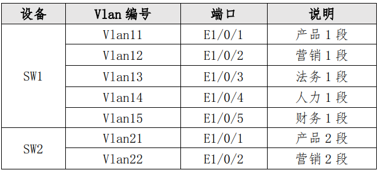
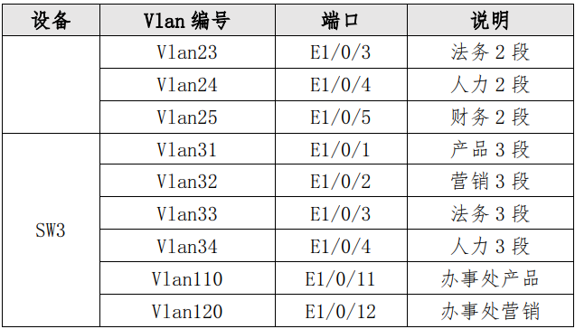

# 二、交换配置

## 1小题
1.配置 SW1、SW2、SW3 的 Vlan，二层链路只允许下面 Vlan 通过，不限制 vlan1。（<font style="color:#DF2A3F;">这个第二题有要求</font>）





```plain
全局配置模式下连续输入
VLAN 11  #创建VLAN 11
NAME CP1 #VLAN名称为CP1
switchport interface ethernet 1/0/1 #加入端口e1/0/1

VLAN 12
NAME YX1
switchport interface ethernet 1/0/2

VLAN 13
NAME FW1
switchport interface ethernet 1/0/3

VLAN 14
NAME RL1
switchport interface ethernet 1/0/4

VLAN 15
NAME CW1
switchport interface ethernet 1/0/5

SW1扩展配置
VLAN 1019
switchport interface ethernet 1/0/19

VLAN 1020
switchport interface ethernet 1/0/20

VLAN 1023
switchport interface ethernet 1/0/23

VLAN 1024
switchport interface ethernet 1/0/24
```

```plain
全局配置模式下连续输入
VLAN 21  #创建VLAN 21
NAME CP2 #VLAN名称为CP2
switchport interface ethernet 1/0/1 #加入端口e1/0/1

VLAN 22
NAME YX2
switchport interface ethernet 1/0/2

VLAN 23
NAME FW2
switchport interface ethernet 1/0/3

VLAN 24
NAME RL2
switchport interface ethernet 1/0/4

VLAN 25
NAME CW2
switchport interface ethernet 1/0/5

SW2扩展配置
VLAN 1019
switchport interface ethernet 1/0/19

VLAN 1020
switchport interface ethernet 1/0/20

VLAN 1023
switchport interface ethernet 1/0/23

VLAN 1024
switchport interface ethernet 1/0/24
```

```plain
全局配置模式下连续输入
VLAN 31  #创建VLAN 31
NAME CP3 #VLAN名称为CP3
switchport interface ethernet 1/0/1 #加入端口e1/0/1

VLAN 32
NAME YX3
switchport interface ethernet 1/0/2

VLAN 33
NAME FW3
switchport interface ethernet 1/0/3

VLAN 34
NAME RL3
switchport interface ethernet 1/0/4

VLAN 110
NAME BSCCP
switchport interface ethernet 1/0/11

VLAN 120
NAME BSCYX
switchport interface ethernet 1/0/12

VLAN 1019
switchport interface ethernet 1/0/19

VLAN 1020
switchport interface ethernet 1/0/20

SW3扩展配置
VLAN 1015
switchport interface ethernet 1/0/15

VLAN 1017
switchport interface ethernet 1/0/15

VLAN 1018
switchport interface ethernet 1/0/15
```

## 2小题
2.SW1 和 SW2 之间利用三条裸光缆实现互通，其中一条裸光缆承载三层 IP 业务、一条裸光缆承载 VPN 业务、一条裸光缆承载二层业务。 用相关技术分别实现财务 1 段、财务 2 段业务路由表与其它业务路由表隔离，财务业务 VPN 实例名称为 Finance，RD 为 1:1。<font style="color:#DF2A3F;">承载二层业务的只有一条裸光缆通道，配置相关技术，方便后续链路扩容与冗余备份，编号为 1，用 LACP 协议，SW1 为 active，SW2 为 passive；采 用目的、源 IP 进行实现流量负载分担。 </font>

```plain
vrf配置
ip vrf Finance #创建vrf实例
rd 1:1         #配置RD

int vlan 15 #进入财务1段对应VLAN
ip vrf forwarding Finance #关联VLAN15到Finace转发实例

int vlan 1024 #VLAN 1024是SW1-SW2用来承载VPN业务的
ip vrf forwarding Finance #关联VLAN 1024到Finace转发实例

interface Loopback2 			#用于BGP中的要求
ip vrf forwarding Finance

端口汇聚
port-group 1  #创建端口汇聚组，编号为1
int e1/0/22 #22口是二层业务的端口
port-group 1 mode active  #汇聚组1，主动发起汇聚
exit

int port-channel 1
switchport mode trunk
switchport trunk allowed vlan 11-15

load-balance dst-src-ip  #流量分担模式为目的、源IP方式
```

```plain
ip vrf Finance #创建vrf实例
rd 1:1         #配置RD

int vlan 25 #进入财务2段对应VLAN
ip vrf forwarding Finance #关联VLAN15到Finace转发实例

int vlan 1024 #VLAN 1024是SW1-SW2用来承载VPN业务的
ip vrf forwarding Finance #关联VLAN 1024到Finace转发实例

interface Loopback2 			#用于BGP中的要求
ip vrf forwarding Finance

port-group 1
int e1/0/22
port-group 1 mode passive
exit

int port-channel 1
switchport mode trunk
switchport trunk allowed vlan 21-25

load-balance dst-src-ip
```

<details class="lake-collapse"><summary id="ua8915b87"><span class="ne-text">释义</span></summary><p id="u645b3c0a" class="ne-p"><span class="ne-text">1、VRF（Virtual Routing and Rorwarding，虚拟路由转发）技术通过在一台三层转发设备上创建多张路由表实现数据或业务的隔离，常用于MPLS VPN、防火墙等一些需要实现隔离的应用场景。<br /></span></p><p id="ubf2416b8" class="ne-p"><span class="ne-text">2、LACP（链路汇聚控制协议）</span></p><p id="u8dfffb89" class="ne-p"><span class="ne-text"></span></p><p id="u38f0ede4" class="ne-p"><span class="ne-text">3、loopback口作用：</span></p><p id="u2d4ebf11" class="ne-p"><span class="ne-text" style="color: rgb(51, 51, 51)">3.1 建立路由邻居；</span><span class="ne-text"><br /></span><span class="ne-text" style="color: rgb(51, 51, 51)">3.2 作为Router-ID；</span><span class="ne-text"><br /></span><span class="ne-text" style="color: rgb(51, 51, 51)">3.3 虚拟隧道连接；</span><span class="ne-text"><br /></span><span class="ne-text" style="color: rgb(51, 51, 51)">3.4 网络连通性测试；</span></p></details>
## 3小题 
3.为方便后续验证与测试，SW3 的 E1/0/22 连接其他合适设备的一个 接口，配置为 trunk，允许 Vlan31-34、110、120 通过。 

```plain
int e1/0/22
switchport mode trunk  #设置端口模式为trunk
switchport trunk allowed vlan 31-34;110;120 #设置允许通过trunk的VLAN
loopback
```

## 4小题
4.将 SW3 模拟办事处交换机，实现与集团其它业务路由表隔离，办事处路由表 VPN 实例名称为 Office，RD 为 1:1。将 SW3 模拟为 Internet 交换机，实现与集团其它业务路由表隔离，Internet 路由表 VPN 实 例名称为 Internet，RD 为 2:2。 

```plain
ip vrf Office
rd 1:1
exit

ip vrf Internet
rd 2:2

interface vlan 110
ip vrf forwarding Office

interface vlan 120
ip vrf forwarding Office

interface vlan 1015
ip vrf forwarding Office

interface vlan 1017
ip vrf forwarding Internet

interface vlan 1018
ip vrf forwarding Internet

interface loopback2
ip vrf forwarding Office
```

<details class="lake-collapse"><summary id="u92a72f09"><span class="ne-text">注：VRF概述</span></summary><p id="uabd68c81" class="ne-p"><span class="ne-text" style="color: rgb(25, 27, 31); font-size: 14px">VRF（Virtual Routing and Rorwarding，虚拟路由转发）技术通过在一台三层转发设备上创建多张路由表实现数据或业务的隔离，常用于MPLS VPN、防火墙等一些需要实现隔离的应用场景。</span></p></details>
## <font style="color:#DF2A3F;">5小题</font>
5.SW1 配置 SNMP，引擎 id 分别为 1000；创建组 GroupSkills，采用 最高安全级别，配置组的读、写视图分别为：Skills_R、Skills_W；创建认证用户为 UserSkills，采用 aes 算法进行加密，密钥为 Key1122，哈希算法为 sha，密钥为 Key-1122；当设备有异常时，需要用本地的环回地址 Loopback1 发送 v3 Trap 消息至集团网管服务器 10.4.15.120、2001:10:4:15::120，采用最高安全级别；当法务部门的用户端口发生 updown 事件时禁止发送 trap 消息至上述集团网管服务器。 

```plain
全局配置下
snmp-server enable #启用SNMP代理
snmp-server engineid 1000 #配置引擎ID
snmp-server view Skills_R 1. include  #创建一个名为"Skills_R"的视图，包含在版本为1的SNMP中
snmp-server view Skills_W 1. include  #创建一个名为"Skills_W"的视图，包含在版本为1的SNMP中
snmp-server group GroupSkills authpriv read Skills_R write Skills_W #authpriv为鉴别且加密的安全级别，另一种就是只鉴别不加密
snmp-server user UserSkills GroupSkills authPriv aes Key-1122 auth sha Key-1122 #配置认证用户


snmp-server enable traps #启用Trap功能
snmp-server trap-source 10.4.1.1 #配置发送Trap消息的地址
snmp-server trap-source 2001:10:4:1::1

snmp-server host 10.4.15.120 v3 authpriv UserSkills       #配置接收Trap消息的网络管理站
snmp-server host 2001:10:4:15::120 v3 authpriv UserSkills #配置接收Trap消息的网络管理站

int e1/0/3 #进入法务所属端口
no switchport updown notification enable #关闭端口updown事件发送 trap信息的功能
```

<details class="lake-collapse"><summary id="u420d2e2e"><span class="ne-text">释义</span></summary><p id="ua102325d" class="ne-p"><span class="ne-text"> SNMP（简单网络管理协议）简单来讲就是一个网络管理标准，方便不同品牌、不同类型的设备接入统一的网络管理系统。</span></p></details>
## 6小题
6.对 SW1 与 FW1 互连流量镜像到 SW1 E1/0/1，会话列表为 1。

```plain
配置镜像端口
monitor session 1 source interface ethernet 1/0/19 both #配置镜像端口，会话列表为1，镜像源端口为e1/0/19，包含发送和接收的流量 
monitor session 1 destination interface ethernet 1/0/1 #配置镜像端口，会话列表为1，镜像目的端口为e1/0/1
```

<details class="lake-collapse"><summary id="u6a71401e"><span class="ne-text" style="color: rgb(38, 44, 49)">释义</span></summary><p id="ufe7bf83e" class="ne-p"><span class="ne-text" style="color: rgb(38, 44, 49)">镜像端口是用来监测端口流量的，由某个端口收集监测到的数据帧，方便用来分析流量数据、用来诊断网络故障等等</span></p><p id="ufc11f56e" class="ne-p"><span class="ne-text" style="color: rgb(38, 44, 49)"></span></p><p id="u1411d9bc" class="ne-p"><span class="ne-text" style="color: rgb(38, 44, 49)">session 会话列表号/镜像事务号</span></p><p id="u91169e34" class="ne-p"><span class="ne-text" style="color: rgb(38, 44, 49)"></span></p><p id="uf13f87de" class="ne-p"><span class="ne-text" style="color: rgb(38, 44, 49)">source 镜像源端口就是被复制数据的端口</span></p><p id="ua567b4b7" class="ne-p"><span class="ne-text" style="color: rgb(38, 44, 49)">destiation 镜像目的端口就是接收数据的端口</span></p><p id="ua37aeb1c" class="ne-p"><span class="ne-text" style="color: rgb(38, 44, 49)"></span></p><p id="ub92ad057" class="ne-p"><span class="ne-text" style="color: rgb(38, 44, 49)">tx #发送的流量</span></p><p id="uede9f72b" class="ne-p"><span class="ne-text" style="color: rgb(38, 44, 49)">rx #接收的流量</span></p><p id="u182c5886" class="ne-p"><span class="ne-text" style="color: rgb(38, 44, 49)">both #发送和接收的流量</span></p></details>
## 7小题
7.SW1 和 SW2 E1/0/21-28 启用单向链路故障检测，当发生该故障时， 端口标记为 errdisable 状态，自动关闭端口，经过 1 分钟后，端口自动重启；发送 Hello 报文时间间隔为 15s；

```plain
全局配置下输入：
uldp enable  #开启全局uldp
uldp recovery-time 60 #配置端口重启时间间隔
uldp hello-interval 15 #配置通告报文时间间隔
uldp aggressive-mode  #全局uldp工作模式为激进模式

int	e1/0/21-28
uldp enable #开启端口uldp
uldp aggressive-mode #端口uldp工作模式为激进模式
```

<details class="lake-collapse"><summary id="ub53b6aa2"><span class="ne-text">释义</span></summary><p id="ueab2b05a" class="ne-p"><span class="ne-text">uldp #单向链路检测协议，单向链路就是物理链路正常的情况下，本端能和对端正常通信，而对端却不能跟本端正常通信</span></p><p id="ubf5f8050" class="ne-p"><span class="ne-text"></span></p><p id="ua76ada4b" class="ne-p"><span class="ne-text">uldp manual-shutdown #手动关闭单向链路，默认为主动</span></p></details>
## 8小题
8.SW1 和 SW2 所有端口启用链路层发现协议，更新报文发送时间间隔 为 20s，老化时间乘法器值为 5，Trap 报文发送间隔为 10s，配置三条裸光缆端口使能 Trap 功能。   

```plain
lldp enable #启用lldp
lldp notification interval 10 #trap报文发送时间间隔为10s
lldp msgTxHold 5 #配置老化时间乘法器值为5
lldp tx-interval 20 #配置更新报文发送时间为20s

int e1/0/22-24
lldp trap enable #启用trap功能

```

<details class="lake-collapse"><summary id="ua8744b32"><span class="ne-text">注：链路层发现协议（LLDP）</span></summary><p id="u102fa826" class="ne-p"><span class="ne-text">链</span><span class="ne-text" style="color: rgb(51, 51, 51); font-size: 14px">络设备可以通过在本地网络中发送LLDPDU（Link Layer Discovery Protocol Data Unit）来通告其他设备自身的状态。是一种能够使网络中的设备互相发现并通告状态、交互信息的协议。</span></p></details>


> 更新: 2024-05-07 11:04:26  
> 原文: <https://www.yuque.com/gengmouren-1f9qn/whktvz/ak8c55v6xmc05c17>