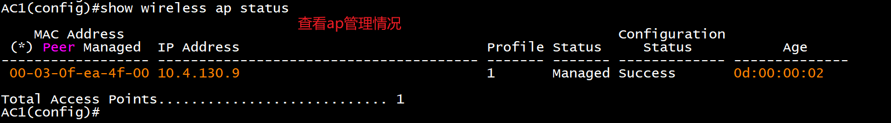
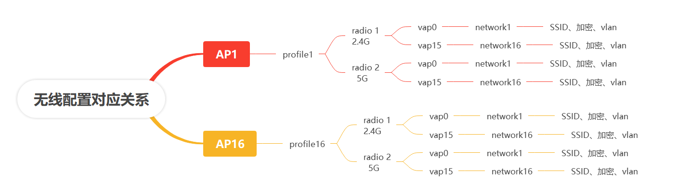

# 四、无线部署

## 1小题 
1.<font style="color:#ED740C;">AC1 与 AP1 相连接口只允许 Vlan140 和 Vlan150 通过。</font><font style="color:#74B602;">AC1 Loopback1 IPv4 和 IPv6 地址分别作为 AC1 的 IPv4 和 IPv6 管理地 址。AP 二层自动注册，AP 采用 MAC 地址认证。</font>配置 2 个 ssid，分别 为 SKILLS-2.4G 和 SKILLS-5G。SKILLS-2.4G 对应 Vlan140，用 Network 140 和 radio1（profile 1, mode n-only-g）,用户接入无线网络时 需要采用基于 WPA-personal 加密方式，密码为 Key-1122，用第一个可用 VAP 发送 2.4G 信号。SKILLS-5G 对应 Vlan150，用 Network 150 和 radio2（profile 1, mode n-only-a），不需要认证，隐藏 ssid， SKILLS-5G 用倒数第一个可用 VAP 发送 5G 信号。  

<details class="lake-collapse"><summary id="ucc9f28da"><span class="ne-text" style="color: #ED740C">橙色部分</span></summary><p id="u290ec0ac" class="ne-p" style="text-align: justify"><span class="ne-text" style="color: #000000; font-size: 16px">Interface Ethernet1/0/2  			#进入AC与AP相连接口</span></p><p id="ua1dcdf5a" class="ne-p" style="text-align: justify"><span class="ne-text" style="color: #000000; font-size: 16px">switchport mode trunk   			#配置trunk口</span></p><p id="ufc52897b" class="ne-p" style="text-align: justify"><span class="ne-text" style="color: #000000; font-size: 16px">switchport trunk allowed vlan 140;150   #允许vlan 140和150通过</span></p><p id="u7525a43f" class="ne-p" style="text-align: justify"><span class="ne-text" style="color: #000000; font-size: 16px">switchport trunk native vlan 130		#把管理vlan，设置为trunk口的本地vlan</span></p></details>
<details class="lake-collapse"><summary id="u8a64452b"><span class="ne-text" style="color: #74B602">绿色部分</span></summary><p id="u2c53c4f8" class="ne-p" style="text-align: justify"><span class="ne-text" style="color: #000000; font-size: 16px">wireless			#开启无线模式</span></p><p id="ub4db3498" class="ne-p" style="text-align: justify"><span class="ne-text" style="color: #000000; font-size: 16px"></span></p><p id="uc9c19184" class="ne-p" style="text-align: justify"><span class="ne-text" style="color: #DF2A3F; font-size: 16px">设置管理IP</span></p><p id="uf6c2e102" class="ne-p" style="text-align: justify"><span class="ne-text" style="color: #000000; font-size: 16px">no auto-ip-assign	          #关闭IP自动获取</span></p><p id="uda1ef161" class="ne-p" style="text-align: justify"><span class="ne-text" style="color: #000000; font-size: 16px">static-ip  10.4.4.1		  #设置静态IP，用于管理</span></p><p id="ued767cc2" class="ne-p" style="text-align: justify"><span class="ne-text" style="color: #000000; font-size: 16px">static-ipv6  2001:10:4:4::1 #设置静态IP，用于管理</span></p><p id="ubf86ea1c" class="ne-p" style="text-align: justify"><span class="ne-text" style="color: #DF2A3F; font-size: 16px">注册及认证配置</span></p><p id="uf6188aec" class="ne-p" style="text-align: justify"><span class="ne-text" style="color: #000000; font-size: 16px">discovery vlan-list 130	  	   #发现方式为vlan</span></p><p id="ubbb05f16" class="ne-p" style="text-align: justify"><span class="ne-text" style="color: #000000; font-size: 16px">ap authentication mac	  	   #ap采用mac方式认证</span></p><p id="uf3bfda74" class="ne-p" style="text-align: justify"><span class="ne-text" style="color: #000000; font-size: 16px">ap database 00-03-0f-ef-c4-40 #指定ap的mac地址</span></p></details>
查看ap状态，AP已被管理才能下发配置文件



<details class="lake-collapse"><summary id="u352003f5"><span class="ne-text" style="font-size: 16px">黑色部分</span></summary><p id="u8cc9e3fb" class="ne-p" style="text-align: justify"><span class="ne-text" style="color: #000000; font-size: 16px">网络配置</span></p><p id="u6fbd04a2" class="ne-p" style="text-align: justify"><span class="ne-text" style="color: #000000; font-size: 16px">network 140				 #进入network 140</span></p><p id="u6dc0e506" class="ne-p" style="text-align: justify"><span class="ne-text" style="color: #000000; font-size: 16px">security mode wpa-personal  #进入network 140 </span></p><p id="u8d6fe6b3" class="ne-p" style="text-align: justify"><span class="ne-text" style="color: #000000; font-size: 16px">ssid SKILLS-2.4G			 #配置ssid为SKILLS-2.4G</span></p><p id="u92443674" class="ne-p" style="text-align: justify"><span class="ne-text" style="color: #000000; font-size: 16px">vlan 140					#绑定vlan140</span></p><p id="u0528f725" class="ne-p" style="text-align: justify"><span class="ne-text" style="color: #000000; font-size: 16px">wpa key Key-1122			#秘钥设置为Key-1122</span></p><p id="u18fa294d" class="ne-p" style="text-align: justify"><span class="ne-text" style="color: #000000; font-size: 16px"></span></p><p id="udf2b9c6f" class="ne-p" style="text-align: justify"><span class="ne-text" style="color: #000000; font-size: 16px">Network 150	  			#进入network 140</span></p><p id="u0e157725" class="ne-p" style="text-align: justify"><span class="ne-text" style="color: #000000; font-size: 16px">hide-ssid		 			#隐藏的SSID配置</span></p><p id="u21b68cdd" class="ne-p" style="text-align: justify"><span class="ne-text" style="color: #000000; font-size: 16px">ssid SKILLS-5G 			#配置ssid为SKILLS-2.4G</span></p><p id="u4769ab6d" class="ne-p" style="text-align: justify"><span class="ne-text" style="color: #000000; font-size: 16px">vlan 150 					#绑定vlan140</span></p><p id="u0c368e49" class="ne-p" style="text-align: justify"><span class="ne-text" style="color: #000000; font-size: 16px">exit</span></p><p id="uae72d84f" class="ne-p" style="text-align: justify"><span class="ne-text" style="color: #000000; font-size: 16px"></span></p><p id="u7321c994" class="ne-p" style="text-align: justify"><span class="ne-text" style="color: #000000; font-size: 16px"></span></p><p id="u8216afa1" class="ne-p" style="text-align: justify"><span class="ne-text" style="color: #000000; font-size: 16px">ap profile 1	#进入id为1的配置</span></p><p id="ub201e40e" class="ne-p" style="text-align: justify"><span class="ne-text" style="color: #000000; font-size: 16px">hwtype 59	#指定硬件号为59</span></p><p id="u1da7bcb0" class="ne-p" style="text-align: justify"><span class="ne-text" style="color: #000000; font-size: 16px">radio 1		#进入radio1</span></p><p id="u26ad21ad" class="ne-p" style="text-align: justify"><span class="ne-text" style="color: #000000; font-size: 16px">mode n-only-g #指定工作在2.4G</span></p><p id="u358984e9" class="ne-p" style="text-align: justify"><span class="ne-text" style="color: #000000; font-size: 16px">vap 0		#进入vap0</span></p><p id="u71753eb2" class="ne-p" style="text-align: justify"><span class="ne-text" style="color: #000000; font-size: 16px">network 140    #绑定network 140 </span></p><p id="ub64bc67e" class="ne-p" style="text-align: justify"><span class="ne-text" style="color: #000000; font-size: 16px">enable		#开启已配置的vap</span></p><p id="u52cfe96c" class="ne-p" style="text-align: justify"><span class="ne-text" style="color: #000000; font-size: 16px">exit</span></p><p id="u8bb418ac" class="ne-p" style="text-align: justify"><span class="ne-text" style="color: #000000; font-size: 16px">exit</span></p><p id="u8811eeed" class="ne-p" style="text-align: justify"><span class="ne-text" style="color: #000000; font-size: 16px"></span></p><p id="ua59499ea" class="ne-p" style="text-align: justify"><span class="ne-text" style="color: #000000; font-size: 16px">radio 2		   #进入radio2</span></p><p id="uf7691285" class="ne-p" style="text-align: justify"><span class="ne-text" style="color: #000000; font-size: 16px">mode n-only-a  #指定工作在5G</span></p><p id="u79012d07" class="ne-p" style="text-align: justify"><span class="ne-text" style="color: #000000; font-size: 16px">vap 15</span></p><p id="ua64fb72c" class="ne-p" style="text-align: justify"><span class="ne-text" style="color: #000000; font-size: 16px">network 150	  #绑定network 140</span></p><p id="uf3f8f7d0" class="ne-p" style="text-align: justify"><span class="ne-text" style="color: #000000; font-size: 16px">enable		  #开启已配置的vap</span></p></details>
```plain
特权模式下发ID为1的配置
wireless ap profile apply 1   
```




> 更新: 2024-05-03 15:47:50  
> 原文: <https://www.yuque.com/gengmouren-1f9qn/whktvz/ugld7qihzqkucisx>