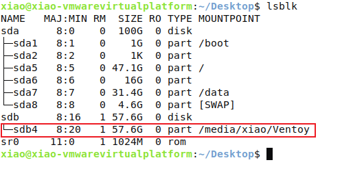
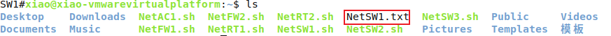

# 1、网络设备答案提交

### 前置条件
A：kylin能够正常连接网络设备（如minicom）

B：网络设备处于特权模式

### lsblk查看U盘路径

### 复制脚本文件
将U盘中的脚本文件复制到Ubuntu目录下

### 执行脚本文件
在脚本文件所在目录下执行

### 查看提取结果

### 复制到指定目录
最后将提取的文件复制到试题要求的位置即可

> 更新: 2024-04-15 18:46:34  
> 原文: <https://www.yuque.com/gengmouren-1f9qn/whktvz/ouga0ibkw6qqdam3>