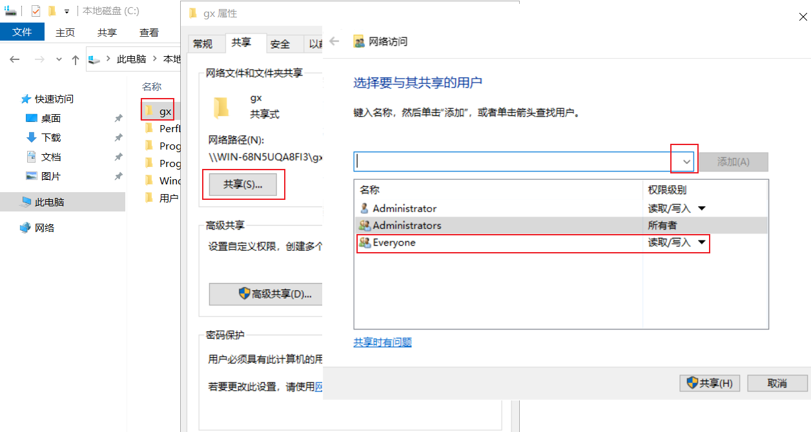

# 2、服务器答案提交

## 前置条件
A：网络可到达（例如用Ubuntu去提取Server1的配置，那它们之间肯定要能ping通）

B：服务可到达（服务可能会被防火墙拦截、相关主机未安装对应服务，所以需要对防火墙进行配置，且安装对应的服务，例如openssh-server、sshpass等等）

## 1、Server1答案提取/提交

## 2、Server2答案提取/提交

## 3、windows答案提取/提交
### 方法一：smb连接
1、创建Windows共享文件夹，允许Everyone读取写入2、打开Ubuntu目录，点击Other Locations，在connect to server 处输入smb://共享文件夹的主机IP，点击连接

3、输入用户名Administrator，域名和密码后，即可进入到共享文件夹

到这个界面可以把脚本复制进来，到Windows界面去执行，执行完，再把结果放到共享文件夹，再切换回Ubuntu复制到指定为止即可

### 方法二：挂载共享文件夹
1、创建Windows共享文件夹，允许Everyone读取写入

## 4、Linux答案提取/提交

> 更新: 2024-04-16 20:59:50  
> 原文: <https://www.yuque.com/gengmouren-1f9qn/whktvz/rpscnx00ndtn95h9>