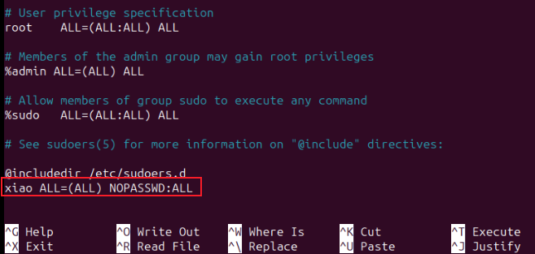

# 一、X86架构计算机安装与管理

## 题目：
**1.**PC1 系统为 ubuntu-desktop-amd64 系统，登录用户为 xiao，密码 

为 Key-1122，配置该用户免密码执行 sudo 命令。

**2.**安装 remmina，用该软件连接 server1 上的虚拟机，并配置虚拟机 

上的相应服务。

PC1的系统是现成的，不需要选手安装，选手只需要在现成的系统上配置xiao用户能够免密码执行sudo命令和安装remmina软件

## 配置步骤：
# 1小题
### 1、登录系统
输入用户名：xiao

输入密码：Key-1122

### 2、打开终端
桌面处右击open in Terminal

### 3、执行命令
sudo visudo

在最后一行写入：

xiao ALL=(ALL) NOPASSWD: ALL

按Ctrl+x，然后按Y，回车之后再按回车即可保存

### 扩展知识：
%xiao ALL=(ALL) NOPASSWD: ALL  #xiao组的用户sudo都不需要密码

# 2小题
### 1、切换到软件所在目录
cd + 目录位置

### 2、安装该目录下的所有包
输入sudo dpkg -i *

> 更新: 2024-05-08 20:38:59  
> 原文: <https://www.yuque.com/gengmouren-1f9qn/whktvz/akgcfv3mw6am4o19>