# 1、创建实例

## **题目：**
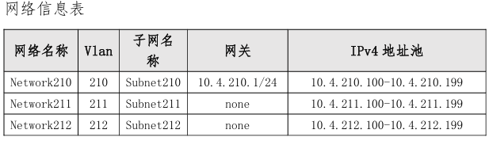

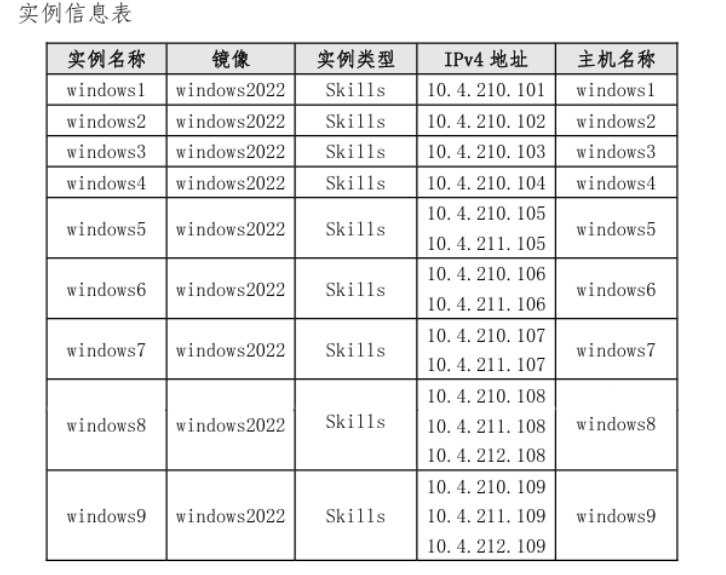

## 配置步骤：
登录地址：192.168.100.100/dcncloud

管理用户名：admin

密码：dcncloud

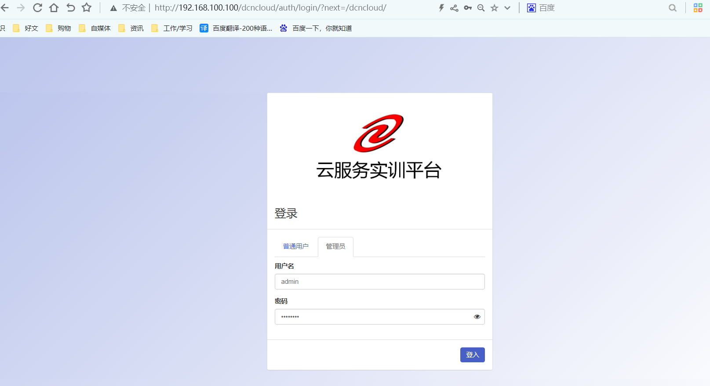

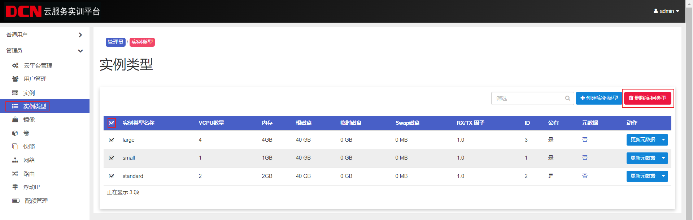

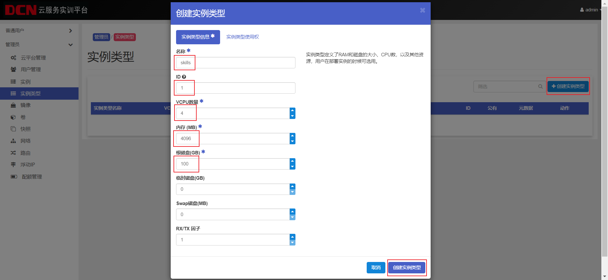

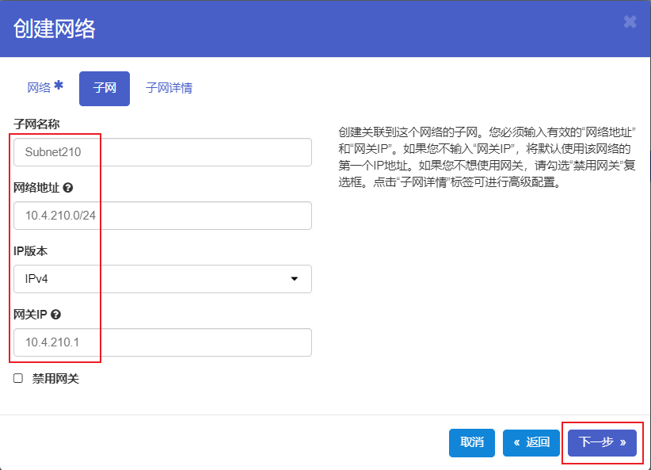

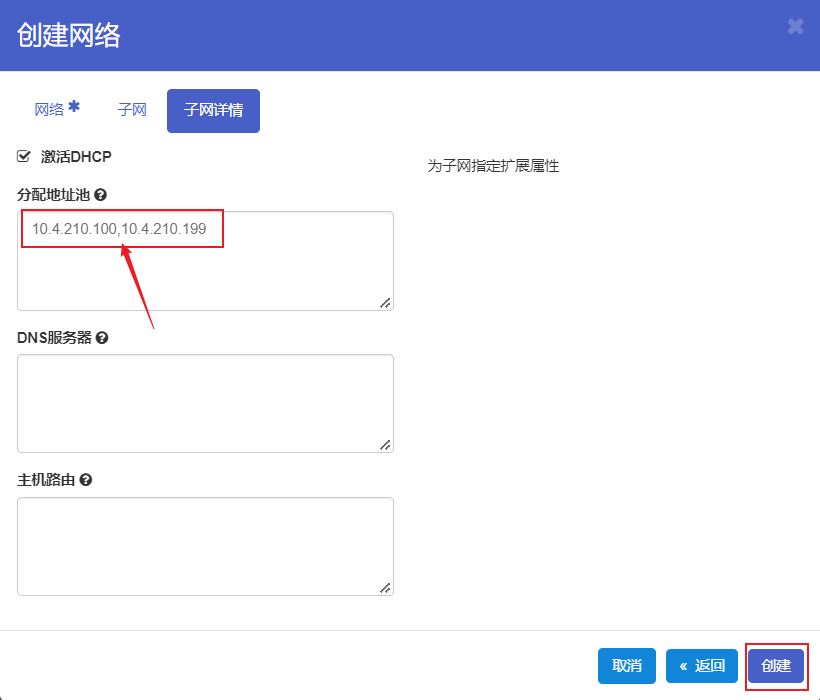

按以上逻辑，对照表格依次创建211/212网络

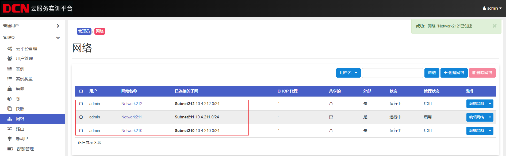

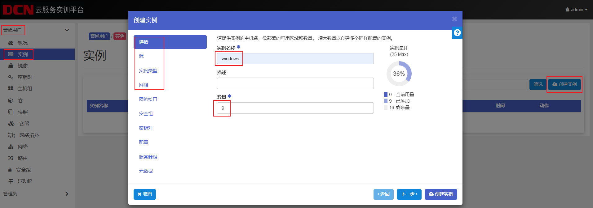

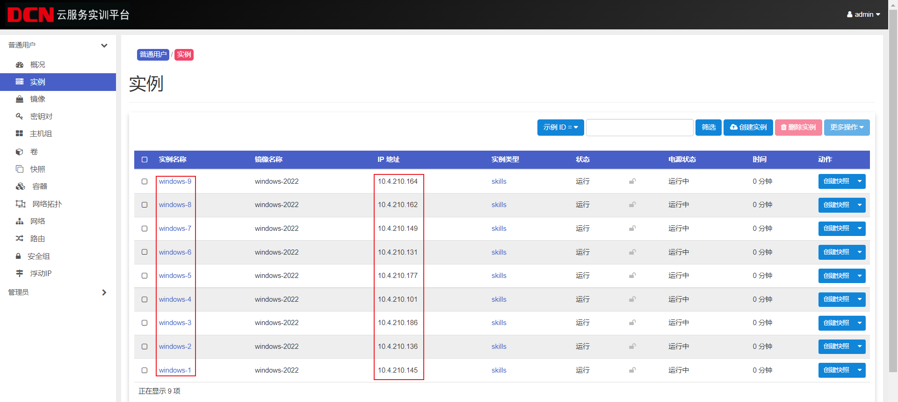

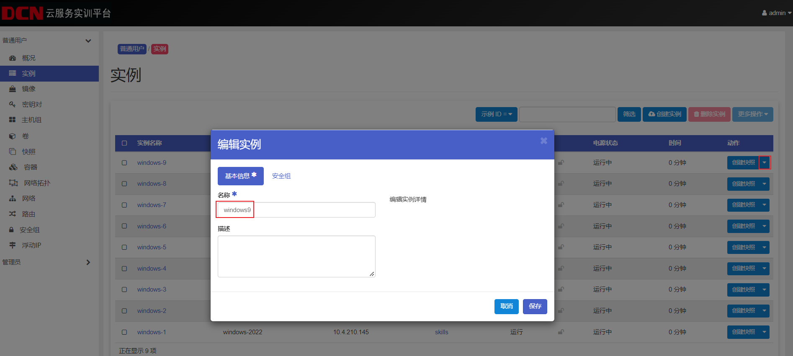

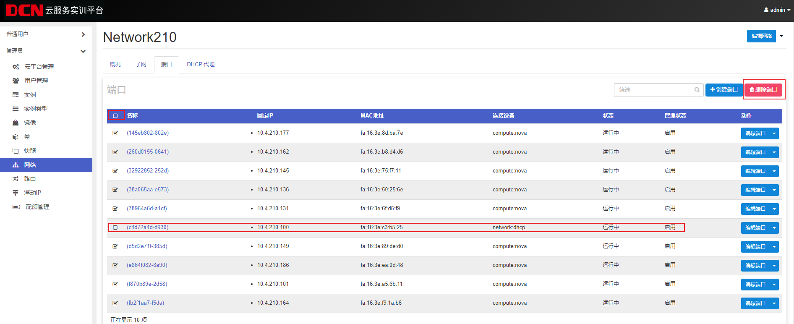

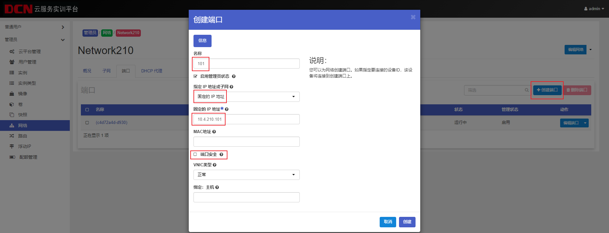

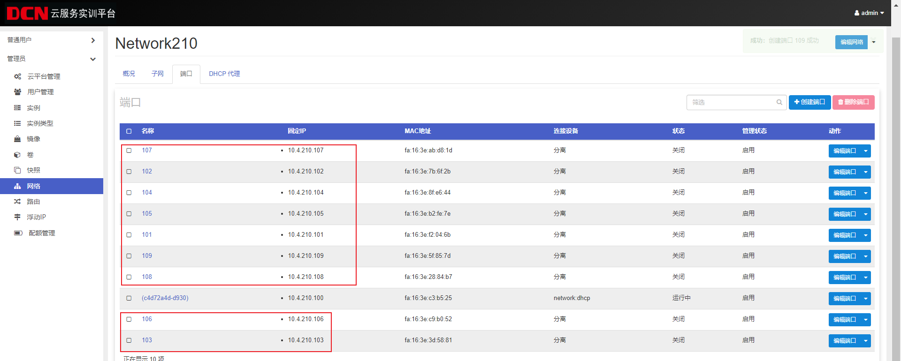

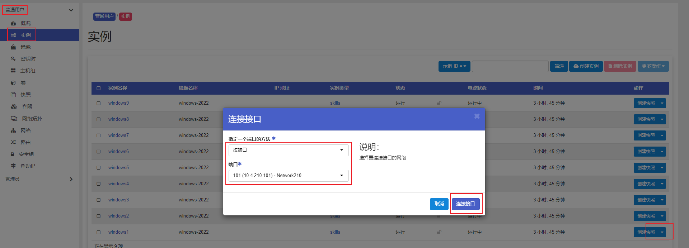

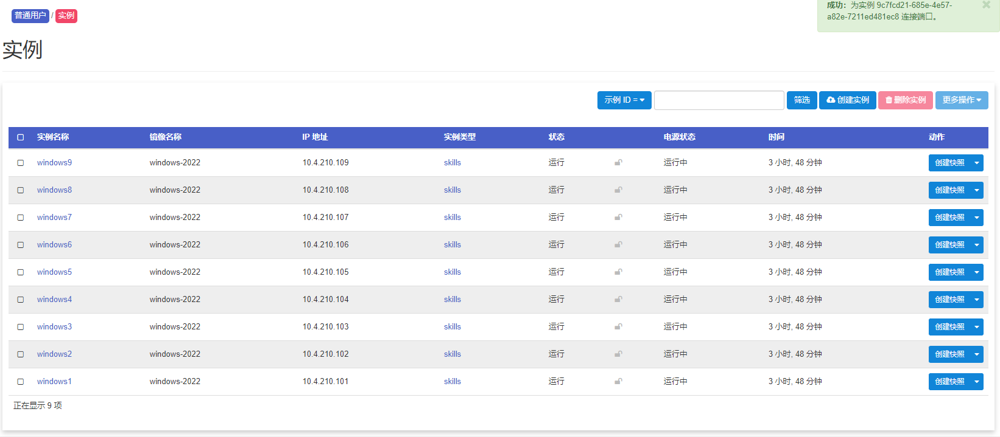

> 更新: 2024-04-29 08:45:44  
> 原文: <https://www.yuque.com/gengmouren-1f9qn/whktvz/ncyxvcen68gsayfz>