# 2、域服务 √

## **题目：**
 任务描述：请采用域环境，管理企业网络资源。 

1、配置所有windows主机IP地址和主机名称。

2、配置windows1 为skills.lan 域控制器；安装dns服务，dns正反向 区域在active directory 中存储，负责该域的正反向域名解析。 配置windows2 为skills.lan 辅助域控制器；安装dns服务，dns正 反向区域在active directory中存储，负责该域的正反向域名解析。 把其他windows 主机加入到skills.lan 域。所有windows 主机（含 域控制器）用skills\Administrator 身份登陆。

 3、在windows1 上安装证书服务，为windows 主机颁发证书，证书颁发 机构有效期为10年，证书颁发机构的公用名为windows1.skills.lan。 复制“计算机”证书模板，名称为“计算机副本”，申请并颁发一张供 windows 服务器使用的证书，证书友好名称为pc，（将证书导入到需 要证书的 windows 服务器），证书信息：证书有效期=5 年，公用名 =skills.lan，国家=CN，省=Beijing，城市=Beijing，组织=skills， 组织单位=system，使用者可选名称=*.skills.lan 和 skills.lan。 浏览器访问https网站时，不出现证书警告信息。在 windows2 上安装从属证书服务，证书颁发机构的公用名为 windows2.skills.lan。 

4、在windows1 上新建名称为manager、dev、sale的3个组织单元；每 个组织单元内新建与组织单元同名的全局安全组；每个组内新建 20 个用户：行政部manager00-manager19、开发部 dev00-dev19、营销 部sale00-sale19，不能修改其口令，密码永不过期。manager00 拥有域管理员权限。  

### 1小题
配置所有windows主机IP地址和主机名称。

### 2小题
配置windows1为skills.lan 域控制器；安装dns服务，dns正反向 区域在active directory 中存储，负责该域的正反向域名解析。 配置windows2 为skills.lan 辅助域控制器；安装dns服务，dns正 反向区域在active directory中存储，负责该域的正反向域名解析。把其他windows 主机加入到skills.lan 域。所有windows 主机（含 域控制器）用skills\Administrator 身份登陆。

#### 所有主机加入域
确定加入后，需要重启

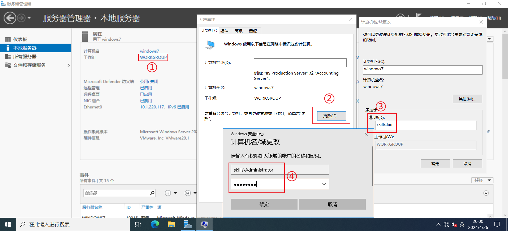

#### 所有主机用域用户登陆
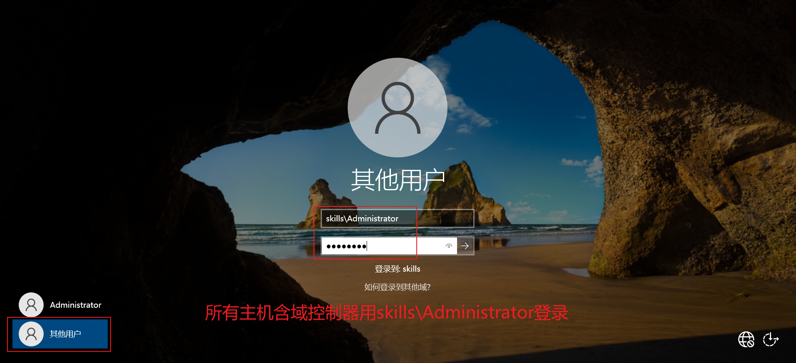

###  3小题
在windows1 上安装证书服务，为windows 主机颁发证书，证书颁发 机构有效期为10年，证书颁发机构的公用名为windows1.skills.lan。 复制“计算机”证书模板，名称为“计算机副本”，申请并颁发一张供 windows 服务器使用的证书，证书友好名称为pc，（将证书导入到需 要证书的 windows 服务器），证书信息：证书有效期=5 年，公用名 =skills.lan，国家=CN，省=Beijing，城市=Beijing，组织=skills， 组织单位=system，使用者可选名称=*.skills.lan 和 skills.lan。 浏览器访问https网站时，不出现证书警告信息。在 windows2 上安装从属证书服务，证书颁发机构的公用名为 windows2.skills.lan。

#### 3.1 安装证书服务
（全程下一步）

#### 3.2 修改注册表
下图项改为10，重启计算机

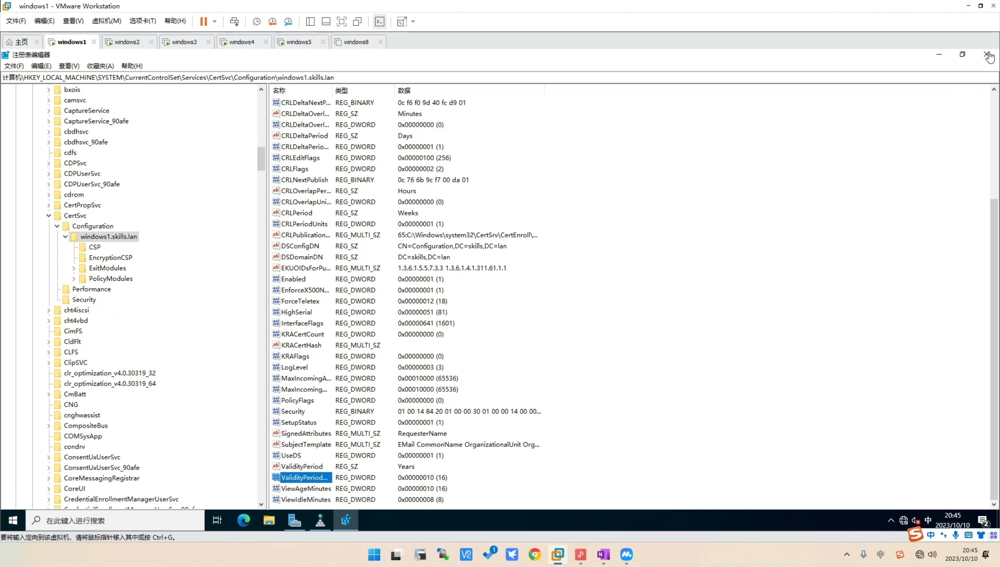

#### 3.3 导出CA证书
打开证书颁发机构--右击域名--所有任务--备份CA--放入指定位置方便共享

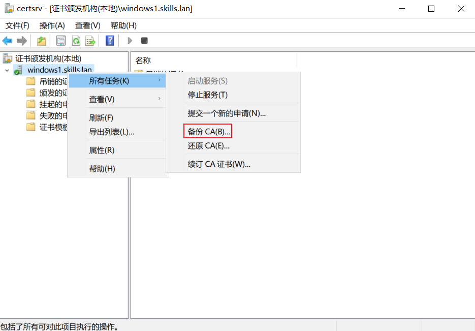

#### 3.4 申请并颁发证书
##### 模板配置
打开证书颁发机构右击证书模板--选择管理--右击计算机复制模板--常规处配置有效期5年--使用者名称处选择在请求中提供--安全处配置authenticated User组可注册--请求处理处勾选允许导出私钥--关闭窗口

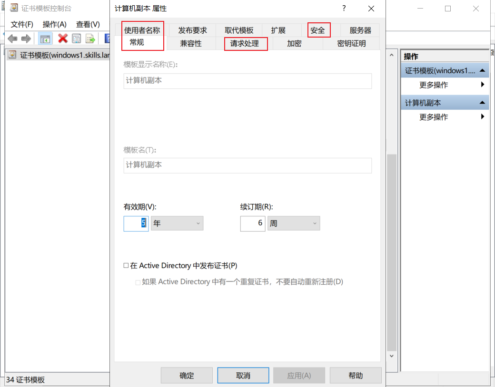

证书颁发机构窗口右击证书模板--选择新建--要颁发的证书模板--选择计算机副本

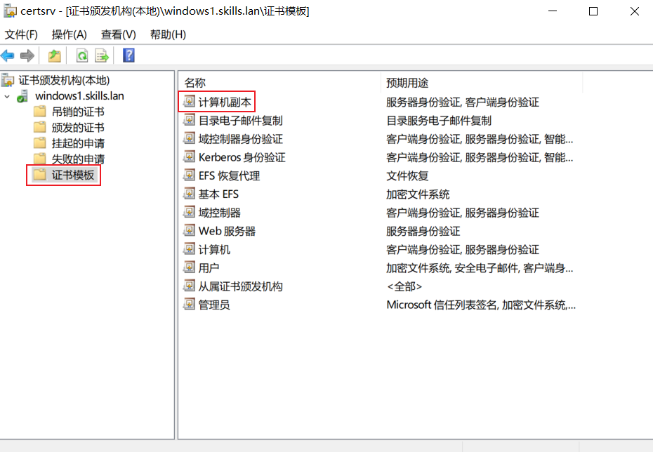

##### 申请证书
ctrl + R运行mmc--点击文件--添加管理单元--双击证书--选择计算机账户--个人--证书--空白处右击所有任务--申请新证书--下一步--勾选计算机副本--点击感叹号处配置申请信息--应用确定--注册

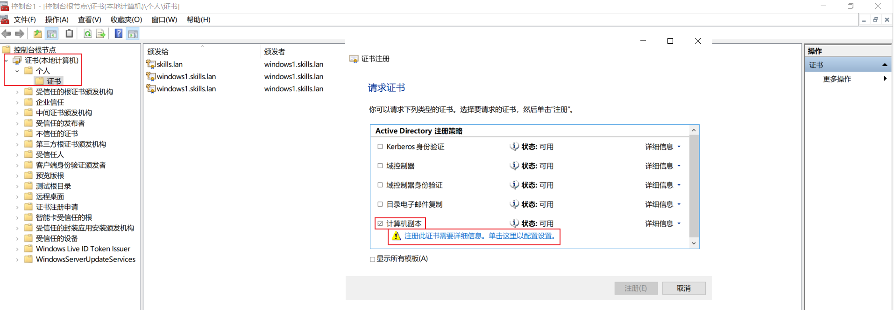

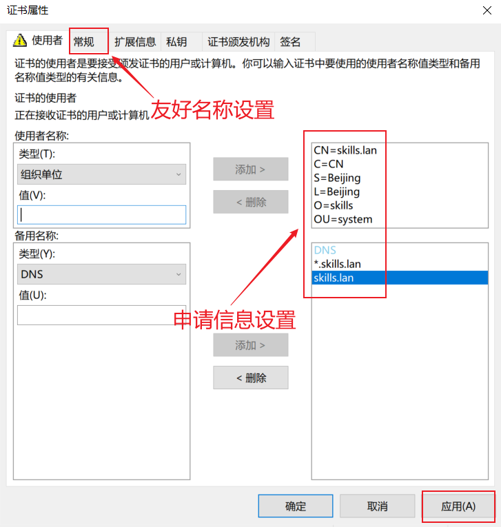

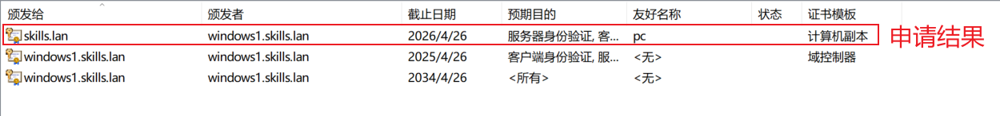

#### 3.4 导出用户证书
含私钥

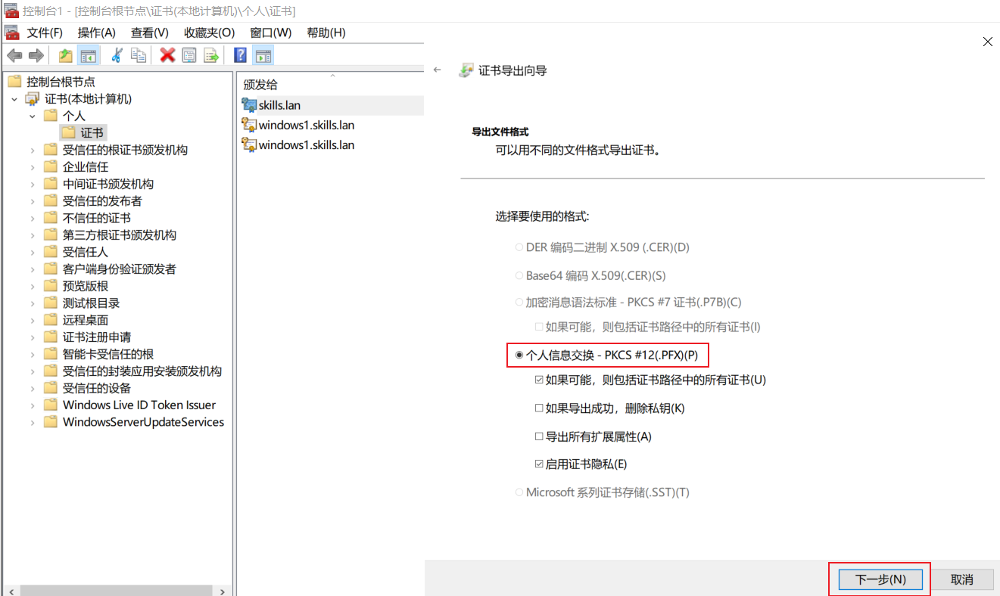

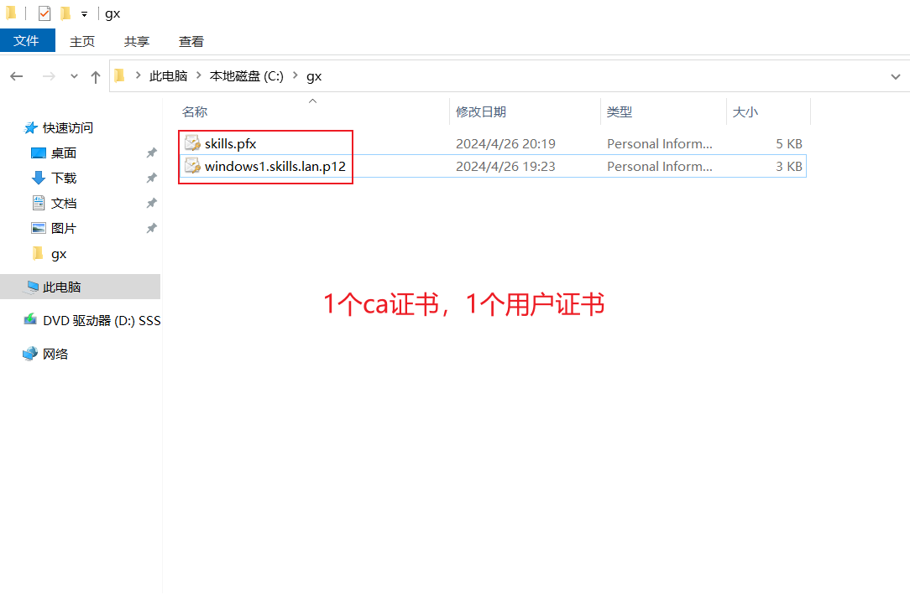

#### 3.5 配置从属证书颁发机构
windows2 默认安装，一直下一步

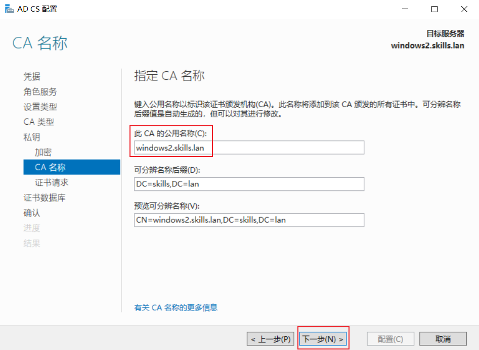

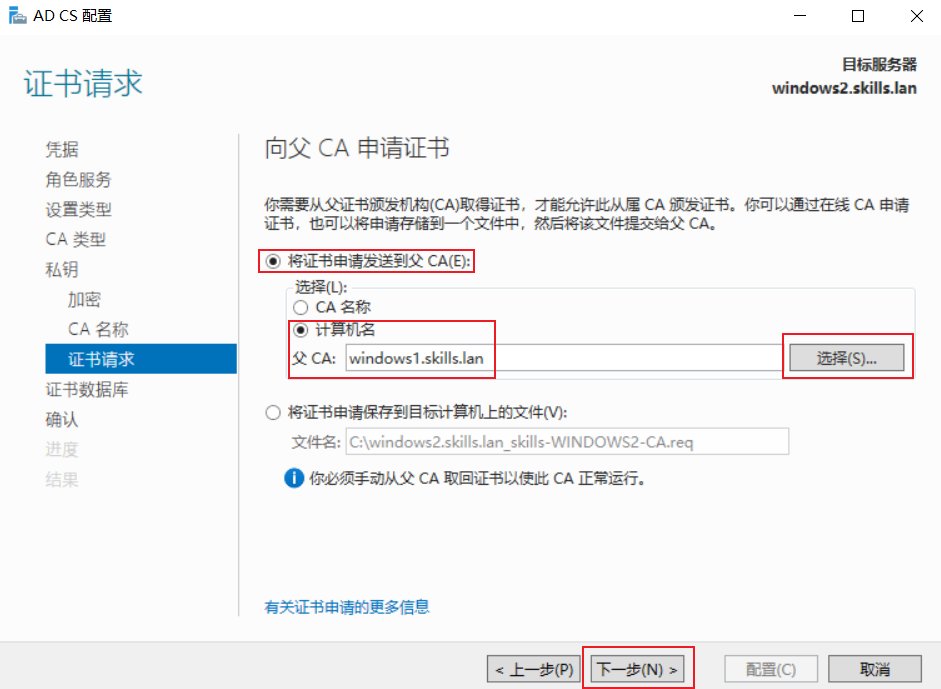

### 4小题
在windows1 上新建名称为manager、dev、sale的3个组织单元；每 个组织单元内新建与组织单元同名的全局安全组；每个组内新建 20 个用户：行政部manager00-manager19、开发部 dev00-dev19、营销 部sale00-sale19，不能修改其口令，密码永不过期。manager00 拥 有域管理员权限。  

#### 创建组织单元和组
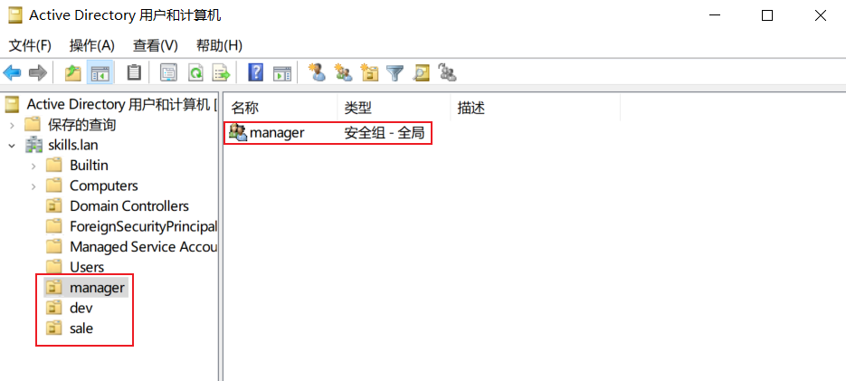

#### 创建用户
打开cmd依次输入以下命令

manager组 00-09

for /L %i in (0,1,9) do dsadd user "cn=manager0%i,ou=manager,dc=skills,dc=lan" -memberof "cn=manager,ou=manager,dc=skills,dc=lan" -pwd Pass1234

创建之后点击manager组，空白处右击刷新可查看到用户

manager组 10-19

for /L %i in (10,1,19) do dsadd user "cn=manager%i,ou=manager,dc=skills,dc=lan" -memberof "cn=manager,ou=manager,dc=skills,dc=lan" -pwd Pass1234

dev组 00-09

for /L %i in (0,1,9) do dsadd user "cn=dev0%i,ou=dev,dc=skills,dc=lan" -memberof "cn=dev,ou=dev,dc=skills,dc=lan" -pwd Pass1234

dev组 10-19

for /L %i in (10,1,19) do dsadd user "cn=dev%i,ou=dev,dc=skills,dc=lan" -memberof "cn=dev,ou=dev,dc=skills,dc=lan" -pwd Pass1234

sale组 00-09

for /L %i in (0,1,9) do dsadd user "cn=sale0%i,ou=sale,dc=skills,dc=lan" -memberof "cn=sale,ou=sale,dc=skills,dc=lan" -pwd Pass1234

sale组 10-19

for /L %i in (10,1,19) do dsadd user "cn=sale%i,ou=sale,dc=skills,dc=lan" -memberof "cn=sale,ou=sale,dc=skills,dc=lan" -pwd Pass1234

#### 用户设置
用户不能更改密码及密码永不过期设置

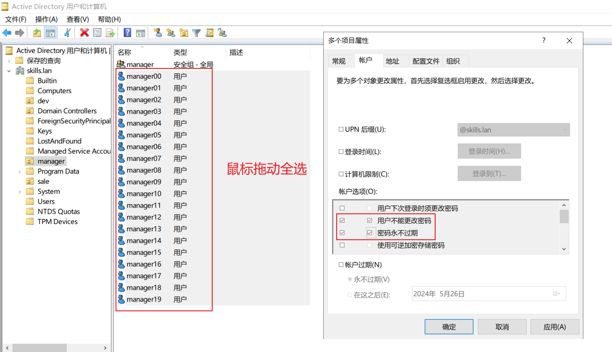

manager00指定为域管理员

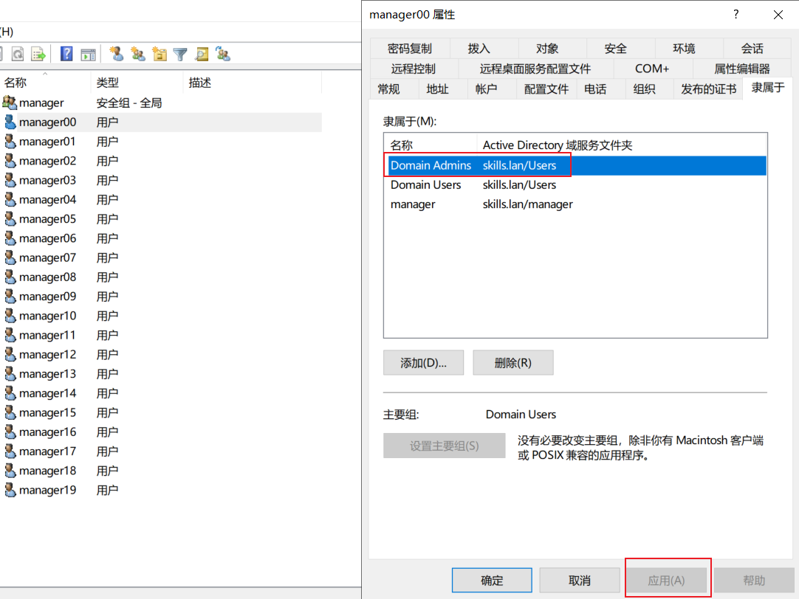

> 更新: 2024-04-29 17:09:07  
> 原文: <https://www.yuque.com/gengmouren-1f9qn/whktvz/byi9s1leqzd23kbs>