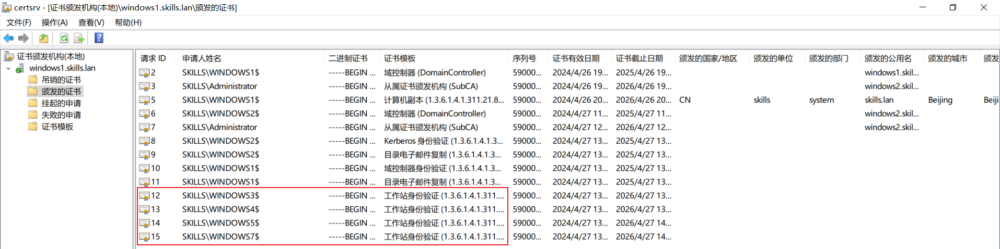

# 3、组策略 √

### 1小题
**题目：**复制 PowerShell-7.3.6-win-x64.msi 到 windows1 的 C:\soft。域中 

主机自动安装 powershell7（提示：如果部署不成功，则需要每台 

windows 主机均手动安装，软件包在 U 盘 soft 目录。导出答案时使 

用 pwsh(powershell7)，而不是 powershell5。）

**位置：计算机配置--策略--软件--软件安装**

### 2小题
**题目：**域中主机自动申请“ipsec”模板证书。自动注册“工作站身份验证” 

模板证书，该模板可用作“服务器身份验证”，有效期 5 年。

**位置：**计算机配置--本地策略--安全设置--公钥设置

cmd处gpupdate 更新组策略，重启其他主机

### 3小题
**题目：**允许 manager 组本地登录域控制器，允许 manager00 用户远程登录到 

域控制器；拒绝 dev 组从网络访问域控制器。

**位置：**计算机配置--策略--windows设置--安全设置--本地策略--用户权限分配

### 4小题
**题目：**登录时不显示上次登录，不显示用户名，无须按 ctrl+alt+del。

**位置：**计算机配置--本地策略--安全设置--安全选项

### 5小题
**题目：**登录计算机时，在桌面新建名称为 vcsc 的快捷方式，目标为 

https://www.vcsc.org.cn，快捷键为 ctrl+shift+f6。

**位置：**用户配置--首选项--windows设置--快捷方式--新建（类型为URL，目标为题中所要求的链接）

### 6小题
**题目：**为正在登录此计算机的所有用户设置漫游配置文件路径为 windows1 

的 C:\profiles，每个用户提供单独的配置文件文件夹。

**位置：**计算机配置--策略--管理模板--系统--用户配置文件

> 更新: 2024-04-29 08:45:44  
> 原文: <https://www.yuque.com/gengmouren-1f9qn/whktvz/ga7hr2ev87kzdfoq>