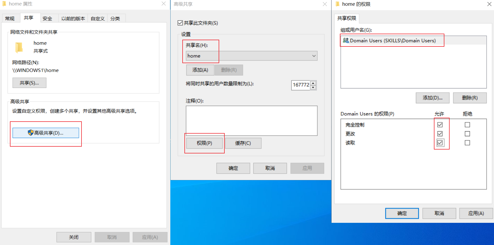
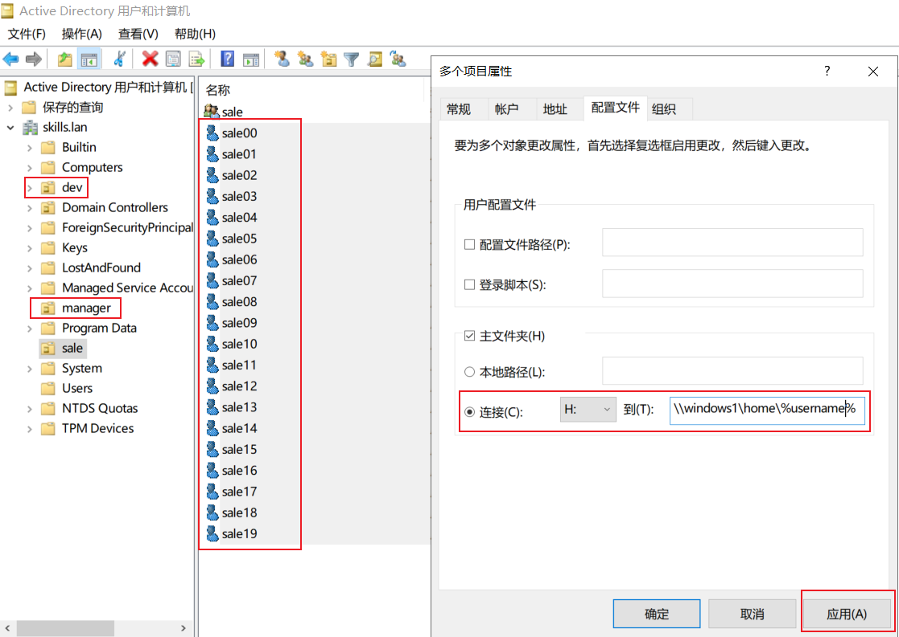
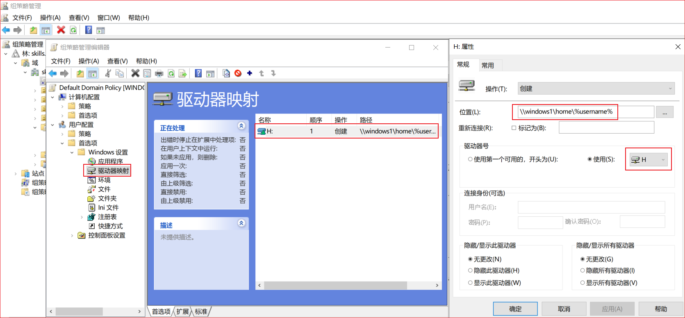
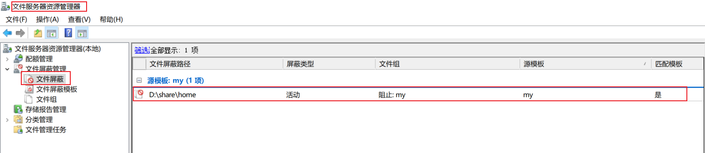
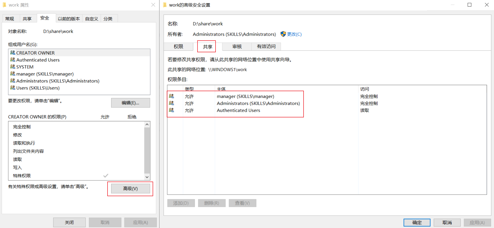
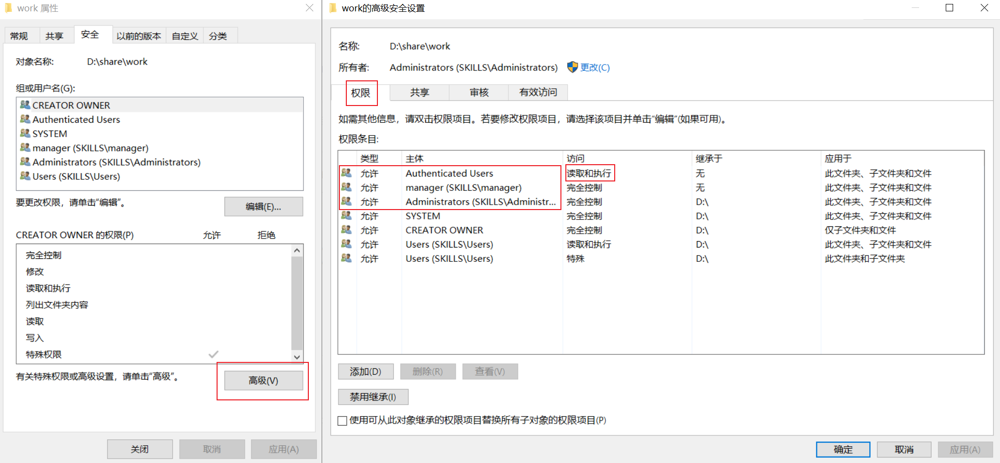
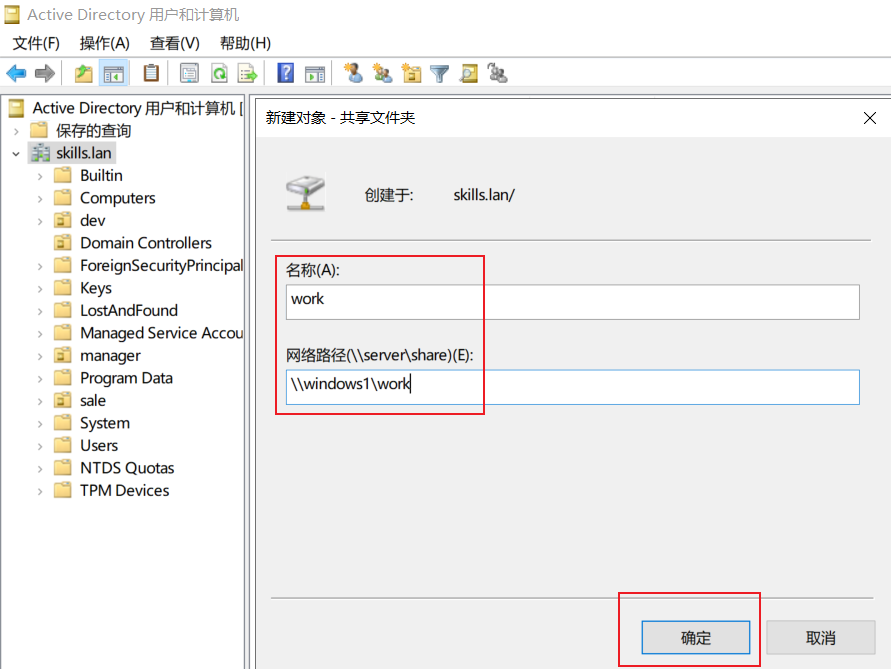

# 4、文件共享 √

## **题目：**
1、在windows1 的C分区划分2GB的空间，创建NTFS主分区，驱动器号 为D；创建用户主目录共享文件夹：本地目录为D:\share\home，共享名为home，允许所有域用户完全控制。在本目录下为所有用户添加一个以用户名命名的文件夹，该文件夹将设置为所有域用户的 home 目录，用户登录计算机成功后，自动映射挂载到h卷。禁止用户在该共享文件中创建“*.exe”文件，文件组名和模板名为my。

2、创建目录 D:\share\work，共享名为 work，仅 manager 组和 Administrator 组有完全控制的安全权限和共享权限，其他认证用户 有读取执行的安全权限和共享权限。在AD DS中发布该共享。  

## 配置步骤：
### 1小题
#### 创建NTFS主分区

VMware操作如下

如果创建不了主分区，压缩2G空间后，需打开AMD--输入diskpart--select disk 0--create partition primary

云平台操作如下：

说明：云平台qcow2镜像一般预设了系统盘大小，如实例规格中的容量大于预设，则会空出大量空间，这时正常方法是创建不了题目中的2G主分区的。

解决方法如下：

打开cmd 进行以下操作

#### 共享文件夹权限配置

#### 添加以用户命名的文件夹
下图只起到按名创建文件夹的作用

#### 配置组策略完成自动映射挂载

#### 文件屏蔽配置

### 2小题
#### work文件夹共享权限
服务器管理器--文件和存储服务--共享处进行修改

#### work文件夹安全权限
可禁用继承，删除无关用户或组，使结果更简洁

#### 在域中发布共享

> 更新: 2024-05-19 13:48:37  
> 原文: <https://www.yuque.com/gengmouren-1f9qn/whktvz/dmo6w32tqua9q3e5>