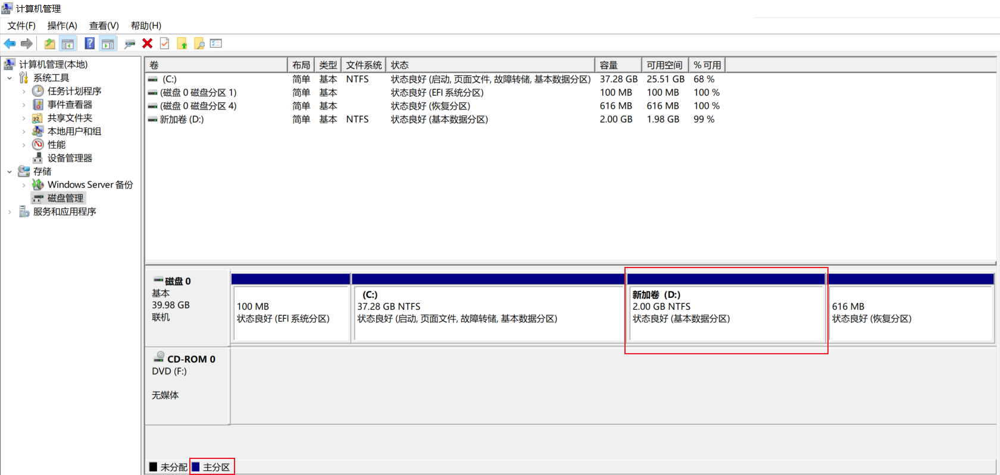
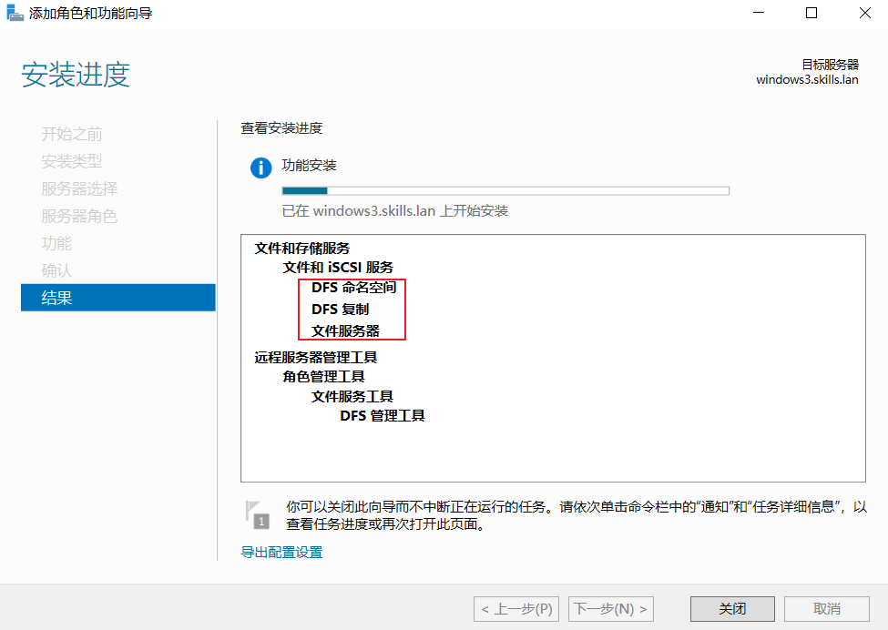
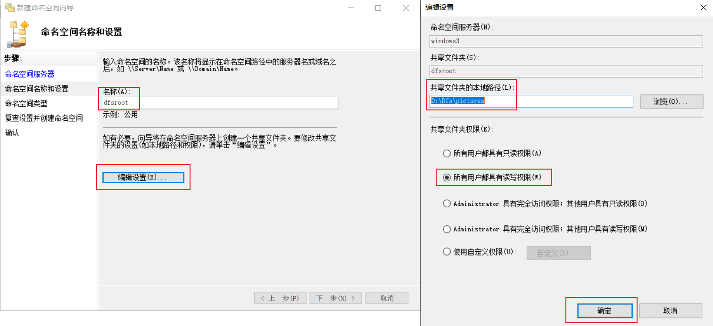
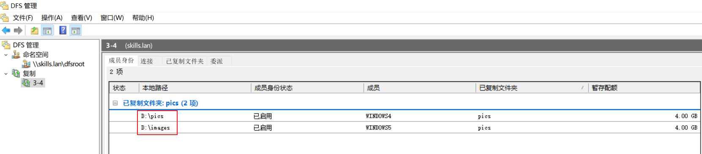
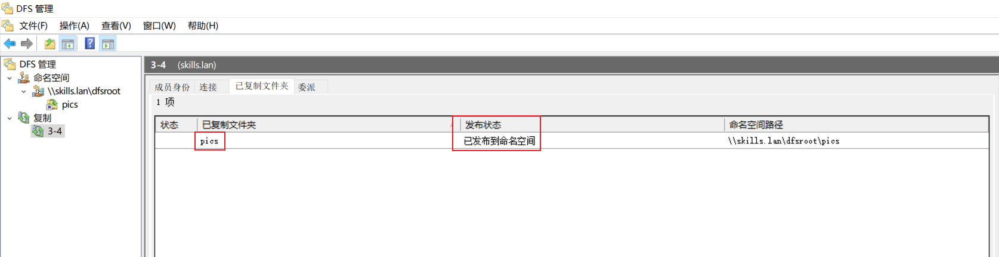
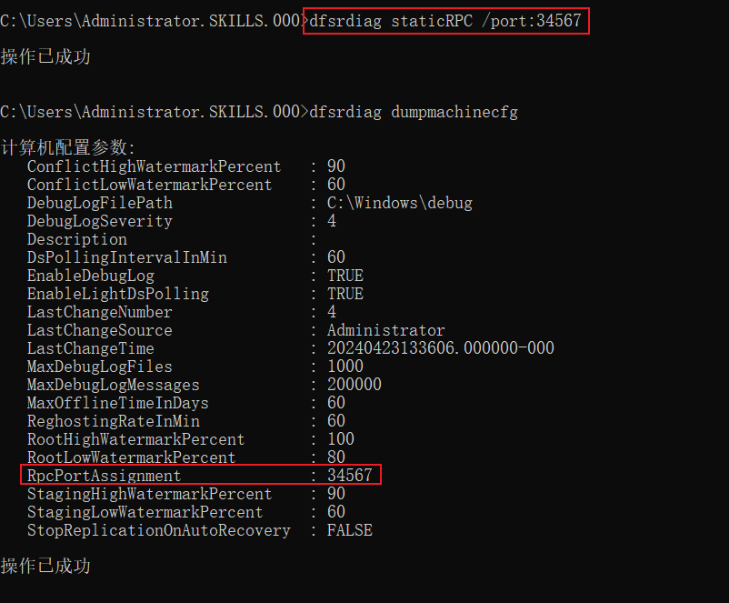
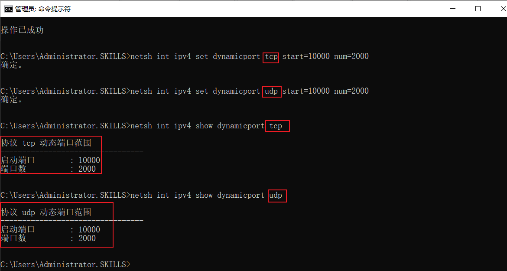

# 5、DFS服务 √

## **题目：**
 在windows3-windows5 的 C 分区分别划分2GB 的空间，创建NTFS主 分区，驱动器号为D。 配置 windows3 为 DFS 服务器，命名空间为 dfsroot，文件夹为 pictures，存储在D:\dfs，所有用户都具有读写权限；实现windows4 的D:\pics 和windows5 的D:\images 同步。配置windows4 的dfs IPv4 使用34567 端口；限制所有服务的IPv4 动态rpc端口从10000开始，共2000个端口号。  

## 配置步骤：
### 创建NTFS主分区
windows3-winodws5，压缩2GB空间后，依次如下图创建

注意 ！！！

1、若创建的分区不是主分区，需删除把空间空闲出来后，打开cmd执行

diskpart

select disk 0

create partition primary

再回到磁盘管理界面，进行格式化并分配盘符

2、若D盘符被其他盘占用，可以把其他盘重新分配盘符，把D空出来给新磁盘

### 安装DFS服务
windows3安装DFS命名空间、复制、文件服务器、其他两台安装复制与文件服务器即可

### 命名空间配置
如下图，未提及的选默认项即可

### 复制组配置
成员添加windows3和windows4,，复制的文件夹按题目要求命名

记得发布到命名空间，服务器文件夹选pics

### 指定端口
指定34567 端口配置及测试

### 限制端口
限制端口配置及测试

> 更新: 2024-04-29 08:45:44  
> 原文: <https://www.yuque.com/gengmouren-1f9qn/whktvz/efofb97qnnwrmym1>