# 6、ASP服务 √

## **题目：**
任务描述：请采用 IIS 搭建 web 服务，创建安全动态网站，。 

把 windows3 配置为 ASP 网站，网站仅支持 dotnet clr v4.0，站点名称为 asp。 

http 和 https 绑定本机与外部通信的 IP 地址，仅允许使用域名访问 （使用“计算机副本”证书模板）。客户端访问时，必需有 ssl 证书 （浏览器证书模板为“管理员”）。 

网 站 目 录 为 C:\iis\contents ， 默 认 文 档 index.aspx 内 容 为 "HelloAspx"。 

使用 windows5 测试。

## 配置步骤：
### web服务安装
注意勾选角色服务里的asp和asp.net 4.8

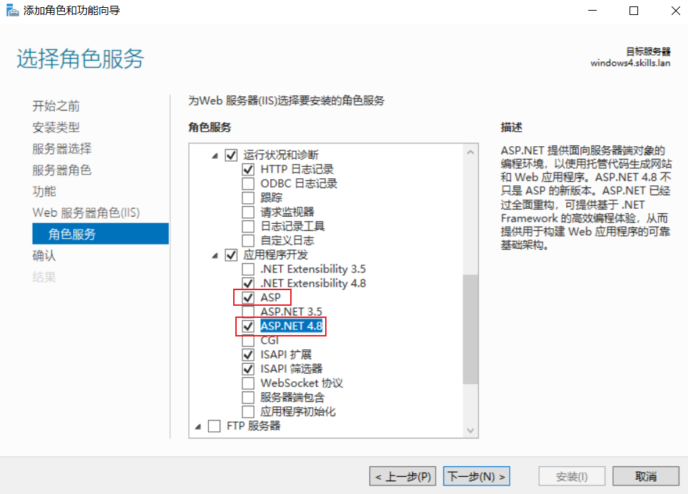

### 网站配置
右击新建网站，创建对应目录

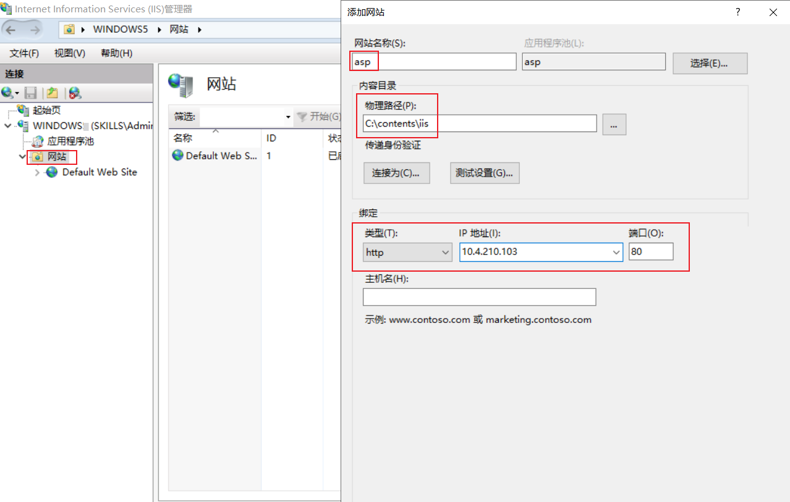

导入windows1提供的skills证书

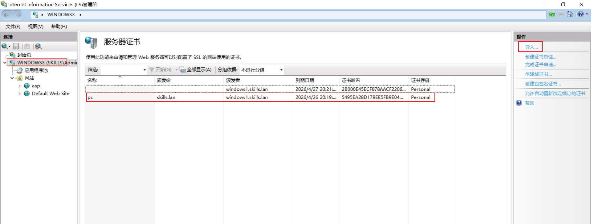右击asp网站，选择编辑绑定添加https绑定

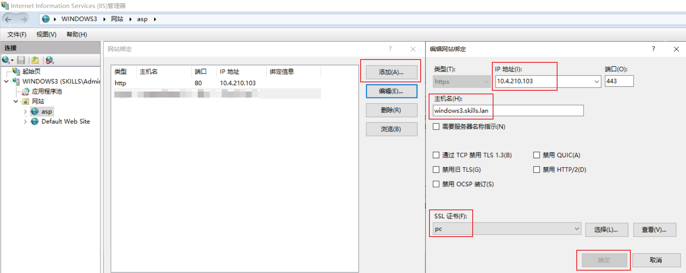

更改asp网站的应用池为经典dotnet clr v4.0

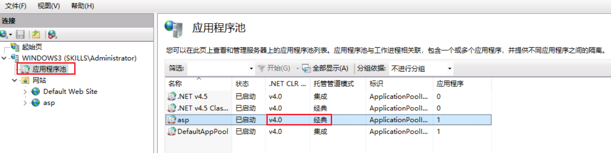

全局处启用ASP父路径

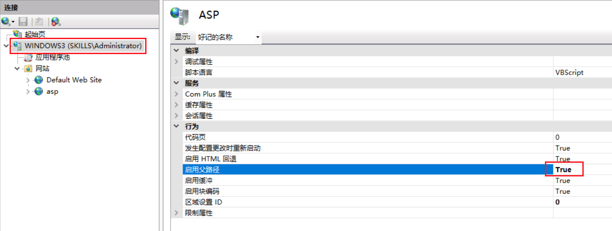

添加MIME类型，使其支持aspx格式的文件

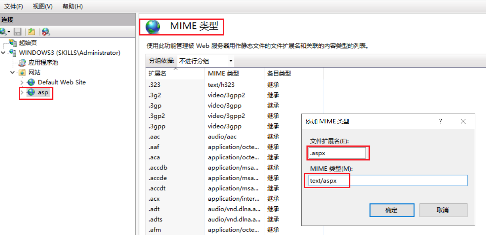

手动在网站目录下新建index.aspx并添加内容HelloAspx，然后如下图添加默认文档

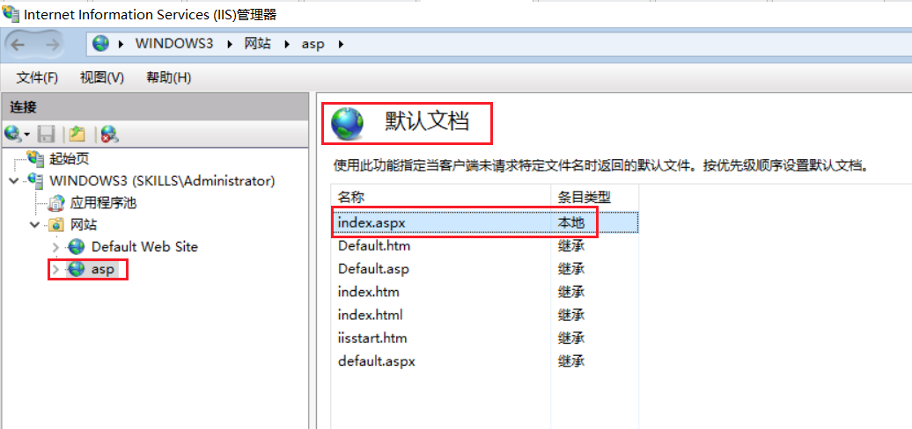

### 测试
windows5申请管理员证书，公用名Windows3.skills.lan，dns为Windows3.skills.lan

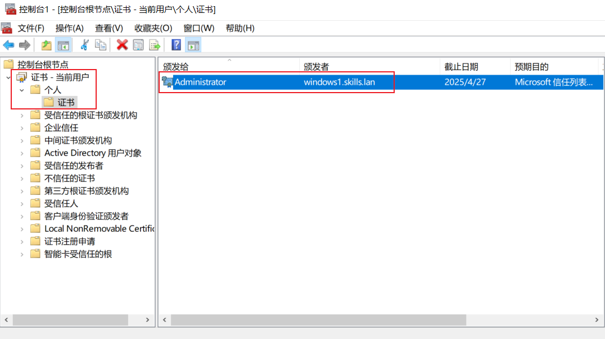

使用IE浏览器访问

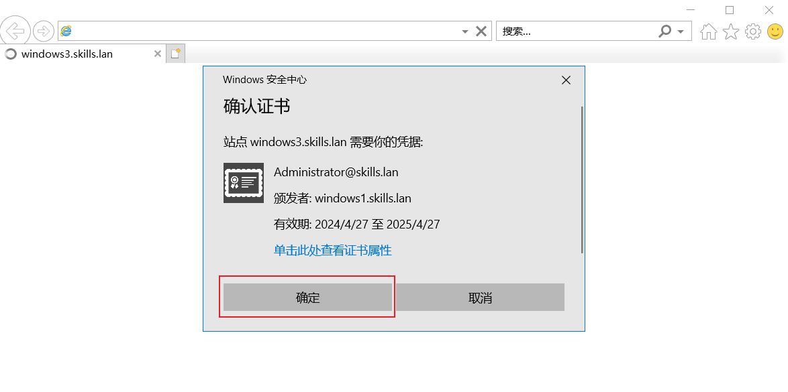

域名正常访问，IP无法访问

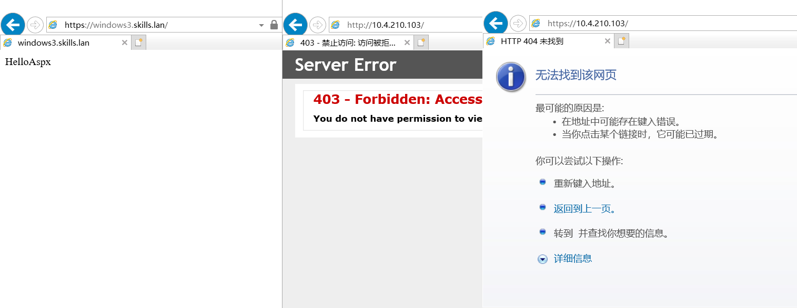

> 更新: 2024-04-29 08:45:44  
> 原文: <https://www.yuque.com/gengmouren-1f9qn/whktvz/pccwbzugsc9cd0ei>