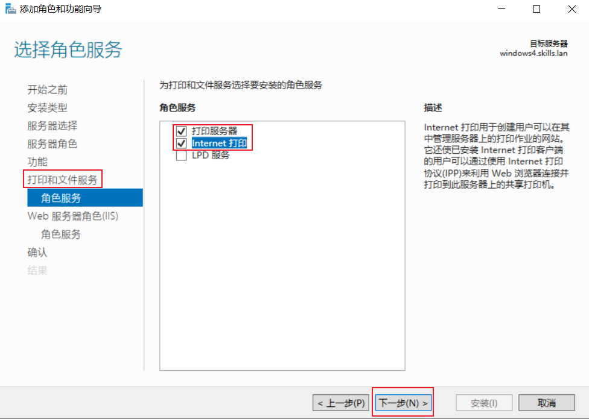
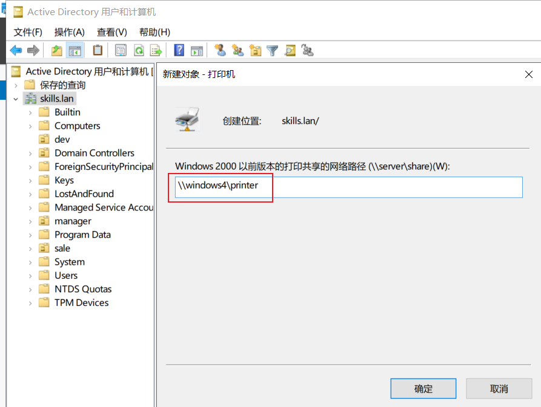

# 7、打印服务 √

## **题目：**
任务描述：请采用共享打印服务，实现共享打印的安全性。

1、在 windows4 上安装打印机，驱动程序为“Ms Publisher Color Printer”，名称和共享名称均为“printer”；在域中发布共享；使用组策略部署在"Default Domain Policy"的计算机。

2、网站名称为 printer，http 和https 绑定主机 IP 地址，仅允许使用域名访问，启用 hsts，实现 http 访问自动跳转到 https（使用“计算机副本”证书模板）。

3、用浏览器访问打印机虚拟目录 printers 时，启用匿名身份认证，匿 名用户为 manager00。

4、新建虚拟目录 dev，对应物理目录 C:\development，该虚拟目录启用 windows 身份验证，默认文档 index.html 内容为"development"。  

## 配置步骤：
### 1小题
#### 安装打印服务
安装打印和文件服务，勾选打印服务器、Internet打印，web服务记得勾选IP和域名限制

#### 添加部署打印机
打开打印管理--进行下图配置

#### 在域中发布共享

### 2小题
网站创建

网站名称：perinter 

物理路径：C:\Windows\Web\Printers

默认文档：ipp_0001.asp

限制仅域名访问

导入用户证书

绑定https

http自动跳转https

### 3小题
右击网站名称添加虚拟目录--名称dev--创建选择对应物理目录--新建index.txt文件--写入内容--修改为index.html---在虚拟目录默认文档处将index.html移到前列--测试图如下

> 更新: 2024-04-29 08:45:45  
> 原文: <https://www.yuque.com/gengmouren-1f9qn/whktvz/ldk66ky22sgl2bgk>