# 8、NLB服务 √

## **题目：**
配置windows5 和windows6 为NLB服务器。 

1、windows5 群集优先级为5，windows6 群集优先级为6，群集IPv4地 址为10.4.210.60/24，群集名称为www.skills.lan，采用多播方式。 

2、配置windows5 为 web 服务器，站点名称为 www，网站的最大连接数 为10000，网站连接超时为60s，网站的带宽为100Mbps。

3、共享网页文件、共享网站配置文件和网站日志文件分别存储到 windows1 的 D:\FilesWeb\Contents 、 D:\FilesWeb\Configs 和 D:\FilesWeb\Logs。网站主页index.html 内容为"HelloNLB"。

4、使用W3C记录日志，每天创建一个新的日志文件，日志只允许记录日期、时间、客户端IP地址、用户名、服务器IP地址、服务器端口号。 网站仅绑定https，IP 地址为群集地址，仅允许使用域名加密访问， 使用“计算机副本”证书。

5、配置windows6 为 web 服务器，要求采用共享windows5配置的方式， 使用“计算机副本”证书。

## 配置步骤：
### 1小题
1、确保网卡已添加，并设置了相应IP

2、windows5、windows6安装web服务（添加IP和域名限制组件）、网络负载均衡功能

3、window5打开网络负载平衡管理器，进行下图配置，windows6刷新即可，无需配置：

注：windows6的接口是二次添加

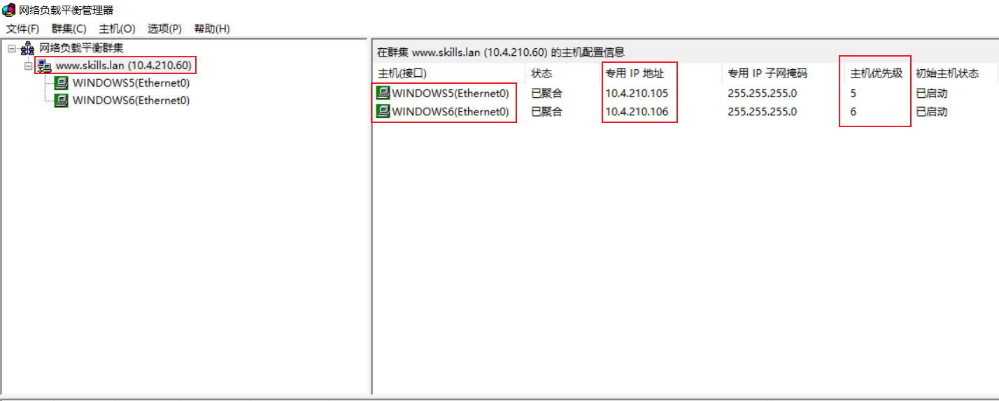

### 3小题
#### 文件夹创建
按要求在windows1创建文件夹--设置共享--新建主页文件--写入内容-改为html格式

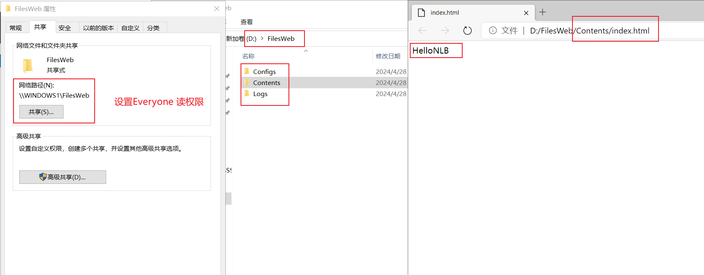

### 2小题
#### 新建网站
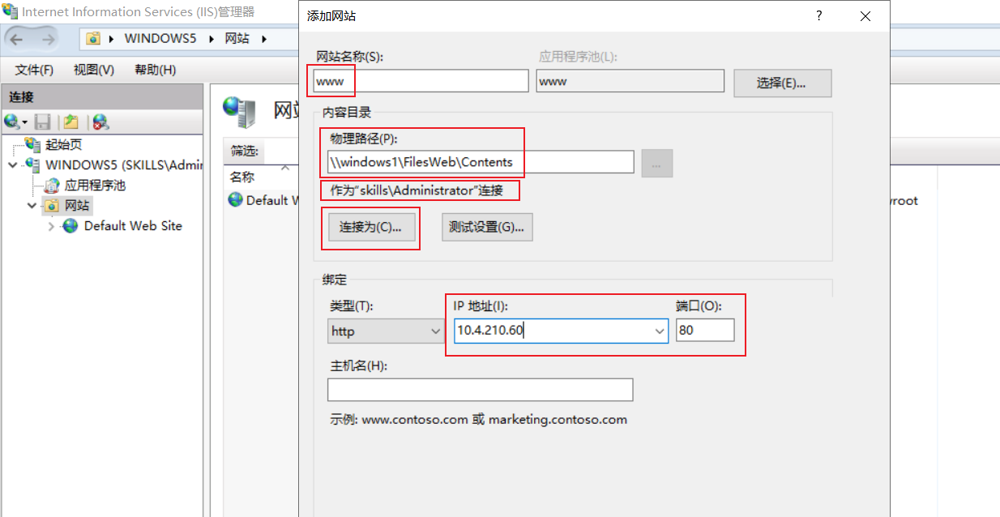

#### 网站限制
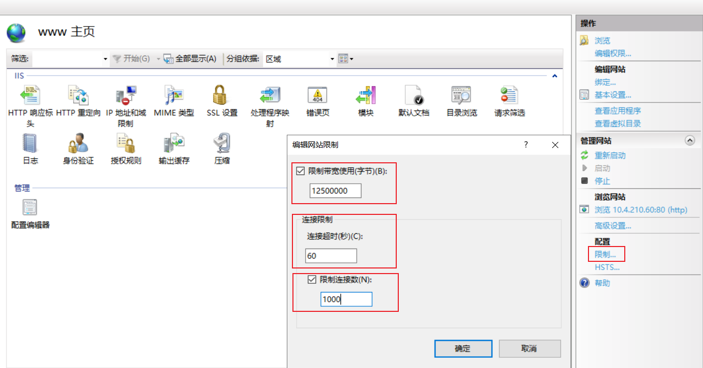

### 4小题
#### 日志记录
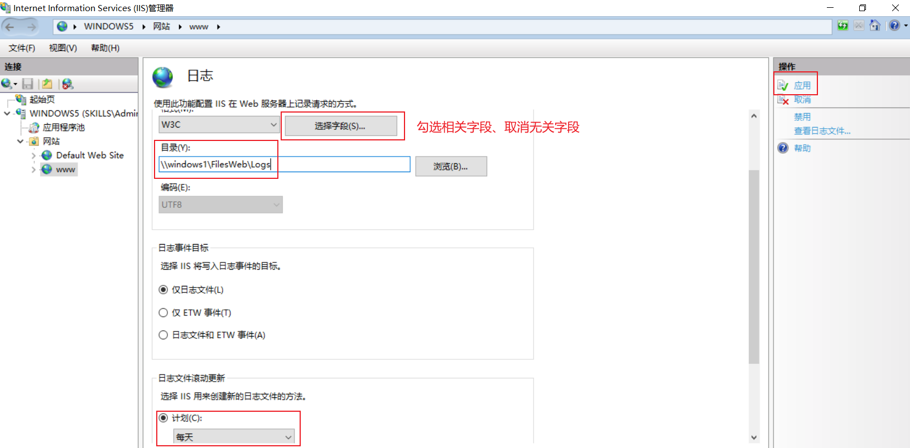

#### https配置
导入证书、添加443端口绑定、删除80端口的绑定

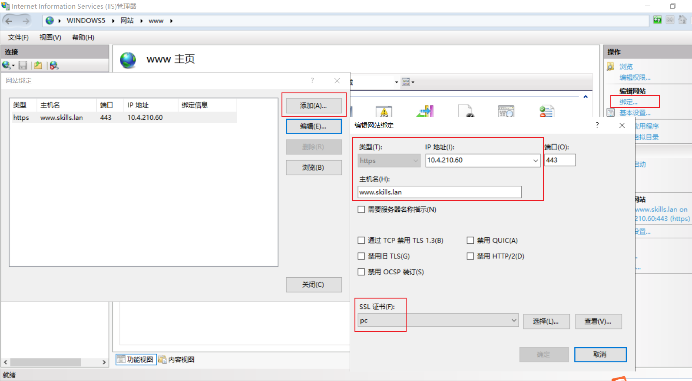

#### dns解析
windows1 做www与210.60的正反向记录

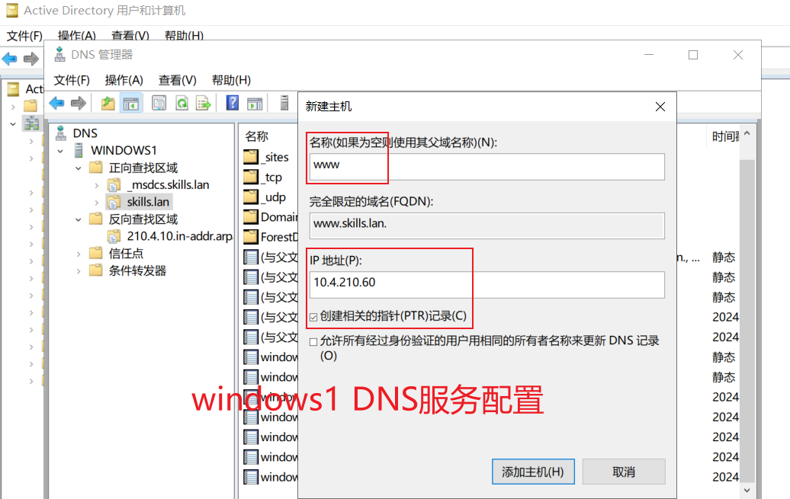

#### 访问主页
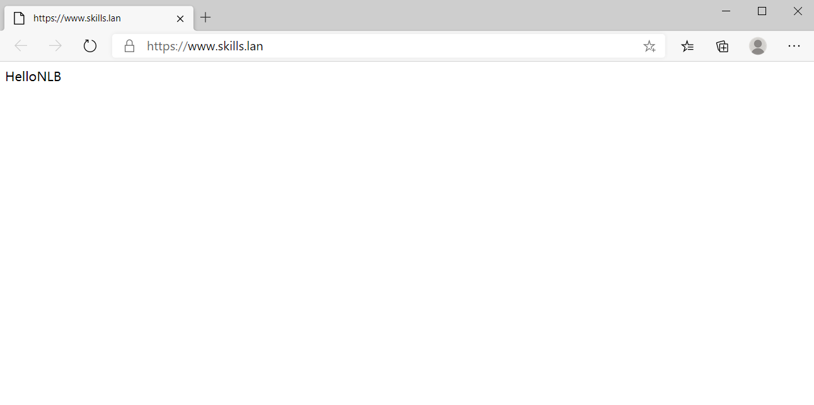

#### 仅域名访问
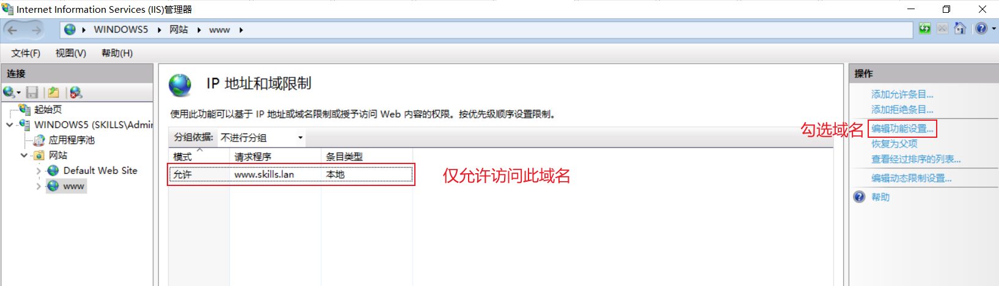

### 5小题
#### 共享配置
加密密码需包含字符大小写

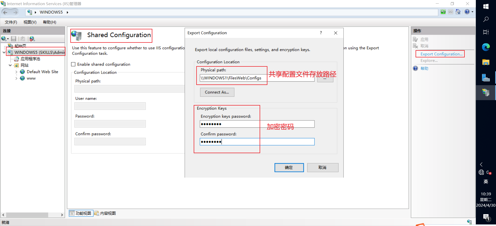

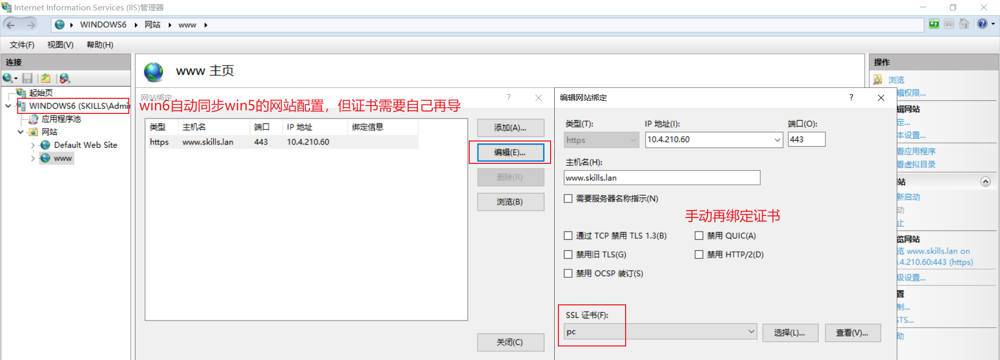

上图可先导win6证书再配置共享，这样顺序就合理得多

> 更新: 2024-04-30 16:02:07  
> 原文: <https://www.yuque.com/gengmouren-1f9qn/whktvz/hgl6gtdg59locgw6>