# 1、网络运维

## **<font style="color:rgb(0,0,0);">题目：</font>**
 任务描述：某集团公司在更新设备后，路由之间无法正常通信，请修 复网络达到正常通信。 

（1） 请在server1“管理员”下拉菜单中选择“镜像”选项卡，点 击 “创建镜像”按钮，弹出“创建镜像”对话框后，名称为eve-ng， 镜像文件请在U盘soft目录下选择“eve-ng.qcow2”文件，“镜像格 式”为qcow2格式，“最小磁盘”和“最低内存”不填，单击“创建 镜像”按钮完成镜像创建。 

（2） 用上述eve-ng镜像创建虚拟机，虚拟机名称为eve-ng，IP地 址为10.4.210.110/24，虚拟机实例类型为Skills。 

（3） 通过http://10.4.210.110 运行 eve-ng 虚拟机，登录用户名 为admin，密码为eve，html5 console，启动所有网络设备。 

（4） 完善设备配置，请在最少改动设备路由协议的基础上，实现所有设备的loopback1之间通信。 

（5） 在每台设备图标上右击，从弹出菜单中选择“export CFG”， 在左侧的面板中选择“Startup-configs”，依次单击设备图标，复制 右侧文本框内容，保存到选手目录中以设备名称命名的文本文件 （R1.txt，R2.txt，R3.txt）。  

## <font style="color:rgb(0,0,0);">配置步骤：</font>
### 1小题
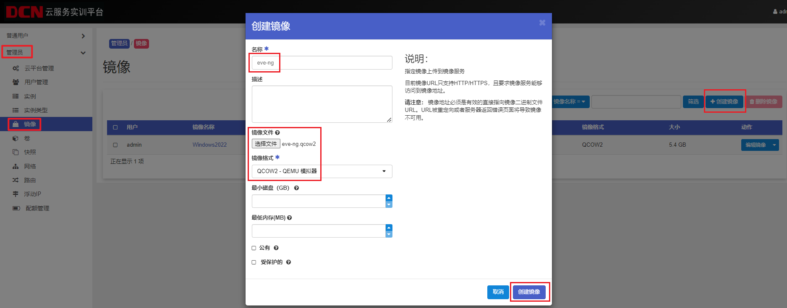

### 2小题
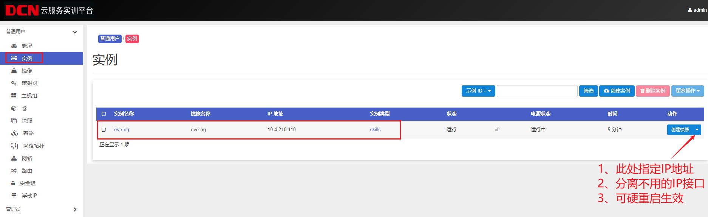

### 3小题
PC与210网络通过交换机通信

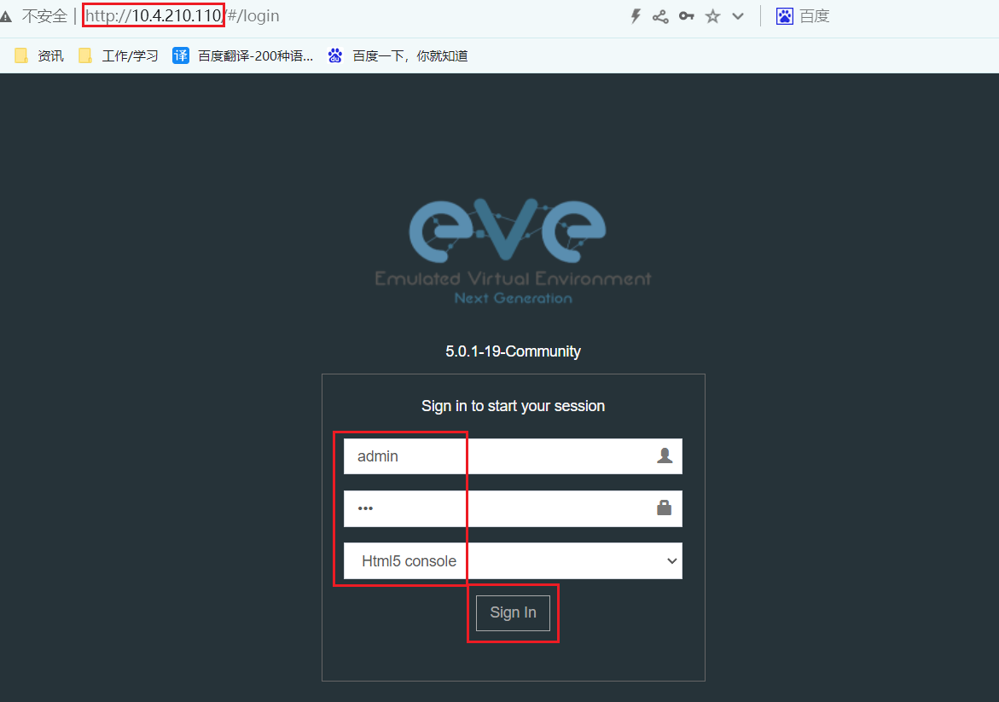

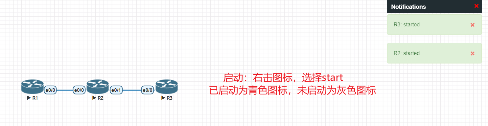

双击图标进入命令行，进入后按回车检查是否可正常操作


### 4小题
#### 检查现有配置和状态
进入设备命令行后，先检查各设备的接口IP及路由表

show ip interface b

show ip route

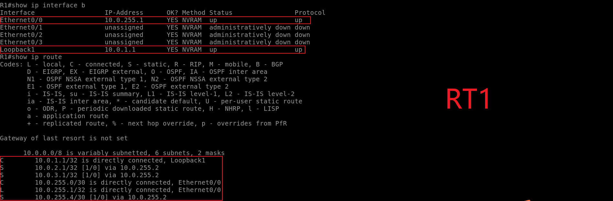

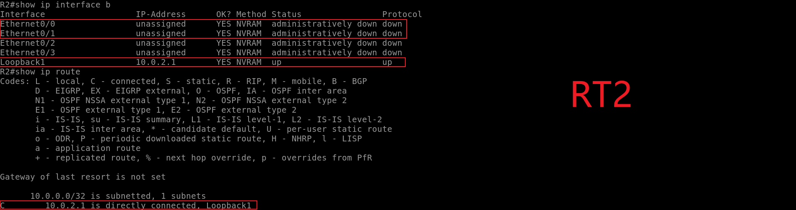

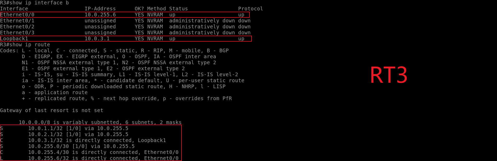

#### **分析**
**由上图可见**

RT1物理接口和lo接口 IP配置及接口状态正常，路由条目正常

RT2 物理接口<font style="color:#DF2A3F;">无IP</font>，lo口IP配置及接口状态正常

RT3物理接口和lo接口 IP配置及接口状态正常，路由条目正常

得出信息：通过RT1和RT3的E0/0口，可得出RT2 E0/0接口IP为10.0.255.2/30，E0/1接口IP为10.0.255.5/30

#### **配置**
##### <font style="color:#DF2A3F;">1、RT2配置物理接口IP地址</font>
```plain
int e0/0
ip address 10.0.255.2 255.255.255.252
no shutdown
int e0/1
ip address 10.0.255.5 255.255.255.252
no shutdown
```

查看接口状态、测试连通性

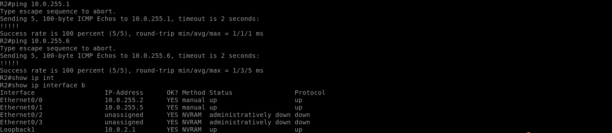

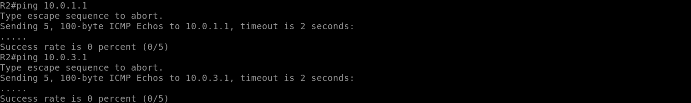

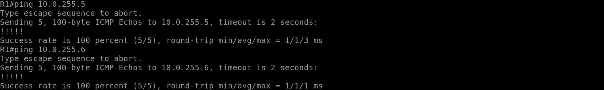

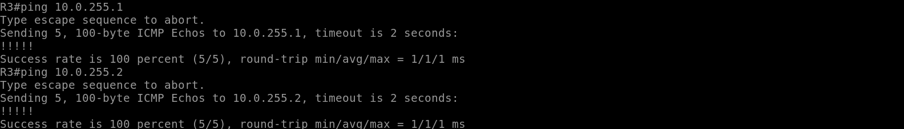

如上图所示，所有物理接口可以互通，但lo口还是无法连通，原因如下：

物理接口为什么能互通？

因为物理接口的接口虽然有4个，但只有两个网络，255.1和255.2是1个网络，255.5和255.6是1个网络，而中间设备RT2同时存在这两个网络，所以RT1和RT3在互访时，RT2能够正常寻路。

lo口为什么无法互通？

因为3台设备上的lo口是独立的网络，它们没有邻居，所以在每台设备上都需要添加到目的的具体路由

##### <font style="color:#DF2A3F;">2、RT2添加到lo口的路由</font>
```plain
ip route 10.0.1.1 255.255.255.255 10.0.255.1
ip route 10.0.3.1 255.255.255.255 10.0.255.6
```

查看

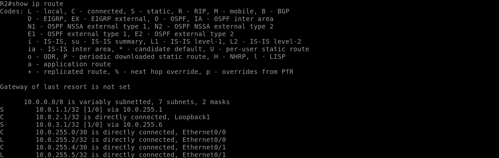

验证

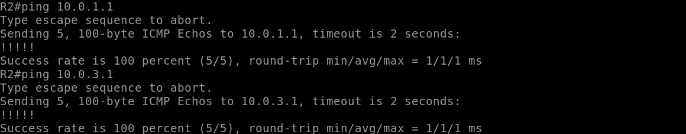

### 5小题
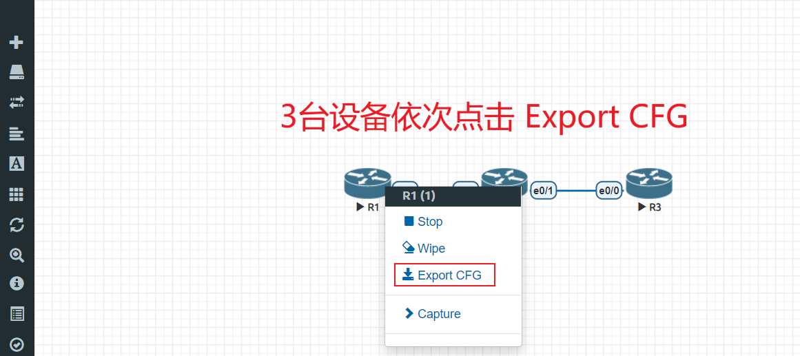

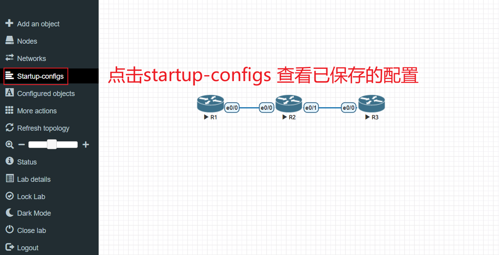

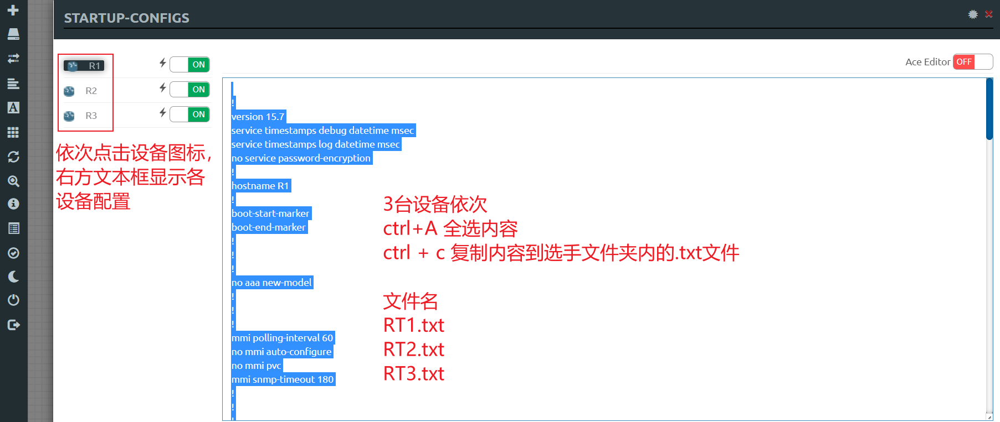


> 更新: 2024-05-19 14:01:31  
> 原文: <https://www.yuque.com/gengmouren-1f9qn/whktvz/rogymfkiseqd7zgg>