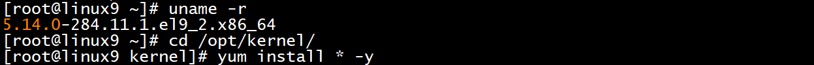
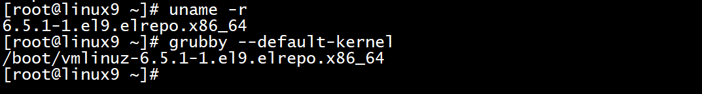

# 2、系统运维

## **题目：**
 任务要求：为保证linux9 系统稳定性，请在不破坏原有服务的基础 上，升级linux9的内核kernel，删除旧版本kernel。  

## 配置步骤：
注意事项：

操作顺序不要颠倒，升级--重启--卸载

准备工作：

将相应内核版本的RPM包放入linux9

scp -r /kernel root@10.4.220.109:/opt/

### 一、查询及升级
uname -r   #查看当前启动内核版本

cd /opt/kernel/   #切换至软件包所在目录

yum install * -y   #安装当前目录下的所有

reboot #重启生效

### 二、删除旧版本
yum remove kernel-5.14.0-284.11.1.el9_2.x86_64   #卸载软件名为kernel，版本可复制uname -r的查询结果

### 三、验证
uname -r				#查看当前启动内核版本

grubby --default-kernel  #查看默认内核

> 更新: 2024-05-18 20:36:33  
> 原文: <https://www.yuque.com/gengmouren-1f9qn/whktvz/zgusyk4hq5z3e78b>