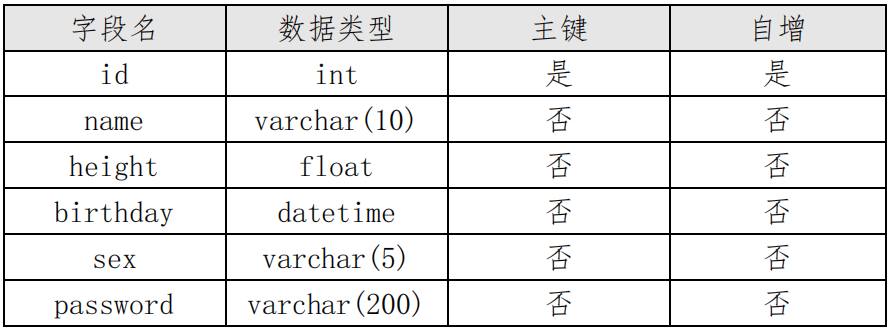
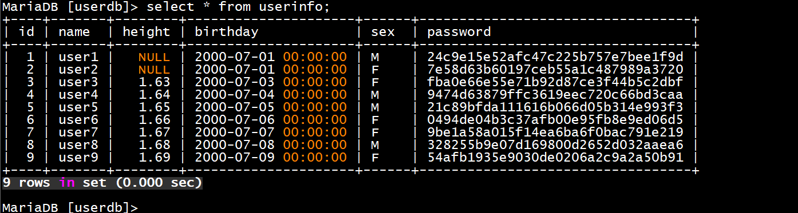
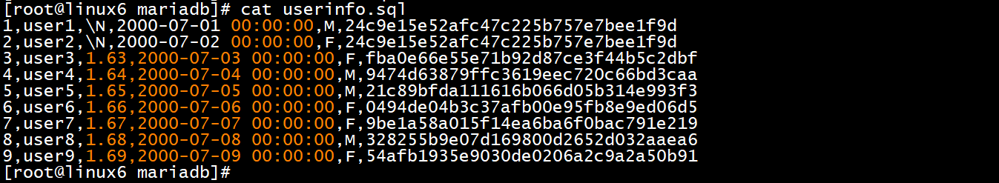
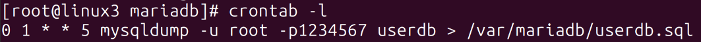

# 10、mariadb服务 √

## **<font style="color:rgb(0,0,0);">题目：</font>**
<font style="color:rgb(0,0,0);">请安装 mariadb 服务，建立数据表。 </font>

<font style="color:rgb(0,0,0);">1、配置 linux3 为 mariadb 服务器，创建数据库用户 xiao，在任意机器上对所有数据库有完全权限。</font>

**<font style="color:rgb(0,0,0);">2、</font>**<font style="color:rgb(0,0,0);">创建数据库 userdb；在库中创建表 userinfo，表结构如下： </font>



<font style="color:rgb(0,0,0);">3、在表中插入 2 条记录，分别为(1,user1,1.61,2000-07-01，M)， (2,user2，1.62,2000-07-02，F)，password 字段与 name 字段相同， password 字段用 md5 函数加密。 </font>

<font style="color:rgb(0,0,0);">4、新建/var/mariadb/userinfo.txt 文件，文件内容如下，然后将文件内容导入到 userinfo 表中，password 字段用 md5 函数加密。 </font>

<font style="color:rgb(0,0,0);">3,user3,1.63,2000-07-03,F,user3 </font>

<font style="color:rgb(0,0,0);">4,user4,1.64,2000-07-04,M,user4 </font>

<font style="color:rgb(0,0,0);">5,user5,1.65,2000-07-05,M,user5 </font>

<font style="color:rgb(0,0,0);">6,user6,1.66,2000-07-06,F,user6 </font>

<font style="color:rgb(0,0,0);">7,user7,1.67,2000-07-07,F,user7 </font>

<font style="color:rgb(0,0,0);">8,user8,1.68,2000-07-08,M,user8 </font>

<font style="color:rgb(0,0,0);">9,user9,1.69,2000-07-09,F,user9 </font>

<font style="color:rgb(0,0,0);">5、将表 userinfo 中的记录导出，并存放到/var/mariadb/userinfo.sql，字段之间用','分隔。 </font>

<font style="color:rgb(0,0,0);">6、为 root 用户创建计划任务（day 用数字表示），每周五凌晨 1:00 备</font>**<font style="color:rgb(0,0,0);"></font>**<font style="color:rgb(0,0,0);">份数据库 userdb(含创建数据库命令)到/var/mariadb/userdb.sql。 </font>

<font style="color:rgb(0,0,0);">（为便于测试，手动备份一次。）</font>

## <font style="color:rgb(0,0,0);">配置步骤：</font>
## 1小题
### 1.1 安装和基础配置
```plain
yum install mariadb* -y
systemctl enable mariadb --now 开机自启并现在启动
mysql_secure_installation 设置root密码  输入后按回车
[root@linux5 ~]# mysql -uroot -p登录数据库
```

### 1.2 创建用户并分配权限
```plain
MariaDB [(none)]> show databases;查看所有库
MariaDB [(none)]> select user from mysql.user; #查看数据库用户
MariaDB [(none)]> grant all privileges on *.* to xiao@10.1.220.103 identified by '123456'; #授权并创建用户
MariaDB [(none)]> show grants for 'xiao'@'10.1.220.103';   #查看用户权限
```

注：xiao@本地可以在本机上登录，xiao@IP地址，无法在本地登录mariadb

## 2小题
### 2.1创建数据库和创建表
```plain
create database userdb; #创建数据库
use userdb; 切换到userdb数据库
create table userinfo(id int auto_increment,name varchar(10),height float,birthday datetime,sex varchar(5),password varchar(200) not null,primary key(id));
创建表
```

## 3小题
```plain
insert into userinfo(id,name,birthday,sex,password) values ('1','user1','2000-7-1','M',md5('user1'));
insert into userinfo(id,name,birthday,sex,password) values ('2','user2','2000-7-1','F',md5('user2'));
```

<details class="lake-collapse"><summary id="u699b8244"><span class="ne-text" style="font-size: 19px">扩展命令：</span></summary><p id="u1987ff5e" class="ne-p"><span class="ne-text" style="font-size: 19px">desc userinfo; #查看表结构</span></p><p id="u290b5712" class="ne-p"><span class="ne-text" style="font-size: 19px">select * from userinfo; #查看userinfo表记录</span></p><p id="u6e61bfe8" class="ne-p"><span class="ne-text" style="font-size: 19px"></span></p><p id="u04f5cc8e" class="ne-p"><span class="ne-text" style="font-size: 19px">password字段password加密应写成</span></p><p id="u879ea4fe" class="ne-p"><span class="ne-text" style="font-size: 19px">insert into userinfo(id,name,birthday,sex,password) values ('1','user1','2000-7-1','M',</span><span class="ne-text" style="color: #DF2A3F; font-size: 19px">password</span><span class="ne-text" style="font-size: 19px">('user1'));</span></p></details>


## 4小题
### 4.1 创建文件路径并复制内容到该文件中


### 4.1 在mariadb中输入以下命令导入
 load data local infile '/var/mariadb/userinfo.txt' into table userinfo fields terminated by ',' lines terminated by '\n' (id,name,height,birthday,sex,password) set password=md5(password);

 #导入txt文件中的表记录到userinfo表的id,name,height等字段中



## 5小题
```plain
chmod 777 /var/mariadb #授予权限

vi /etc/selinux/config #建议永久关闭selinux

进入mariadb输入以下命令导出以逗号隔开的记录
select * from userinfo into outfile '/var/mariadb/userinfo.sql' fields terminated by ',';
```



## 6小题
crontab -e    #使用crontab创建任务，写入以下内容：


crontab -l  #查看任务列表



下图看说明：


> 更新: 2024-04-28 10:14:33  
> 原文: <https://www.yuque.com/gengmouren-1f9qn/whktvz/evq0lwq5mqh5w3i7>