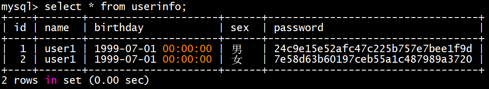
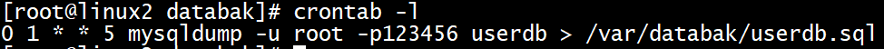

# 11、mysql服务 √

mysql服务

任务描述：请安装mysql服务，建立数据表。

（1）配置linux2为mysql服务器，创建数据库用户xiao，在任意机器上对所有数据库有完全权限。

（2）创建数据库userdb；在库中创建表userinfo，表结构如下：

| <font style="color:black;">字段名</font> | <font style="color:black;">数据类型</font> | <font style="color:black;">主键</font> | <font style="color:black;">自增</font> |
| :---: | :---: | :---: | :---: |
| id | int | 是 | 是 |
| name | varchar(10) | 否 | 否 |
| birthday | datetime | 否 | 否 |
| sex | varchar(5) | 否 | 否 |
| password | varchar(200) | 否 | 否 |


（3）在表中插入2条记录，分别为(1,user1，1999-07-01，男)，(2,user2，1999-07-02，女)，password与name相同，password字段用password函数加密。

（4）修改表userinfo的结构，在name字段后添加新字段height(数据类型为float)，更新user1和user2的height字段内容为1.61和1.62。

（5）新建/var/mysqlbak/userinfo.txt文件，文件内容如下，然后将文件内容导入到userinfo表中，password字段用password函数加密。

3,user3,1.63,1999-07-03,女,user3

4,user4,1.64,1999-07-04,男,user4

5,user5,1.65,1999-07-05,男,user5

6,user6,1.66,1999-07-06,女,user6

7,user7,1.67,1999-07-07,女,user7

8,user8,1.68,1999-07-08,男,user8

9,user9,1.69,1999-07-09,女,user9

（6）将表userinfo的记录导出，存放到/var/databak/mysql.sql，字段之间用','分隔。

（7）每周五凌晨1:00以root用户身份备份数据库userdb到/var/databak/userdb.sql(含创建数据库命令)。


## 1小题
 yum install mysql-server.x86_64 

systemctl start mysqld

 mysql_secure_installation 

mysql -u root -p

create user 'xiao'@'%' identified by '123456';

grant all privileges on *.* to 'xiao'@'%';

flush privileges;


## 2小题
create database userdb charset utf8;

use userdb;

create table userinfo(id int auto_increment,name varchar(10),birthday datetime,sex varchar(5),password varchar(200),primary key(id));


## 3小题
**注：mysql8.0版本取消了password函数加密，可选加密方式有md5/SHA等**

insert into userinfo(id,name,birthday,sex,password) values ('1','user1','1999-7-1','男',md5('user1'));

insert into userinfo(id,name,birthday,sex,password) values ('2','user1','1999-7-1','女',md5('user2'));



## 4小题
alter table userinfo add height float after name;


update userinfo set height=1.61 where name="user1";

update userinfo set height=1.62 where name="user2";


## 5小题
mkdir -p /var/mysqlbak/

touch /var/mysqlbak/userinfo.txt

 chmod 777 /var/mysqlbak/userinfo.txt

```plain
3,user3,1.63,1999-07-03,女,user3
4,user4,1.64,1999-07-04,男,user4
5,user5,1.65,1999-07-05,男,user5
6,user6,1.66,1999-07-06,女,user6
7,user7,1.67,1999-07-07,女,user7
8,user8,1.68,1999-07-08,男,user8
9,user9,1.69,1999-07-09,女,user9
```

mysql -u root

mysql> use userdb;

SET GLOBAL local_infile = true;  #<font style="color:rgb(34, 34, 38);">启用或禁用本地数据加载功能</font>，此设置为单次，重启mysql之后失效

SHOW GLOBAL VARIABLES LIKE 'local_infile';  #查看local_infile 状态


<details class="lake-collapse"><summary id="uf3758b31"><span class="ne-text">导入userinfo内记录并md5加密password字段</span></summary><p id="u70c90236" class="ne-p"><span class="ne-text">load data local infile '/var/mysqlbak/userinfo.txt' into table userinfo fields terminated by ',' lines terminated by '\n' (id,name,height,birthday,sex,password) set password=md5(password);</span></p></details>
mysql> select * from userinfo;


## 6小题
mkdir -p /var/databak/

chmod 777 /var/databak/

<details class="lake-collapse"><summary id="u4d03a108"><span class="ne-text">vi /etc/my.cnf.d/mysql-server.cnf </span></summary><p id="u8214670b" class="ne-p"><span class="ne-text">在[mysqld]下添加以下内容</span></p><p id="u4d2e421e" class="ne-p"><span class="ne-text">secure-file-priv=/var/databak/</span></p></details>


mysql> select * from  userinfo into outfile '/var/databak/mysql.sql' fields terminated by ',';


## 7小题
touch userdb.sql

chmod 777 userdb.sql

<details class="lake-collapse"><summary id="ude8b99c0"><span class="ne-text">crontab -u root -e  #写入以下内容</span></summary><p id="ub5df4a0c" class="ne-p"><span class="ne-text">0 1 * * 5 mysqldump -u root -p123456 userdb &gt; /var/databak/userdb.sql</span></p></details>


date -s "2023-7-22 00:59:57"   #设置时间


> 更新: 2024-05-03 12:06:24  
> 原文: <https://www.yuque.com/gengmouren-1f9qn/whktvz/utl7dkgs2aogfy2g>