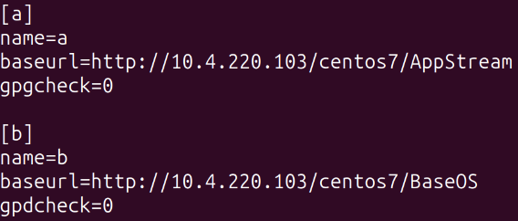

# 13、podman服务-arm √

## **<font style="color:rgb(0,0,0);">题目：</font>**
<font style="color:rgb(0,0,0);">请采用 podman，实现容器虚拟化技术。 </font>

<font style="color:rgb(0,0,0);">1、在 linux3 上安装 podman，导入 rockylinux-9.tar 镜像。 创建名称为 skills 的容器，映射本机的 8000 端口到容器的 80 端口， 在容器内安装 httpd，默认网页内容为“HelloPodman”。 </font>

<font style="color:rgb(0,0,0);">2、配置 https 访问的私有仓库，登录用户和密码均为 admin。导入registry.tar 镜像，创建名称为 registry 的容器。 </font>

<font style="color:rgb(0,0,0);">3、修 改 rockylinux 镜像的tag为linux3.skills.lan:5000/rockylinux:9，上传该镜像到私有仓库。</font>

<font style="color:rgb(0,0,0);"></font>

## <font style="color:rgb(0,0,0);">配置步骤：</font>
## 1小题
### 1.1 安装podman
yum install podman* -y

systemctl enable --now podman

### 1.2 导入<font style="color:rgb(0,0,0);">镜像</font>
<font style="color:rgb(0,0,0);">podman load -i rockylinux-9.tar</font>

<font style="color:rgb(0,0,0);">podman images  #查看导入的镜像信息</font>


### <font style="color:rgb(0,0,0);">1.3 创建容器</font>
<font style="color:rgb(0,0,0);">podman run -itd -p 8000:80 --name skills name/ID /bin/bash</font>

<details class="lake-collapse"><summary id="u538cf111"><span class="ne-text" style="color: rgb(0,0,0); font-size: 19px">注意！</span></summary><p id="u744f8117" class="ne-p"><span class="ne-text" style="color: rgb(0,0,0); font-size: 19px">加/bin/bash 让用户与容器能正常交互，</span><span class="ne-text" style="color: rgb(7, 19, 62); font-size: 16px">即启动一个Bash shell</span></p></details>
```plain
podman ps -a				#查看容器
podman stop skills  #停止容器
podman start skills #启动容器
podman rm skills		#删除容器
podman images							#查看容器
podman rmi 镜像名:tag/ID	#删除镜像

```

### <font style="color:rgb(0,0,0);">1.4 容器配置</font>
<font style="color:rgb(0,0,0);">podman exec -it skills bash #以bash启动进入skills容器</font>

### <font style="color:rgb(0,0,0);">1.5 在容器中安装httpd，进行相应配置</font>
<font style="color:rgb(0,0,0);">配置http网络源</font>



<font style="color:rgb(0,0,0);">yum clean all </font>

<font style="color:rgb(0,0,0);">yum makecache</font>

<font style="color:rgb(0,0,0);"></font>

<font style="color:rgb(0,0,0);">yum install httpd</font>

<font style="color:rgb(0,0,0);">echo "Helledocker" > /var/www/html/index.html</font>

<font style="color:rgb(0,0,0);">httpd -k start</font>

<font style="color:rgb(0,0,0);">curl localhost</font>

## <font style="color:rgb(0,0,0);">2小题</font>
### 2.1 配置私有仓库
<font style="color:rgb(0,0,0);">vim /etc/containers/registries.conf</font>

<font style="color:rgb(0,0,0);">prefix = "linux3.skills.lan:5000"  #指定镜像前缀</font>

<font style="color:rgb(0,0,0);">location = "linux3.skills.lan:5000" #指定获取地址</font>

<font style="color:rgb(0,0,0);">insecure = true #允许通过http协议获取镜像</font>

<font style="color:rgb(0,0,0);"></font>

<font style="color:rgb(0,0,0);">systemctl daemon-reload    #重新加载所有 systemd 守护程序配置文件</font>

<font style="color:rgb(0,0,0);">systemctl restart podman    #重启启动podman，私有仓库的配置生效</font>

### <font style="color:rgb(0,0,0);">2.2 导入registry镜像</font>
<font style="color:rgb(0,0,0);">podman load -i registryarm.tar</font>


<font style="color:rgb(0,0,0);">mkdir /podman/admin -p    #登录用户密码存放点</font>

<font style="color:rgb(0,0,0);">mkdir /podman/registry      #镜像存放点</font>

<font style="color:rgb(0,0,0);">mkdir /podman/cert	     #证书存放点</font>

<font style="color:rgb(0,0,0);">htpasswd -Bc /podman/admin/htpasswd admin	#设置htpasswd账户密码</font>

<font style="color:rgb(0,0,0);">cat /etc/ssl/ca.crt >> /etc/pki/tls/certs/ca-bundle.crt  #ca证书从Linux1发送过来</font>


```plain
podman run -d --name registry \
-p 5000:5000 \
-v /podman/admin/:/auth:z \
-e "REGISTRY_AUTH=htpasswd" \
-e "REGISTRY_AUTH_HTPASSWD_REALM=Registry Realm" \
-e REGISTRY_AUTH_HTPASSWD_PATH=/auth/htpasswd \
-v /podman/cert:/certs \
-e REGISTRY_HTTP_ADDR=0.0.0.0:5000 \
-e REGISTRY_HTTP_TLS_CERTIFICATE=/certs/skills.crt \
-e REGISTRY_HTTP_TLS_KEY=/certs/skills.key registry:latest \
registry

以下为配置说明，上面的是正式配置
podman run -itd --name registry \
-p 5000:5000 \      #将主机的5000端口映射到容器的5000端口
-v /podman/registry/:/var/lib/registry:z \ #将主机的/podman/registry/挂载到容器的/var/lib/registry，并启用挂载的权限检查。
-v /podman/admin/:/auth:z \		#将主机的/podman/admin/目录挂载到容器的/auth目录，并启用挂载的权限检查。
-e "REGISTRY_AUTH=htpasswd" \  #设置私有仓库的身份验证类型为htpasswd。
-e "REGISTRY_AUTH_HTPASSWD_REALM=Registry Realm" \	#设置私有仓库的身份验证域
-e REGISTRY_AUTH_HTPASSWD_PATH=/auth/htpasswd \   #指定htpasswd文件路径。
  #将主机的/podman/cert/目录挂载到容器的/certs目录，并启用挂载的权限检查。
-e "REGISTRY_HTTP_TLS_CERTIFICATE=/certs/skills.crt" \ #设置环境变量，指定证书路径
-e "REGISTRY_HTTP_TLS_KEY=/certs/skills.key" \ #设置环境变量，指定私钥的路径
-e REGISTRY_COMPATIBILITY_SCHEMA1_ENABLED=true \ #启用兼容性模式，支持旧版本的镜像
-e REGISTRY_STORAGE_DELETE_ENABLED=true \  #启用删除镜像功能，允许删除镜像
registry
```

<font style="color:rgb(0,0,0);">podman tag 210996f98b85 linux3.skills.lan:5000/rockylinux:9  #修改标签</font>


<font style="color:rgb(0,0,0);">podman login -u admin -p admin linux3.skills.lan:5000            #登录到私有仓库</font>


<font style="color:rgb(0,0,0);">podman push --tls-verify=false linux3.skills.lan:5000/rockylinux:9 #上传  rockylinux:9本地镜像到linux3.skills.lan:5000仓库</font>


<font style="color:rgb(0,0,0);">curl -k -u "admin:admin" </font>[<font style="color:rgb(0,0,0);">https://linux3.skills.lan:5000/v2/_catalog</font>](https://linux3.skills.lan:5000/v2/_catalog)


<font style="color:rgb(0,0,0);"></font>

<font style="color:rgb(0,0,0);"></font>


> 更新: 2024-04-26 11:05:03  
> 原文: <https://www.yuque.com/gengmouren-1f9qn/whktvz/cvrnfk1mci3igng3>