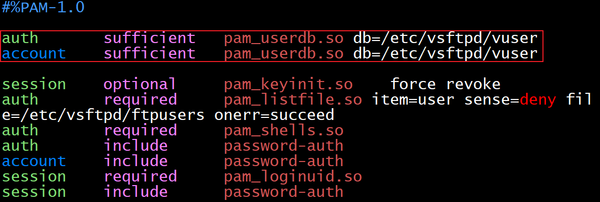

# 15、ftp服务 √

ftp服务

任务描述：请采用FTP服务器，实现文件安全传输。

（1）配置linux2为FTP服务器，安装vsftpd，新建本地用户test，本地用户登陆ftp后的目录为/var/ftp/pub，可以上传下载。

（2）配置ftp虚拟用户认证模式，虚拟用户ftp1和ftp2映射为ftp，ftp1登录ftp后的目录为/var/ftp/vdir/ftp1，可以上传下载,禁止上传后缀名为.docx的文件；ftp2登录ftp后的目录为/var/ftp/vdir/ftp2，仅有下载权限。

（3）使用ftp命令在本机验证。


## 1小题
### 1.安装vsftpd
yum install vsftpd*  ftp libdb*

### 2.创建用户并设置密码
useradd test && echo Qwer1234|passwd --stdin test 

### 3.编辑主配置文件
```plain
chroot_local_user=YES      #注释 让用户登录锁定到家目录
local_root=/var/ftp/pub    #新增 指定用户登录到的目录
allow_writeable_chroot=YES #是否有写入权限
chroot_list_enable=NO      #注释 让登录用户不能切换到其他目录
chroot_list_file=/etc/vsftpd/chroot_list   #新增 只能访问家目录的用户列表，需要自行创建
```

### 4.权限配置
chmod 777 /var/ftp/pub #赋予pub目录满权限

## 2小题
### 1.创建虚拟用户目录、赋权
mkdir /var/ftp/vdir

mkdir /var/ftp/vdir/ftp1

mkdir /var/ftp/vdir/ftp2

chmod 777 /var/ftp/vdir/ftp1

chmod 777 /var/ftp/vdir/ftp2

### 2.配置虚拟用户
cd /etc/vsftpd/

```plain
anonymous_enable=YES   #允许匿名用户登录
anon_upload_enable=YES  #允许匿名用户上传
anon_mkdir_write_enable=YES #允许匿名用户写入/创建

文件尾部添加以下三行
guest_enable=YES  #启用虚拟用户
guest_username=ftp  #映射的匿名用户为ftp
user_config_dir=/etc/vsftpd/vuser_conf #虚拟用户的配置文件路径
```

```plain
ftp1 虚拟用户名
Qwer1234 用户密码
ftp2
Qwer1234
```

db_load -T -t hash -f vuser_list vuser.db #生成db数据库，使其能够快速读取

```plain
auth       sufficient   pam_userdb.so db=/etc/vsftpd/vuser
account    sufficient   pam_userdb.so db=/etc/vsftpd/vuser
```

<font style="color:#DF2A3F;">注意：这两行的位置是独立的，不要放到已存在的内容中，否则会提示530登录失败</font>



### 3.创建和配置虚拟用户权限文件
mkdir /etc/vsftpd/vuser_conf

touch /etc/vsftpd/vuser_conf/ftp1

touch /etc/vsftpd/vuser_conf/ftp2

```plain
write_enable=YES
deny_file=*.docx #禁止上传.docx格式的文件
anon_upload_enable=YES
anon_mkdir_write_enable=YES
anon_other_write_enable=YES
local_root=/var/ftp/vdir/ftp1
```

```plain
write_enable=NO  #不允许写入
anon_upload_enable=YES #匿名用户上传权限
anon_mkdir_write_enable=YES #匿名用户新增目录权限
anon_other_write_enable=YES #匿名用户的其它权限
local_root=/var/ftp/vdir/ftp2 #匿名用户登录到的目录
```


systemc enable vsftpd.service --now

## 3小题
在本地test用户的登录目录上创建t.txt

在虚拟用户ftp1登录目录创建f1.txt

在虚拟用户ftp1登录目录创建f2.txt

在root目录创建 g.docx和g.txt


使用Linux  测试ftp

cd /root/  
ftp 10.4.120.102 #登录到ftp并输入用户名密码 

ftp> put g.txt g.txt  #上传当前目录的g.txt

ftp> get t.txt t.txt    #下载t.txt到当前目录

ftp> put g.docx g.docx    #下载g.txt到当前目录


Bye        #断开


实验问题总结：  
1、无法上传文件（提示227和553）

修改setsebool -P ftpd_full_access 1 修改完成后会提示500和421  
修改vsftpd.conf，在chroot处加入：allow_writeable_chroot=YES  
重启就解决了


2、限制上传.sh文件  
虚拟用户的权限文件处加入以下内容  
deny_file=*.sh


> 更新: 2024-04-28 18:55:35  
> 原文: <https://www.yuque.com/gengmouren-1f9qn/whktvz/qelqzhwsvnm7cgpn>