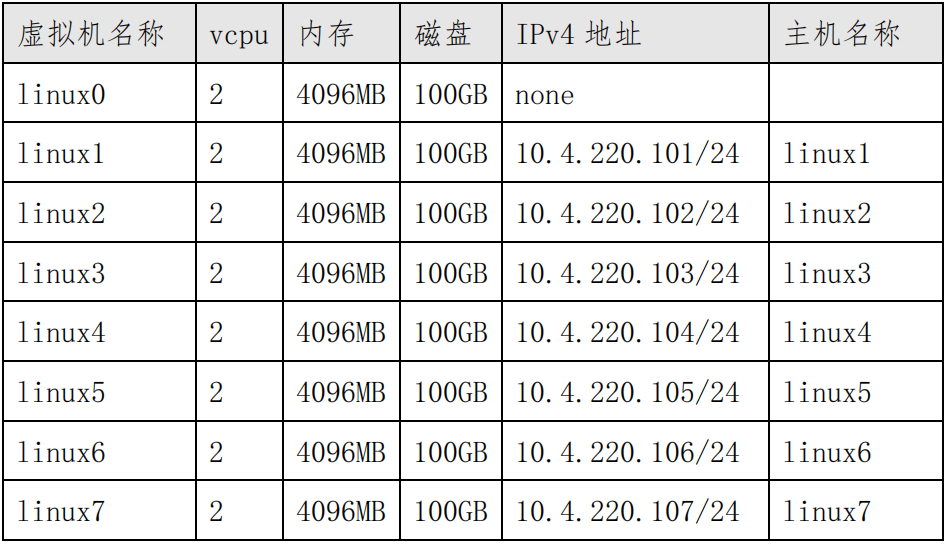
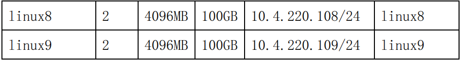

# 1、系统安装 √

## **题目：**
1、PC1 web 连接 server2，给 server2 安装 rocky-arm64 CLI 系统（语 

言为英文）。 

2、配置 server2 的 IPv4 地址为 10.4.220.100/24。 

3、安装 qemu-kvm、libvirt 和 virt-install。 

4、创建 rocky-arm64 虚拟机，虚拟机磁盘文件保存在默认目录，名称为 

linuxN.qcow2(N 表示虚拟机编号 0-9，如虚拟机 linux1 的磁盘文件 

为 linux1.qcow2),虚拟机信息如下： 

4.1 安装 linux0，系统为 rocky9 CLI，网络模式为桥接模式，用户 root 

密码为 Key-1122。 

4.2 关闭 linux0，给 linux0 创建快照，快照名称为 linux-snapshot。 

根据 linux0 克隆虚拟机 linux1-linux9。

## 配置步骤：
## 1小题

1.1 修改Ubuntu IP地址与鲲泰服务器管理口同网段

1.2 web登录管理后台

鲲泰服务器管理口为192.168.2.10

用户名：Admin 密码：Admin@123

1.3 创建逻辑盘（非必须）

服务器可能存在两块较小的磁盘，例如一块只有480G，需要进行合并成逻辑盘，不然可能不够完成9台甚至更多的虚拟机安装

1.4  启动虚拟控制台

位于首页右下角---选择html5共享模式

1.5 连接安装镜像

点击光盘图标--连接位于本地的镜像文件

1.6 选择光驱启动

点击B图标--选择光驱

1.7 强制重启鲲泰

点击电源图标--选择强制重启

1.8 选择安装rocky

需要关注安装界面的变化，跳出提示就快速选择安装rocky，不然它自动选择检查再安装会浪费很多时间

1.9 进行磁盘分区

注意：题目中有明确要求分区容量就按题目来配置，没有要求的话boot分区1G即可，swap分区10G即可，home分区20G即可，其余空间都给/根分区。

1.10 选择安装版本

选择最小化安装版本

1.11 配置密码

按题目要求配置

1.12 进行安装

所有设置完成后，进行安装。

## 2小题

2.1 创建桥接网卡

nmcli c add type bridge ifname br0 #创建桥设备 br0

nmcli c add type bridge-slave ifname enp125s0f0 master br0 #配置桥设备桥接的网卡

nmcli c show #查看连接情况

2.2 修改本地网卡为自动获取

vi /etc/NetworkManager/system-connections/enp125s0f0.nmconnection

2.3 修改桥设备的IP地址为静态

vi /etc/NetworkManager/system-connections/bridge-br0.nmconnection

2.4 重启网卡

nmcli connection reload enp125s0f0  #加载配置信息，立即生效

nmcli connection up enp125s0f0         #激活配置

2.5 nmcli 查看网络连接情况

2.6 关防火墙、开ssh

1、关闭防火墙

systemctl disable firewalld --now #开机不自启并现在关闭防火墙

2、开启ssh服务

vi /etc/ssh/sshd_config #允许ssh

systemctl restart sshd #重启ssh服务

2.7 Ubuntu ssh登录Server2

ssh root@10.4.220.100  #输入用户名密码，远程软件用Ubuntu自带终端或remmina都可以

## 3小题

3.1 Ubuntu传输镜像到Server2

scp + 镜像名 + root@10.4.220.100:/opt  #在Ubuntu传输镜像到Server2的opt目录下

3.2 搭建本地yum源

Server2执行以下操作

cd /etc/yum.repos.d/ #切换到yum文件所在目录

vi rocky-devel.repo  #编辑yum文件，修改红框处

rm -rf 文件名 #删除除rocky-devel.repo外的所有文件

yum clean all #清除缓存

yum makecache #建立新的仓库缓存

3.3 安装软件

yum install qemu* virt-*  libvirt* bash-comp* httpd -y 

bash #重新加载，使tab功能生效

3.4 搭建网络yum源环境

mkdir /var/ww/html/a

umount /mnt

mount /opt/镜像名  /var/www/html/a #挂载镜像到a目录

systemctl restart httpd

包说明

qemu-kvm：qemu模拟器 qemu-img：qemu磁盘image管理器 virt-install：用来创建虚拟机的命令行工具 libvirt：提供libvirtd daemon来管理虚拟机和控制hypervisor libvirt-client：提供客户端API用来访问server和提供管理虚拟机命令行工具的virsh实体 virt-viewer：图形控制台，vnc的显示就是它提供

bash-completion：tab功能的软件包，可以进行命令补齐，减少配置难度

httpd：为搭建yum源提供共享服务

3.5 启动守护进程

systemctl enable libvirtd  --now #设为开机自启并现在启动

systemctl status libvirtd              #查看运行状态

## 4小题
### 4.1 小题

4.1.1 创建Linux0

virt-install --name linux0 --memory 4096 --disk path=/var/lib/libvirt/images/linux0.qcow2,size=40,bus=virtio --vcpus 2 --os-variant auto --network bridge=br0,model=virtio --cdrom /opt/Rocky-9.2-x86_64-dvd.iso --graphics vnc,listen=0.0.0.0 --video virtio

字段释义：

1、--name linux1 #设置虚拟机名称

2、--ram 2048  #分配内存大小，单位MB

3、--disk path=/var/lib/libvirt/images/linux1.qcow2,size=40,bus=virtio #指定硬盘文件路径 容量大小 类型 默认存放位置：/var/lib/libvirt/images

4、--vcpus 2 #设置虚拟CPU数

5、--os-variant rocky9 #指定操作系统类型

6、--network bridge=br0,model=virtio #网络模式 指定桥接网卡 类型

7、--location /opt/Rocky-9.1-x86_64-dvd.iso #选择安装镜像的本地路径

8、--graphics vnc,listen=0.0.0.0 #图形化输出为vnc，监听的IP地址为所有

9、--video virtio #指定显示驱动

4.1.2 VNC连接完成安装

由于linux0是唯一1台启动的虚拟机，所以端口是5900

回车后跳出rocky安装界面，这里不做说明，正常进行设置完成安装即可

注：关于VNC服务

vnc默认端口为5900，如果有3台虚拟机，服务器IP为10.1.220.100:5900，那么登录vnc时，第一台为10.1.220.100，第二台为10.1.220.100:5901，第三台为10.1.220.100:5902，以此类推，若不关闭防火墙，需要放行相应服务或端口

4.1.3 进行Linux的基础配置
<ul class="ne-ul"><li id="ua591815c" data-lake-index-type="0">修改IP地址</li></ul>

linux0为模版，为了节省linux1-9的配置量，dns可预先设置，IP地址设为10，后续linux1-9只需要在0后+1个数字
<ul class="ne-ul"><li id="udb7c0ecb" data-lake-index-type="0">关闭selinux</li></ul>
vi /etc/selinux/config

<ul class="ne-ul"><li id="u7667b98b" data-lake-index-type="0">关闭防火墙</li></ul>
systemctl disable firewalld --now
<ul class="ne-ul"><li id="uf94199df" data-lake-index-type="0">允许ssh</li></ul>
vi /etc/ssh/sshd_conf

systemctl restart sshd
<ul class="ne-ul"><li id="u1b72ce27" data-lake-index-type="0">配置局域网yum源</li></ul>
cd /etc/yum.repos.d/ #切换到yum文件所在目录

vi rocky-devel.repo  #编辑yum文件，修改红框处

rm -rf 文件名 		#删除除rocky-devel.repo外的所有文件

yum clean all 		#清除缓存

yum makecache 	#建立新的仓库缓存

<ul class="ne-ul"><li id="u2534ef6c" data-lake-index-type="0">安装tab包和vim编辑器</li></ul>
yum install bash-comp* vim -y

### 4.2小题

创建快照

virsh shutdown linux0 #关机虚拟机

virsh snapshot-create-as linux0 linux-snapshot #创建快照

克隆

virt-clone --original linux0  --name linux1 --file /var/lib/libvirt/images/linux1.qcow2 --auto-clone

按上面的命令，修改--name 和qcow2磁盘文件名，依次完成2-9的克隆

### 修改linux1-9基础配置（必须）

修改IP地址及主机名

for i in {1..9} ;do virsh start linux$i ;done   #依次启动linux1-9

使用remmina依次修改主机名和IP地址

所有主机修改完IP地址和主机，直接重启，不要去手动重新激活网卡，浪费时间

### 扩展命令参考

扩展命令

1、列出所有虚拟机，虚拟机状态

virsh list --all  

 2、启动虚拟机

virsh start linux1  3、关闭虚拟机

virsh shutdown linux1  4、重启虚拟机

virsh reboot linux1  5、销毁虚拟机，相当拔掉虚拟机的电源

virsh destroy linux1   6、删除虚拟机

virsh undefine linux1 --nvram    #nvram为取消域定义  7、修改虚拟机名称

virsh domrename linux100 linux1  8、修改硬盘文件名称

mv /var/lib/libvirt/images/linux100.qcow2  /var/lib/libvirt/images/linux1.qcow2  9、获取域的网络接口状态

virsh domiflist linux1  10、恢复快照

virsh snapshot-revert linux1 linux-snapshot  11、删除快照

virsh snapshot-delete linux1 linux-snapshot  12、添加磁盘 qemu-img create -f qcow2 /cp/a.qcow2 10G 

13、查看磁盘信息

qemu-img info /opt/a.qcow2 

14、挂载磁盘

virsh attach-disk linux1 /cp/a.qcow2 vdb --persistent --subdriver=qcow2 

#将该磁盘连接到linux1当中，在linux中显示为vdb，persistent为永久的意思，subdriver指定磁盘类型

15、查看主机磁盘连接情况 virsh domblklist linux1  fdisk -l 查看所有磁盘信息，这个时候就有一个vdb  16、分离磁盘 virsh detach-disk linux1 /cp/a.qcow2

> 更新: 2024-05-23 16:33:26  
> 原文: <https://www.yuque.com/gengmouren-1f9qn/whktvz/sfa1knwz7o1co6z9>