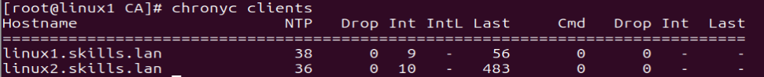
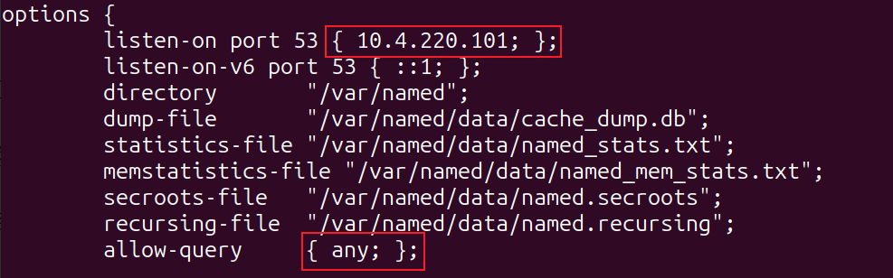
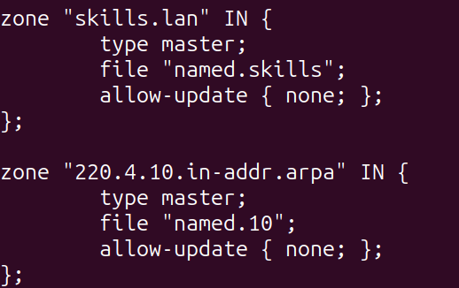
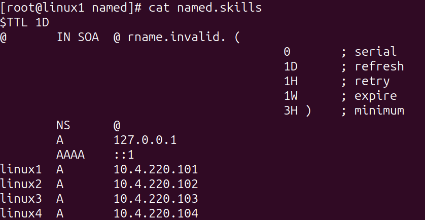
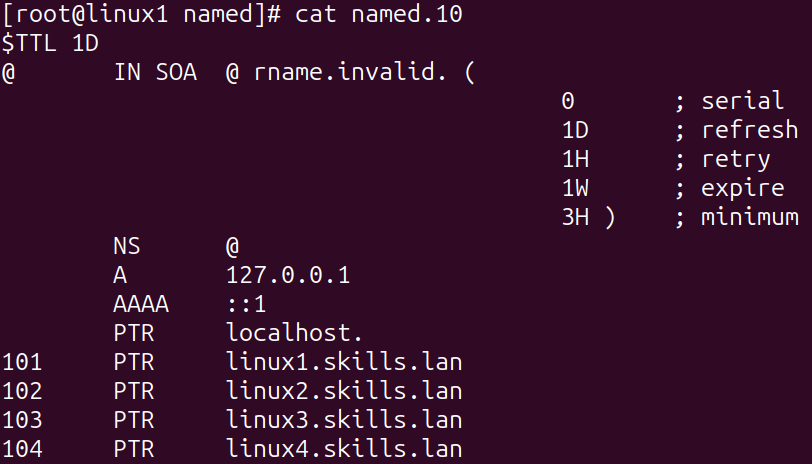
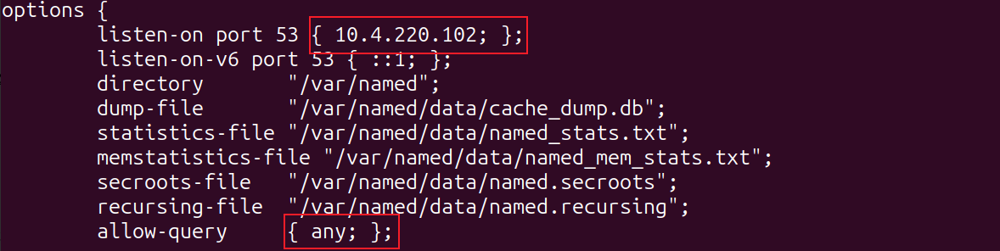
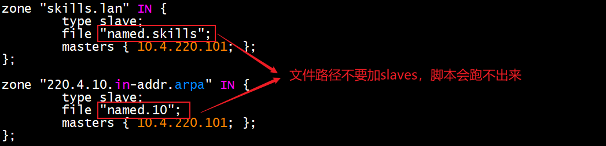
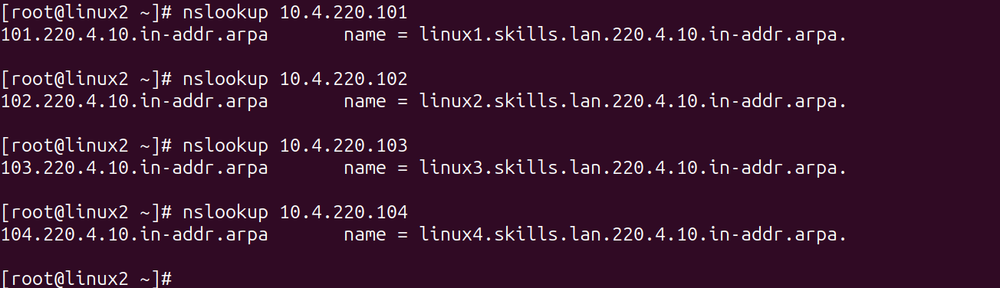
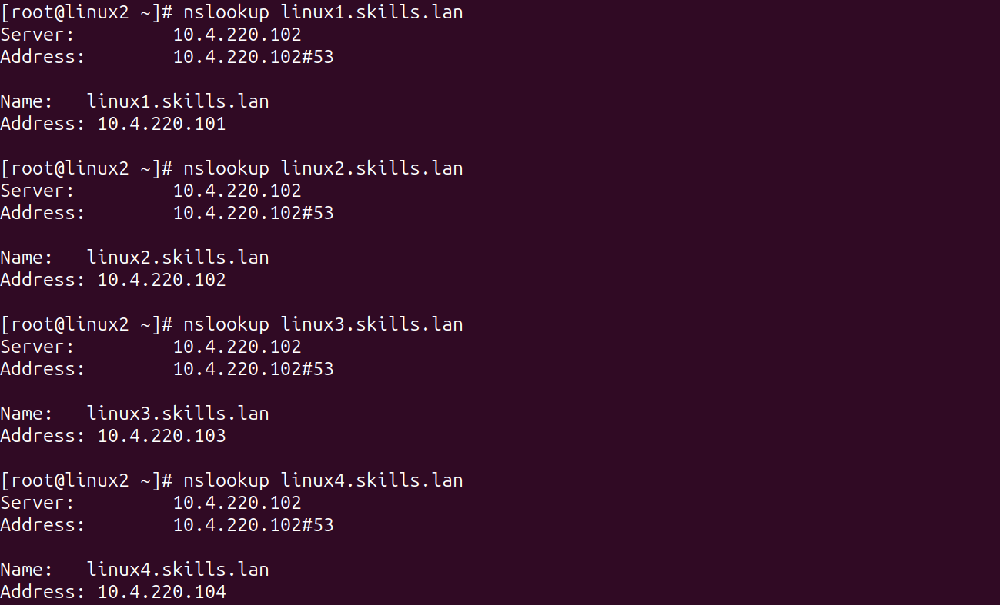

# 2、dns服务 √

## **<font style="color:rgb(0,0,0);">题目：</font>**
<font style="color:rgb(0,0,0);">创建 DNS 服务器，实现企业域名访问。</font>

<font style="color:rgb(0,0,0);">1、配置 linux 主机的 IP 地址和主机名称。 </font>

<font style="color:rgb(0,0,0);">2、所有 linux 主机启用防火墙（kubernetes 服务主机除外），防火墙区域为 public，在防火墙中放行对应服务端口。 </font>

<font style="color:rgb(0,0,0);">3、所有 linux 主机之间（包含本主机）root 用户实现密钥 ssh 认证，禁用密码认证。 </font>

<font style="color:rgb(0,0,0);">4、利用 chrony，配置 linux1 为其他 linux 主机提供 NTP 服务。</font>

<font style="color:rgb(0,0,0);">5、利用 bind，配置 linux1 为主 DNS 服务器，linux2 为备用 DNS 服务器，为所有 linux 主机提供冗余 DNS 正反向解析服务。正向区域文件均/var/named/named.skills ， 反 向 区 域 文 件 均 为 /var/named/named.10。 </font>

<font style="color:rgb(0,0,0);">6、配置 linux1 为 CA 服务器,为 linux 主机颁发证书。证书颁发机构有效期 10 年，公用名为 linux1.skills.lan。申请并颁发一张供 linux 服务器使用的证书，证书信息：有效期=5 年，公用名=skills.lan，国家=CN，省=Beijing，城市=Beijing，组织=skills，组织单位=system， 使用者可选名称=*.skills.lan 和 skills.lan。将证书skills.crt 和私钥 skills.key 复制到需要证书的 linux 服务器/etc/pki/tls 目 录。浏览器访问 https 网站时，不出现证书警告信息。</font>

## <font style="color:rgb(0,0,0);">配置步骤：</font>
### 1小题
<details class="lake-collapse"><summary id="uaf1dc54d"><span class="ne-text" style="font-size: 19px">修改IP地址</span></summary><p id="ub5e3543d" class="ne-p"><span class="ne-text">vi /etc/NetworkManager/system-connections/ens160.nmconnection #使用vi编辑器修改网卡配置文件</span></p><p id="uf1f49298" class="ne-p"><span class="ne-text"></span></p><p id="u0ffe8fc9" class="ne-p"><span class="ne-text">[ipv4]</span></p><p id="u6fcccc96" class="ne-p"><span class="ne-text">method=manual  				      #取消自动获取，改为manual，manual为手动的意思</span></p><p id="udd150560" class="ne-p"><span class="ne-text">address1=10.4.220.100/24,10.4.220.1  #配置IP地址和网关</span></p><p id="u62ec66ff" class="ne-p"><span class="ne-text">dns=10.4.220.101;10.4.220.102  	      #dns配置</span></p></details>
nmcli connection reload  ens160 加载配置信息

nmcli connection up ens160 激活配置

<details class="lake-collapse"><summary id="u913df0ef"><span class="ne-text">修改主机名</span></summary><p id="u0b48ba29" class="ne-p"><span class="ne-text">nmcli g hostname linux1</span></p></details>
### 2小题
<details class="lake-collapse"><summary id="uae309de0"><span class="ne-text">放行端口</span></summary><p id="u6eb96d8d" class="ne-p"><span class="ne-text">firewall-cmd --zone=public --add-port=22/tcp --add-port=53/tcp --add-port=53/udp --add-port=123/udp --add-port=80/tcp --add-port=443/tcp --add-port=21/tcp --add-port=8080/tcp --add-port=2049/tcp --add-port=111/tcp --add-port=111/udp --add-port=139/tcp --add-port=445/tcp --add-port=860/tcp --add-port=3260/tcp --add-port=3306/tcp --add-port=8000/tcp --permanent</span></p><p id="u6ec5c5a9" class="ne-p"><span class="ne-text"></span></p><p id="uae77b159" class="ne-p"><span class="ne-text">firewall-cmd --reload   #重启防火墙</span></p><p id="u571f4638" class="ne-p"><span class="ne-text">firewall-cmd --list-all #查看放行情况</span></p></details>
<details class="lake-collapse"><summary id="u12a8807e"><span class="ne-text" style="font-size: 19px">服务端口说明</span></summary><p id="u9b4baa24" class="ne-p"><span class="ne-text" style="font-size: 16px">dns：53/tcp 53/udp</span></p><p id="ua8d82b60" class="ne-p"><span class="ne-text" style="font-size: 16px">chrony端口：123/UDP</span></p><p id="u98e29e25" class="ne-p"><span class="ne-text" style="font-size: 16px">ansible：22/tcp</span></p><p id="u4082c8e8" class="ne-p"><span class="ne-text" style="font-size: 16px">Apache2服务：80/TCP 443</span></p><p id="u90dd6017" class="ne-p"><span class="ne-text" style="font-size: 16px">ftp</span><span class="ne-text" style="font-size: 16px">端口：</span><span class="ne-text" style="font-size: 16px">21/TCP</span><span class="ne-text" style="font-size: 16px">  </span><span class="ne-text" style="font-size: 16px">VSFTP</span></p><p id="u0c32666d" class="ne-p"><span class="ne-text" style="font-size: 16px">tomcat</span><span class="ne-text" style="font-size: 16px">端口：</span><span class="ne-text" style="font-size: 16px">80/TCP 443/TCP 8080/TCP</span></p><p id="u91adc863" class="ne-p"><span class="ne-text" style="font-size: 16px">nfs</span><span class="ne-text" style="font-size: 16px">端口：</span><span class="ne-text" style="font-size: 16px">2049/TCP 111/TCP</span><span class="ne-text" style="font-size: 16px">  </span><span class="ne-text" style="font-size: 16px">111/UDP</span></p><p id="u70b4858f" class="ne-p"><span class="ne-text" style="font-size: 16px">smaba</span><span class="ne-text" style="font-size: 16px">端口：</span><span class="ne-text" style="font-size: 16px">139/TCP 445/TCP</span></p><p id="u26e6760c" class="ne-p"><span class="ne-text" style="font-size: 16px">iscsi</span><span class="ne-text" style="font-size: 16px">端口：</span><span class="ne-text" style="font-size: 16px">860/TCP 3260/tcp</span></p><p id="u6b7a8efa" class="ne-p"><span class="ne-text" style="font-size: 16px">mariadb：3306/tcp</span></p><p id="u6619057a" class="ne-p"><span class="ne-text" style="font-size: 16px">podman：8000/udp</span></p></details>
### 3小题
```plain
ssh-keygen #生成公钥，跳出提示一直按回车即可
注：生成的公钥位于/root/.ssh/目录下，名为id_rsa.pub
```

```plain
cd /root/.ssh/
touch authorized_keys #创建免密认证文件
vi authorized_keys    #编辑文件，把linux1-9的公钥复制到该文件
```

```plain
方法一（有几台输几条命令）
scp /root/.ssh/authorized_keys root@10.4.220.102:/root/.ssh/

方法二（输一条即可）
for i in {2..9};do sshpass -p 'Qwer1234' scp /root/.ssh/authorized_keys root@10.4.220.10$i:/root/.ssh ;done
```

<details class="lake-collapse"><summary id="u41fb1652"><span class="ne-text">3.4 禁用密码认证</span></summary><p id="u9c2bda1d" class="ne-p"><span class="ne-text">vi /etc/ssh/sshd_config   #修改该文件，在下图位置取消passwordauthentication注释，将yes改为no</span></p><p id="u6f5a31c5" class="ne-p"></p><p id="u589fd9de" class="ne-p"><span class="ne-text">systemctl restart sshd   #重启sshd生效</span></p></details>
```plain
ssh root@10.4.220.102 #不需要输入密码，即配置成功
ssh root@10.4.220.103
ssh root@10.4.220.104
ssh root@10.4.220.105
ssh root@10.4.220.106
ssh root@10.4.220.107
ssh root@10.4.220.108
ssh root@10.4.220.109
```

### 4小题




### 5小题
#### Linux1执行
yum install bind bind-utils   #安装dns服务

vi /etc/named.conf 	#编辑主配置文件



vi /etc/named.rfc1912.zones #编辑区域文件



cd /var/named/  #切换到配置文件目录

cp -p named.localhost named.skills #复制正向区域模板文件到新文件

cp -p named.loopback named.10	#复制反向区域模板到新文件

vi named.skills #编辑新的正向区域文件



vi named.10 编辑新的反向区域文件



systemc	restart named  #重启dns服务

<details class="lake-collapse"><summary id="u38e997d8"><span class="ne-text">测试正向解析</span></summary><p id="ud9f2d6f4" class="ne-p"></p></details>
<details class="lake-collapse"><summary id="u02ed2fa5"><span class="ne-text">测试反向解析</span></summary><p id="ud4e0a73d" class="ne-p"></p></details>
#### Linux2执行
yum install bind bind-utils   #安装dns服务

vi /etc/named.conf 	#编辑主配置文件



vi /etc/named.rfc1912.zones #编辑区域文件

systemctl restart named  #重启dns服务

systemctl stop named #关闭linux1的dns服务

测试辅助dns服务器的dns解析

正向测试



反向测试



#### 结论
主dns服务器关闭的情况下，备用dns服务能正常解析

### 6小题
#### <font style="color:#DF2A3F;">方案一</font>
##### 步骤一、根CA证书配置
```plain
yum install  openssl-perl
cd /etc/pki/CA/
touch serial
echo 00 >> serial
touch index.txt
```

```plain
openssl genrsa -out cakey.key 2048
```

```plain
openssl req -new -out ca.csr -key cakey.key
```

```plain
openssl x509 -req -days 3650 -in ca.csr -signkey cakey.key -out cacert.crt
```

##### 阶段二、SSL证书配置
```plain
req_extensions = v3_req  取消注释这一行 167行
# extendedKeyUsage = critical,timeStamping
[ v3_req ]
subjectAltName = @alt_names 在v3字段下添加这一行
# Extensions to add to a certificate request
basicConstraints = CA:TRUE   改为TRUE
keyUsage = nonRepudiation, digitalSignature, keyEncipherment
[alt_names]      添加字段
DNS.1=skills.com  添加行
DNS.2=*.skills.com 添加行
```

```plain
openssl genrsa -out skills.key 2048
```

```plain
openssl req -new -key skills.key -out skills.csr -config /etc/pki/tls/openssl.cnf -extensions v3_req
```

```plain
openssl ca -in skills.csr -out skills.crt -cert cacert.crt  -keyfile cakey.key -extensions v3_req -days 1825 -config /etc/pki/tls/openssl.cnf
```

##### 阶段三、CA证书转换
openssl pkcs12 -export -out cacert.pfx -inkey cacert.key -in cacert.crt 

openssl pkcs12 -in cacert.pfx -nodes -out cacert.pem

##### 阶段四、配置信任
for i in {1..9};do scp skills.* cacert.pem 10.4.220.10$i:/etc/pki/tls/ ;done

cat cacert.pem >> /etc/pki/tls/certs/ca-bundle.crt   #每一台有证书的主机执行

#### <font style="color:#DF2A3F;">方案二</font>
##### 步骤一、根CA证书配置
```plain
yum install  openssl-perl -y
cd /etc/pki/CA/
touch serial
echo 00 >> serial
touch index.txt
```

```plain
openssl genrsa -out cakey.pem 2048
cp cakey.pem /etc/pki/CA/private/		#签发客户证书需要把ca私钥放到这个位置
```

```plain
openssl req -new -x509 -key cakey.pem -days 3650 -out cacert.pem
```

##### 阶段二、SSL证书配置
```plain
vim file.ext
subjectAltName = @alt_names
[alt_names]
DNS.1=skills.lan
DNS.2=*.skills.lan
```

```plain
openssl genrsa -out skills.key 2048
```

```plain
openssl req -new -key skills.key -out skills.csr
```

```plain
openssl ca -in skills.csr -out skills.crt -days 1825 -extfile file.ext
```

##### **阶段三、配置信任**
for i in {1..9};do scp skills.* cacert.pem 10.4.220.10$i:/etc/pki/tls/ ;done

cat cacert.pem >> /etc/pki/tls/certs/ca-bundle.crt   #每一台有证书的主机执行

<details class="lake-collapse"><summary id="ub6127fcf"><span class="ne-text" style="font-size: 19px">扩展</span></summary><p id="u9e7ac507" class="ne-p"><span class="ne-text" style="font-size: 16px">key和crt 转为pfx</span></p><p id="uf70026f9" class="ne-p"><span class="ne-text" style="font-size: 16px">openssl pkcs12 -export -out skills.pfx -inkey skills.key -in skills.crt </span></p><p id="udab13ff9" class="ne-p"><span class="ne-text" style="font-size: 16px"></span></p><p id="u4191b28b" class="ne-p"><span class="ne-text" style="font-size: 16px">pfx转为pem</span></p><p id="u4bdc9354" class="ne-p"><span class="ne-text" style="font-size: 16px">openssl pkcs12 -in skills.pfx -nodes -out skills.pem</span></p><p id="u6715bdb3" class="ne-p"><span class="ne-text" style="font-size: 16px"></span></p><p id="ua9f28b8f" class="ne-p"><span class="ne-text" style="font-size: 16px">从pem证书提取crt和key</span></p><p id="ud4fd4d52" class="ne-p"><span class="ne-text" style="font-size: 16px">openssl x509 -in skills.pem -out apache.crt</span></p><p id="ue7360ff6" class="ne-p"><span class="ne-text" style="font-size: 16px">openssl rsa -in skills.pem -out apache.key</span></p><p id="u3bc6844d" class="ne-p"><span class="ne-text" style="font-size: 16px"></span></p><p id="u988ce76f" class="ne-p"><span class="ne-text" style="font-size: 16px">转jks</span></p><p id="u3d9ba89e" class="ne-p"><span class="ne-text" style="font-size: 19px">yum install javapackages-tools.noarch -y</span></p><p id="ue887fda8" class="ne-p"><span class="ne-text" style="font-size: 19px">keytool -importkeystore -srckeystore skills.pfx -destkeystore skills.jks -deststoretype JKS</span></p></details>


> 更新: 2024-05-21 21:46:21  
> 原文: <https://www.yuque.com/gengmouren-1f9qn/whktvz/qzb0gyneeae3ryfx>