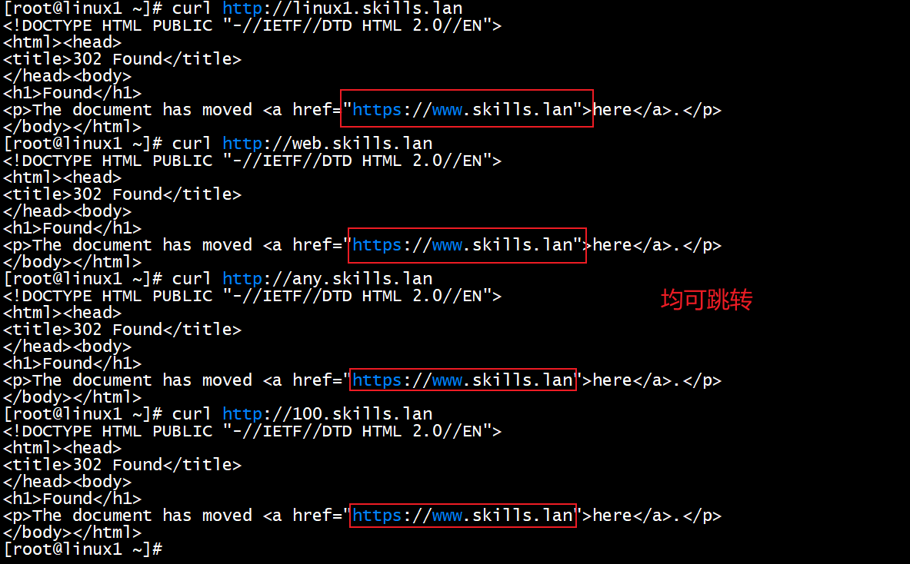
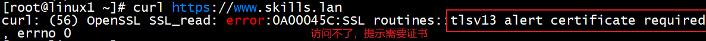
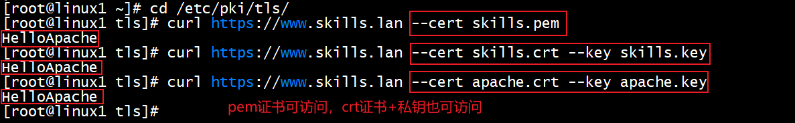

# 4、Apache服务 √

## **<font style="color:rgb(0,0,0);"> 题目：</font>**
<font style="color:rgb(0,0,0);">1、配置 linux1 为 Apache2 服务器，使用 skills.lan 或 any.skills.lan （any 代表任意网址前缀，用 linux1.skills.lan 和 web.skills.lan 测试）访问时，自动跳转www.skills.lan。禁止使用 IP 地址访问， 默认首页文档/var/www/html/index.html 的内容为"HelloApache"。 </font>

<font style="color:rgb(0,0,0);">2、把/etc/pki/tls/skills.crt 证书文件和/etc/pki/tls/skills.key 私钥文件转换成含有证书和私钥的/etc/pki/tls/skills.pfx 文件； 然后把 /etc/pki/tls/skills.pfx 转 换 为 含 有 证 书 和 私 钥 的 /etc/pki/tls/skills.pem 文件，再从/etc/pki/tls/skills.pem 文 件 中 提 取 证 书 和 私 钥 分 别 到 /etc/pki/tls/apache.crt 和 /etc/pki/tls/apache.key。</font>

<font style="color:rgb(0,0,0);">3、客户端访问 Apache 服务时，必需有 ssl 证书。</font>

## <font style="color:rgb(0,0,0);">配置步骤：</font>
## 1小题
### 1、安装httpd服务
yum install httpd mod_ssl -y    #mod_ssl为2-3小题所用

### 2、修改ssl.conf配置文件
```plain
#http将所有访问 linux1.skills.lan 或 any.skills.lan 的请求重定向到 https://www.skills.lan
<VirtualHost *:80>
ServerName linux1.skills.lan
ServerAlias any.skills.lan
rewriteengine on
rewriterule ^/(.*) https://www.skills.lan
</VirtualHost>
#https启用证书并绑定
<VirtualHost *:443>
ServerName linux1.skills.lan
SSLEngine on
SSLCertificateFile /etc/ssl/skills.crt
SSLcertificatekeyFile /etc/ssl/skills.key
</VirtualHost>
#http重定向到403错误页面
<VirtualHost *:80>
servername 10.4.220.101
redirect 403 /
</virtualHost>
#https重定向到403错误页面
<VirtualHost *:443>
servername 10.4.220.101
redirect 403
</virtualHost>
```

### 3、写入主页文件内容
echo HelloApache >> /var/www/html/index.html 写入内容

###  4、修改dns解析文件
正向区域文件中加入*与10.4.220.101的对应记录，反向不用加

*       A       10.4.220.101

systemctl restart named  #主备dns都重启dns服务

注意：在hosts文件中写对应关系只能在本机正常测试

## 2小题
key和crt 转为pfx

openssl pkcs12 -export -out skills.pfx -inkey skills.key -in skills.crt 


pfx转为pem

 openssl pkcs12 -in skills.pfx -nodes -out skills.pem


提取pem中的证书为crt和key   

openssl x509 -in skills.pem -out apache.crt  

openssl rsa -in skills.pem -out apache.key

## 3小题
```plain
SSLCertificateFile /etc/pki/tls/apache.crt		 #绑定ssl证书
SSLCertificateKeyFile /etc/pki/tls/apache.key  #绑定ssl证书私钥
SSLCACertificateFile /etc/pki/tls/cacert.pem   #绑定ca证书
SSLVerifyClient require    #客户端必须提供有效的证书才能与服务器进行SSL连接
SSLVerifyDepth  10				 #设置为10表示在验证证书链时，最多可以遍历到10层，超过这个深度将拒绝连接。
```

systemctl restart httpd

## 测试
cd /etc/pki/tls  #切换至证书所在目录

跳转测试

 curl [http://linux1.skills.lan](http://linux1.skills.lan)

curl [http://web.skills.lan](http://100.skills.lan)

curl [http://100.skills.lan](http://100.skills.lan)



必需证书测试

curl [https://www.skills.lan](https://www.skills.lan)



必需证书测试

curl [https://www.skills.lan](https://www.skills.lan) --cert skills.pem 

curl [https://www.skills.lan](https://www.skills.lan) --cert skills.crt --key skills.key

curl [https://www.skills.lan](https://www.skills.lan) --cert apache.crt --key apache.key




> 更新: 2024-05-09 11:22:40  
> 原文: <https://www.yuque.com/gengmouren-1f9qn/whktvz/imeg22m5zl81lneq>