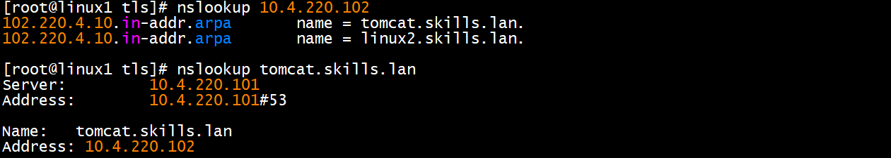
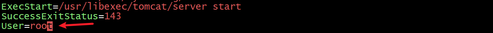
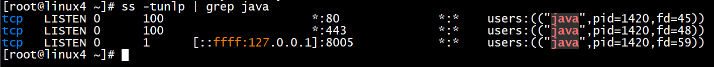
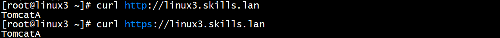
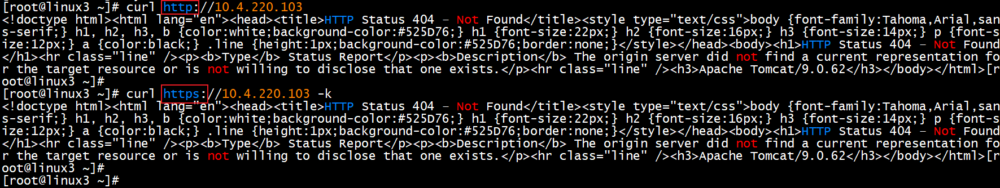
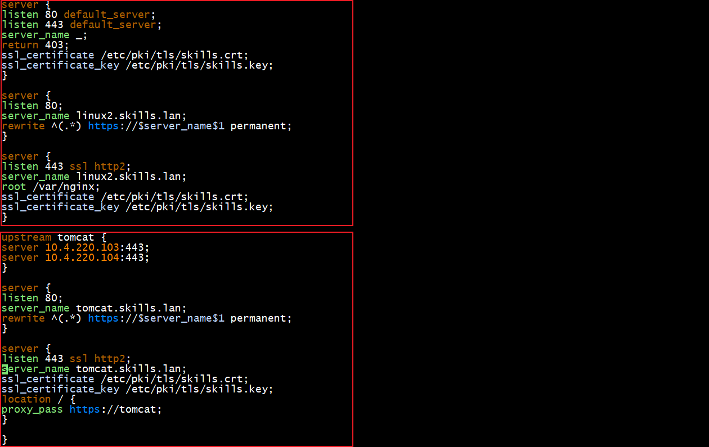
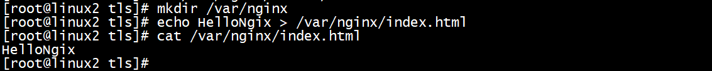
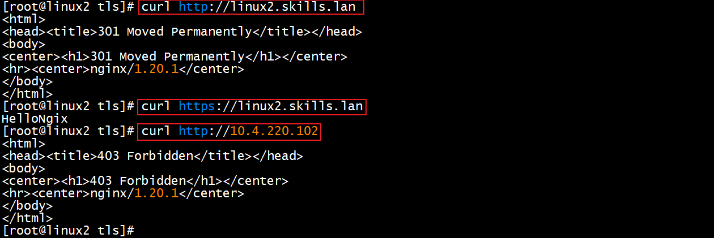
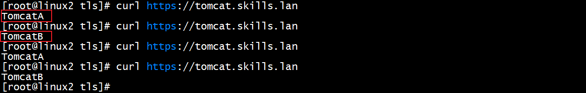
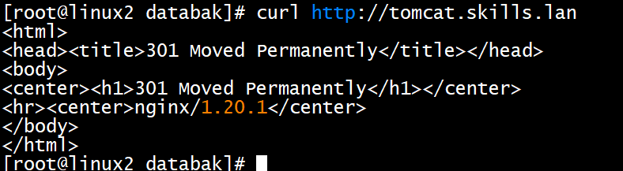

# 5、nginx和tomcat服务 √

## **<font style="color:rgb(0,0,0);">题目：</font>**
<font style="color:rgb(0,0,0);">1、配置 linux2 为 nginx 服务器，默认文档 index.html 的内容为 “HelloNginx”；仅允许使用域名访问，http 访问自动跳转到 https。 </font>

<font style="color:rgb(0,0,0);">2、利用 nginx 反向代理，实现 linux3 和 linux4 的 tomcat 负载均衡， 通过https://tomcat.skills.lan 加密访问 Tomcat，http 访问通过 301 自动跳转到 https。 </font>

<font style="color:rgb(0,0,0);">3、配置 linux3 和 linux4 为 tomcat 服务器，网站默认首页内容分别为 </font>

<font style="color:rgb(0,0,0);">“tomcatA”和“tomcatB”，采用修改配置文件端口形式，仅使用域名 </font>

<font style="color:rgb(0,0,0);">访问 80 端口 http 和 443 端口 https。</font>

## <font style="color:rgb(0,0,0);">配置步骤：</font>
## 准备工作：
1、关闭防火墙

2、关闭selinux

3、linux1 dns服务中添加tomcat与10.4.220.102的解析记录




做题顺序：3 - 1 - 2

## 3小题--Linux3-4执行
yum install java-17-openjdk* tomcat* vim -y

### 3.1 配置Java环境变量--Linux3-4执行
 vi /etc/profile 编辑该文件配置JAVA环境变量

在文件尾部添加：

export JAVA_HOME=/usr/lib/jvm/java-17

export PATH=$JAVA_HOME/bin:$PATH

source /etc/profile  #让该文件生效

java -version #查看Java版本是否是环境变量中的版本

### 3.2 将tomcat加入systemctl进行管理--Linux3-4执行
vim /usr/lib/systemd/system/tomcat.service



### 3.2 证书服务器上转换证书--Linux1执行
yum install javapackages-tools.noarch -y  #安装转jks格式的工具

openssl pkcs12 -export -in skills.crt -inkey skills.key -out skills.pfx #转换原有的crt证书为pfx证书，记得要设证书密码 

keytool -importkeystore -srckeystore skills.pfx -destkeystore skills.jks -deststoretype JKS #转换pfx证书成jks证书


scp skills.jks root@10.1.220.103:/etc/ssl/  #将证书发送到linux3的ssl目录里

scp skills.jks root@10.1.220.104:/etc/ssl/  #将证书发送到linux4的ssl目录里

scp skills.crt skills.key root@10.1.220.102:/etc/ssl/

### 3.6 配置Tomcat--Linux3-4执行
linux3和linux4配置一样,注意调换IP地址和域名就行

<details class="lake-collapse"><summary id="u89b0a227"><span class="ne-text">vim /etc/tomcat/server.xml </span></summary><p id="u128f1a39" class="ne-p"></p><p id="u17f66ae9" class="ne-p"></p><p id="u6955abc3" class="ne-p"></p></details>
echo "TomcatA" > /usr/share/tomcat/webapps/ROOT/index.jsp #修改写入内容TomcatA

systemctl restart tomcat.service

检查80和433端口在Tomcat中是否正常启动

ss -tunlp | grep java



测试1：http和https下域名的访问情况



上图所示：通过域名正常访问

测试2：通过IP方式的访问情况



上图所示：通过IP无法访问

## 1小题-2小题--Linux2执行
### 1、安装
yum install vim nginx -y #安装vim编辑器和nginx服务

### 2、修改selinux：输入以下配置
setsebool -P httpd_can_network_connect 1或<font style="color:#DF2A3F;">直接关闭selinux</font>

### 3、让主配置文件的server字段不生效
<details class="lake-collapse"><summary id="uc665c6d5"><span class="ne-text">vi /etc/nginx/nginx.conf #编辑该文件，注释掉下图内容</span></summary><p id="ua9d143e2" class="ne-p"></p></details>
### 4、配置负载均衡和自动跳转
```plain
server {
listen 80 default_server;     #用default_server指令禁止IP访问
listen 443 default_server;    #用default_server指令禁止IP访问
server_name _或10.4.220.102;	#
return 403;	#返回403禁止访问
ssl_certificate /etc/pki/tls/skills.crt;
ssl_certificate_key /etc/pki/tls/skills.key;
}

server {
listen 80;
server_name linux2.skills.lan;

rewrite ^(.*) https://$server_name$1 permanent;   #通过80端口访问时301跳转到https
}

server {
listen 443 ssl http2;  #通过443端口访问时
server_name linux2.skills.lan;
root /var/nginx;	#访问到的目录
ssl_certificate /etc/pki/tls/skills.crt;	#绑定的证书
ssl_certificate_key /etc/pki/tls/skills.key;	#绑定的证书私钥
}

upstream tomcat {	#upstream为指令域，这是在写一段指令域的配置，里面包含了IP地址和对应端口号
server 10.4.220.103:443;
server 10.4.220.104:443;
}

server {
listen 80;
server_name tomcat.skills.lan;

rewrite ^(.*) https://$server_name$1 permanent;
}

server {
listen 443 ssl http2;
server_name tomcat.skills.lan;
ssl_certificate /etc/pki/tls/skills.crt;
ssl_certificate_key /etc/pki/tls/skills.key;
location / {
proxy_pass https://tomcat;
}

}
```



注意：前面三段server是1小题的要求，后面三段2小题的要求

### 5、创建ng.conf中指定的主页的新目录并编辑主页内容
mkdir /var/nginx #创建ng

echo HelloNgix > /var/nginx/index.html 写入主页内容HelloNginx



1小题测试

systemctl restart nginx.service  #重新启动nginx

上图所示：http可以跳转，https能正常访问，IP则访问不了，提示403错误

2小题测试

首先是负载均衡

上图所示：每次访问的服务器都在两台之间互相切换，以此来分摊访问流量，也就是负载均衡的效果


下面测试80端口的访问



上图所示：通过80也就是http访问可以跳转。


> 更新: 2024-05-21 21:19:24  
> 原文: <https://www.yuque.com/gengmouren-1f9qn/whktvz/atuf2qguucq1u0bc>