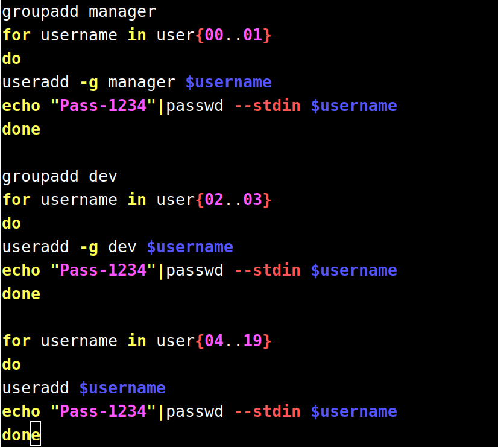
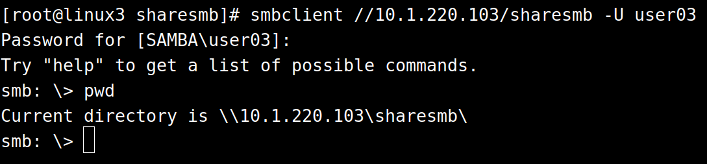
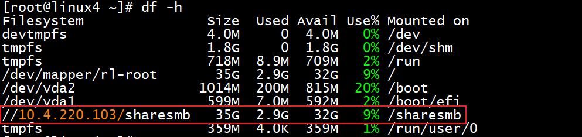

# 6、Samba服务 √

## **<font style="color:rgb(0,0,0);">题目：</font>**
<font style="color:rgb(0,0,0);">请采用 samba 服务，实现资源共享。 </font>

<font style="color:rgb(0,0,0);">1、在 linux3 上创建 user00-user19 等 20 个用户；user00 和 user01 添 </font>

<font style="color:rgb(0,0,0);">加到 manager 组，user02 和 user03 添加到 dev 组。把用户 user00- </font>

<font style="color:rgb(0,0,0);">user03 添加到 samba 用户。 </font>

<font style="color:rgb(0,0,0);">2、配置 linux3 为 samba 服务器,建立共享目录/srv/sharesmb，共享名 </font>

<font style="color:rgb(0,0,0);">与目录名相同。manager 组用户对 sharesmb 共享有读写权限，dev 组 </font>

<font style="color:rgb(0,0,0);">对 sharesmb 共享有只读权限；用户对自己新建的文件有完全权限， </font>

<font style="color:rgb(0,0,0);">对其他用户的文件只有读权限，且不能删除别人的文件。在本机用 </font>

<font style="color:rgb(0,0,0);">smbclient 命令测试。 </font>

<font style="color:rgb(0,0,0);">3、在 linux4 修改/etc/fstab,使用用户 user00 实现自动挂载 linux3 的 </font>

<font style="color:rgb(0,0,0);">sharesmb 共享到/sharesmb。</font>

## <font style="color:rgb(0,0,0);">配置步骤：</font>
## 1小题
一、安装smaba和samba-client

yum install samba samba-client.x86_64


二、创建3个shell脚本

touch 00-01.sh 02-03.sh 04-19.sh

```shell
groupadd manager                          #创建manager组
for username in user{00..01}              #循环创建用户
do
useradd -g manager $username              #将用户加入manager组
echo "Pass-1234"|passwd --stdin $username #写入用户密码
done
```

```shell
groupadd dev                          #创建manager组
for username in user{02..03}              #循环创建用户
do
useradd -g dev $username              #将用户加入manager组
echo "Pass-1234"|passwd --stdin $username #写入用户密码
done

```

```shell
for username in user{04..19}
do
useradd $username
echo "Pass-1234"|passwd --stdin $username
done
```

 或者写成一个脚本也行



三、添加samba用户

smbpasswd -a user00   #添加user00到samba数据库，设置密码：输入两次密码以确认  
smbpasswd -a user01  
smbpasswd -a user02  
smbpasswd -a user03

## 2小题
```plain
[sharesmb]                 #共享名
comment = smbgx            #共享描述
path = /srv/sharesmb       #共享路径
browseable = Yes           #是否可见
writable = Yes             #是否可写
write list = @manager      #可写的用户/组
read list = @dev,@manager  #可读的用户/组
valid users= @dev,@manager #可访问的用户/组
create mask = 0744         #文件权限
directory mask = 0744      #目录权限
```

mkidr /srv/sharesmb

chmod 777 /srv/sharesmb  

chmod o+t /srv/sharesmb/   #配置目录的sbit权限

登录测试：

systemc	enable smb.service --now

Windows：访问\\10.1.220.101

Linux：smbclient //10.1.220.101/sharesmb -U user03

写入测试：


## 3小题
```plain
//10.1.220.101/sharesmb /sharesmb               cifs    username=user00,password=Pass-1234 0 0 
```

重启后使用df -h查看挂载结果




> 更新: 2024-05-08 19:57:54  
> 原文: <https://www.yuque.com/gengmouren-1f9qn/whktvz/grgghfz725c3x3gt>