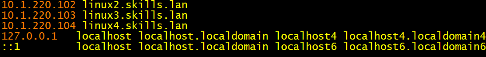
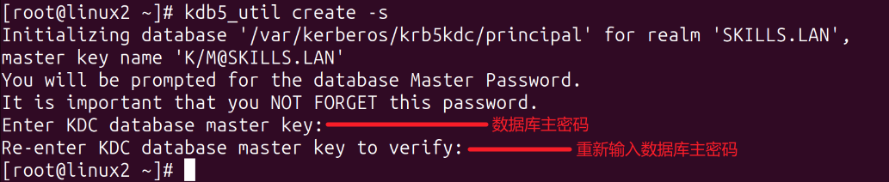
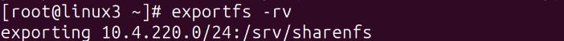
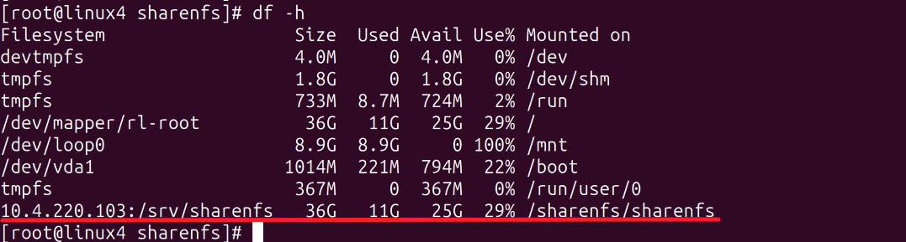

# 7、nfs服务 √

## **题目：**
请采用 nfs，实现共享资源的安全访问。 

1、配置 linux2 为 kdc 服务器，负责 linux3 和 linux4 的验证。 

2、在 linux3 上，创建用户，用户名为 xiao，uid=2222，gid=2222，家目录为/home/xiaodir。 

3、配置 linux3 为 nfs 服务器，目录/srv/sharenfs 的共享要求为：linux 

服务器所在网络用户有读写权限，所有用户映射为 xiao，kdc 加密方 

式为 krb5p。 

4、配置 linux4 为 nfs 客户端，利用 autofs 按需挂载 linux3 上的 

/srv/sharenfs 到/sharenfs 目录，挂载成功后在该目录创建 test 目 

录。

## 配置步骤：
## 1小题
1、所有主机修改hosts

vi /etc/hosts

2、软件安装

yum install krb5*   #Linux2 kdc服务器执行

yum install krb5-workstation*  #linux3 和 linux4 执行

3、定义Kerberos领域名以及它们与DNS域名之间的映射关系，Kerberos是nfs服务里用于认证的协议

vi /etc/krb5.conf

修改以下位置

[libdefaults] #这段定义全局默认参数

    default_realm = SKILLS.LAN  #默认的Kerberos领域名

[realms] #定义具体的Kerberos 领域配置

SKILLS.LAN = {

     kdc = linux2.skills.lan  #指定 KDC 的地址或域名

     admin_server = linux2.skills.lan  #指定管理员服务器的地址或域名

 }

[domain_realm] #定义域名到领域的映射

.skills.lan = SKILLS.LAN #.skills.lan 域名映射到 SKILLS.LAN 领域

skills.lan = SKILLS.LAN #将 skills.lan 域名映射到 SKILLS.LAN 领域

4、授权admin@SKILLS.LAN主体的用户对所有kadmin服务的所有操作的访问权限

vi /var/kerberos/krb5kdc/kadm5.acl

*代表所有服务

5、初始化kdc数据库

kdb5_util create -s 

systemctl start krb5kdc.service kadmin.service --now  启动并开机自启

scp /etc/krb5.conf root@10.4.220.103:/etc/krb5.conf

scp /etc/krb5.conf root@10.4.220.104:/etc/krb5.conf

6、创建主体、key    #kdc服务器执行

kadmin.local #进入到kadmin.local的模式

addprinc root/admin #创建主体

addprinc -randkey "nfs/linux2.skills.lan" #创建节点的key

addprinc -randkey "nfs/linux3.skills.lan" #创建节点的key

addprinc -randkey "nfs/linux4.skills.lan" #创建节点的key

kadmin.local:  listprincs #查看已创建成功的key

ktadd nfs/linux2.skills.lan #下载主服务器的key

7、客户端下载节点key

linux3执行

kadmin 登录数据库 登不了需要放行88/tcp/udp端口

ktadd nfs/linux3.skills.lan  下载节点秘钥

linux4执行

kadmin 

ktadd nfs/linux4.skills.lan

## 2小题
linux3执行

groupadd -g 2222 xiao

useradd -u 2222 -g xiao -d /home/xiaodir xiao

## 3小题
linux3执行

1、yum install nfs-utils 安装nfs

2、mkdir /srv/sharenfs  创建共享目录

3、vi /etc/exports

exportfs -rv #加载配置，使其生效

5、systemctl restart rpcbind.service 重启rpc服务

systemctl restart nfs-server.service 重启nfs服务

6、showmount -e 10.4.220.103 查看挂载情况

## 4小题
linux4执行

 1、yum install autofs nfs-utils

2、vi /etc/auto.master  #auto主配置文件

3、vi /etc/auto.mis

注意：linux3上需要给sharenfs权限，不然挂载的用户没办法创建文件

4、systemctl restart nfs-utils.service autofs.service

5、cd /sharenfs  切换到共享目录

6、cd sharenfs  触发挂载动作

7、df -h 查看挂载情况

> 更新: 2024-04-24 20:30:38  
> 原文: <https://www.yuque.com/gengmouren-1f9qn/whktvz/lgunni6fgnmnctah>