# 8、kubernetes服务-arm √

## **<font style="color:rgb(0,0,0);">题目：</font>**
<font style="color:rgb(0,0,0);">请采用 kubernetes 和 containerd，管理容器。 </font>

<font style="color:rgb(0,0,0);">1、在 linux5-linux7 上安装 containerd 和 kubernetes，linux5 作为master node ， linux6 和 linux7 作 为 work node ； 使 用 containerd.sock 作 为 容 器 runtime-endpoint 。 pod 网 络 为10.244.0.0/16，services 网络为 10.96.0.0/16。 </font>

**<font style="color:rgb(0,0,0);">2、</font>**<font style="color:rgb(0,0,0);">master 节点配置 calico 作为网络组件。 </font>

<font style="color:rgb(0,0,0);">3、导入 nginx.tar 镜像，主页内容为“HelloKubernetes”。用该镜像创 </font>

<font style="color:rgb(0,0,0);">建一个名称为 web 的 deployment（部署），副本数为 2；为该 deployment 创 </font>

<font style="color:rgb(0,0,0);">建一个类型为 nodeport 的 service，port 为 80，targetPort 为 80， </font>

<font style="color:rgb(0,0,0);">nodePort 为 30000。</font>

<font style="color:rgb(0,0,0);"></font>

## <font style="color:rgb(0,0,0);">配置步骤：</font>
## 准备工作--所有节点 
<details class="lake-collapse"><summary id="u4ceb2ad6"><span class="ne-text" style="color: #000000; font-size: 16px">1、禁用交换分区，保证kubelet正常工作</span><span class="ne-text" style="color: #000000; font-size: 14px">    </span></summary><p id="u73ca64a8" class="ne-p" style="text-align: left"><span class="ne-text" style="color: #000000; font-size: 16px">vi /etc/fstab #修改fstab文件，注释掉交换分区 </span></p><p id="u1a474ff9" class="ne-p" style="text-align: left"><span class="ne-text" style="color: #000000; font-size: 16px">echo &quot;vm.swappiness = 0&quot; &gt;&gt; /etc/sysctl.conf #使其永久不分配</span></p><p id="u81067994" class="ne-p" style="text-align: left"><span class="ne-text" style="color: #000000; font-size: 16px">swapoff -a #临时关闭</span></p></details>
<details class="lake-collapse"><summary id="u0beb274d"><span class="ne-text" style="color: #000000; font-size: 16px">2、关闭防火墙或放行服务</span><span class="ne-text" style="color: #000000; font-size: 14px">    </span></summary><p id="ue100ca05" class="ne-p" style="text-align: left"><span class="ne-text" style="color: #000000; font-size: 16px">systemctl stop firewalld #关闭防火墙</span></p><p id="u3db66279" class="ne-p" style="text-align: left"><span class="ne-text" style="color: #000000; font-size: 16px">systemctl disable firewalld #开机不自启</span></p><p id="u8780e428" class="ne-p" style="text-align: left"><span class="ne-text" style="color: #000000; font-size: 16px">除了关闭外，也可以放行相应服务</span></p><p id="u212670cc" class="ne-p" style="text-align: left"><span class="ne-text" style="color: #000000; font-size: 14px">firewall-cmd --permanent --add-service=kadmin</span></p></details>
<details class="lake-collapse"><summary id="ue83b5f76"><span class="ne-text" style="color: #000000; font-size: 16px">3、关闭 selinux </span><span class="ne-text" style="color: #000000; font-size: 14px">    </span></summary><p id="u84a6cf99" class="ne-p" style="text-align: left"><span class="ne-text" style="color: #000000; font-size: 16px">vi /etc/selinux/config #将enabled改为disabled</span></p><p id="uef9fe406" class="ne-p" style="text-align: left"><span class="ne-text" style="color: #000000; font-size: 16px">setenforce 0 #临时关闭</span></p></details>
<details class="lake-collapse"><summary id="u5806bf15"><span class="ne-text" style="color: #000000; font-size: 16px">4、修改 hosts 文件（可不做）</span></summary><p id="u198a13a1" class="ne-p" style="text-align: left"><span class="ne-text" style="color: #000000; font-size: 16px">vi /etc/hosts #节点IP与域名做对应关系</span></p><p id="u022a72d8" class="ne-p" style="text-align: left"><span class="ne-text" style="color: #000000; font-size: 16px">linux5	10.4.220.105	linux5.skills.lan</span></p><p id="u56d1ba9f" class="ne-p" style="text-align: left"><span class="ne-text" style="color: #000000; font-size: 16px">linux6	10.4.220.106	linux6.skills.lan</span></p><p id="u9b46d34d" class="ne-p" style="text-align: left"><span class="ne-text" style="color: #000000; font-size: 16px">linux7	10.4.220.107	linux7.skills.lan</span></p></details>
<details class="lake-collapse"><summary id="ud7796f7b"><span class="ne-text" style="color: #000000; font-size: 16px">5、确保 chrony 时间服务同步正常</span><span class="ne-text" style="color: #000000; font-size: 14px">    </span></summary><p id="u50be388b" class="ne-p" style="text-align: left"><span class="ne-text" style="color: #000000; font-size: 16px">vi /etc/chonryd.config #编辑chrony服务配置文件</span></p><p id="uc3026dac" class="ne-p" style="text-align: left"><span class="ne-text" style="color: #000000; font-size: 16px">systemctl restart chronyd #重启时间服务</span></p><p id="ub706df02" class="ne-p" style="text-align: left"><span class="ne-text" style="color: #000000; font-size: 16px">date #查看当前时间</span></p></details>
<font style="color:#000000;">6、证书和证书私钥发送至Linux5</font>

# <font style="color:#000000;">1小题</font>
## 第一步：安装kubernetes--所有节点
<font style="color:#000000;">1、解压并安装所有rpm包</font><font style="color:#000000;">    </font>

<font style="color:#000000;">tar -xf  kubernetes.tar</font>

<font style="color:#000000;">cd /kubernetes/packages</font>

<font style="color:#000000;">rpm -Uvh --force --nodeps *.rpm或者yum install *.rpm</font>

<font style="color:#000000;">使用yum可以把其他依赖包一并安装，前提是yum本地源要正常</font>

<font style="color:#000000;">source <(kubectl completion bash)  #配置kubernetes tab补全</font>

## 第二步：调整内核参数--所有节点
<details class="lake-collapse"><summary id="u8e818063"><span class="ne-text" style="color: #000000; font-size: 16px">写入内容1:</span><span class="ne-text" style="color: #000000; font-size: 14px">    </span><span class="ne-text" style="color: #000000; font-size: 16px">为Kubernetes提供所需的底层支持</span></summary><p id="aeda74e34c0616fed2b84dc4f85c5996" class="ne-p" style="text-align: left"><span class="ne-text" style="color: #000000; font-size: 16px">cat &lt;&lt;EOF | tee /etc/modules-load.d/k.conf</span></p><p id="u0d44a45d" class="ne-p" style="text-align: left"><span class="ne-text" style="color: #000000; font-size: 16px">overlay</span></p><p id="ua44c0eaf" class="ne-p" style="text-align: left"><span class="ne-text" style="color: #000000; font-size: 16px">br_netfilter</span></p><p id="uf002c2e8" class="ne-p" style="text-align: left"><span class="ne-text" style="color: #000000; font-size: 16px">EOF</span></p></details>
<font style="color:#000000;">modprobe overlay #加载模块</font>

<font style="color:#000000;">modprobe br_netfilter #加载模块</font>

<details class="lake-collapse"><summary id="u5491988f"><span class="ne-text" style="color: #000000; font-size: 16px">写入内容2：使网络可以正常处理和转发</span></summary><p id="c3fd125f1f7384eacb6500aa0bdef96d" class="ne-p" style="text-align: left"><span class="ne-text" style="color: #000000; font-size: 16px">cat &lt;&lt;EOF | tee /etc/sysctl.d/k.conf</span></p><p id="u37f43c05" class="ne-p" style="text-align: left"><span class="ne-text" style="color: #000000; font-size: 16px">net.bridge.bridge-nf-call-iptables = 1</span></p><p id="u7d2a6eea" class="ne-p" style="text-align: left"><span class="ne-text" style="color: #000000; font-size: 16px">net.bridge.bridge-nf-call-ip6tables = 1</span></p><p id="uc0ee6498" class="ne-p" style="text-align: left"><span class="ne-text" style="color: #000000; font-size: 16px">net.ipv4.ip_forward = 1</span></p><p id="u5615c7ae" class="ne-p" style="text-align: left"><span class="ne-text" style="color: #000000; font-size: 16px">EOF</span></p></details>
<font style="color:#000000;">sysctl -p --system #重载内核参数</font>

## 第三步：Kubelet驱动配置--所有节点
<details class="lake-collapse"><summary id="u2ee3f640"><span class="ne-text" style="color: #000000; font-size: 16px">vi /etc/sysconfig/kubelet</span></summary><p id="ud54b9d63" class="ne-p" style="text-align: left"><span class="ne-text" style="color: #000000; font-size: 16px">KUBELET_CGROUP_ARGS=&quot;--cgroup-driver=systemd&quot;  #</span><span class="ne-text" style="color: rgb(7, 19, 62); font-size: 16px">Kubelet使用systemd作为cgroup驱动</span></p></details>
<details class="lake-collapse"><summary id="u41801701"><span class="ne-text" style="color: rgb(7, 19, 62); font-size: 16px">注</span></summary><p id="u107b9546" class="ne-p"><span class="ne-text" style="color: rgb(7, 19, 62); font-size: 16px">配置Kubelet使用systemd作为cgroup驱动，可以确保在不同环境下的兼容性，例如x86和arm</span></p><p id="u44fdf118" class="ne-p"><span class="ne-text" style="color: rgb(7, 19, 62); font-size: 16px">在Kubernetes中，cgroup被用来管理Pod和容器的资源使用。</span></p></details>
<font style="color:#000000;">systemctl enable --now containerd.service kubelet.service #设为开机自启，并现在启动</font>

## 第四步：导入镜像--所有节点
cd 切换到镜像所在目录

<font style="color:#000000;">ctr -n k8s.io image import +  镜像名  --platform=linux/arm64   #单个导入镜像到指定的命名空间</font>

<font style="color:#000000;">for i in *;do ctr -n k8s.io i import $i --platform=linux/arm64 ;done #批量导入</font>

<font style="color:#000000;">ctr -n k8s.io i list -q  #列出命名空间为 "k8s.io" 的所有镜像ID，镜像位置与config.toml对应</font>

<details class="lake-collapse"><summary id="u6dd08d46"><span class="ne-text" style="color: #000000; font-size: 16px">注</span></summary><p id="u93d72307" class="ne-p" style="text-align: left"><span class="ne-text" style="color: #000000; font-size: 16px">kubeadm config images list #查看所需镜像列表    </span></p><p id="u92516282" class="ne-p" style="text-align: left"><span class="ne-text" style="color: #000000; font-size: 16px">ctr namespace ls 查看所有命名空间</span></p></details>
## 第五步：配置containerd--所有节点
<font style="color:#000000;">修改containerd配置文件</font><font style="color:#000000;">    </font>

<font style="color:#000000;">containerd config default | tee > /etc/containerd/config.toml #生成containerd配置文件</font>

```plain
修改1：[plugins."io.containerd.grpc.v1.cri"]
sandbox_image = "reqistry.aliyuncs.com/google_containers/pause:3.9"与要安装的pause版本对应

修改2：[plugins."io.containerd.grpc.v1.cri".containerd.runtimes.runc.options]
SystemdCgroup = true
```

<font style="color:#000000;"></font>

<font style="color:#000000;">配置containerd.sock 作为容器 runtime-endpoint</font>

<font style="color:#000000;">crictl config runtime-endpoint /run/containerd/containerd.sock</font>

<font style="color:#000000;"></font>

<font style="color:#000000;">systemctl restart containerd.service kubelet.service #重启contnainerd和kubelet</font>

## 第六步：初始化集群--主节点
<font style="color:#000000;">kubeadm config print init-defaults > kubA.yaml导出初始化配置信息</font>

```plain
advertiseAddress: 10.4.220.105 #主节点IP
imagePullPolicy: Never #本地拉取镜像
name: linux5 #主节点主机名/域名/IP
kubernetesVersion: 1.27.1 #指定kubernetes具体版本
serviceSubnet: 10.96.0.0/16
podSubnet: 10.244.0.0/16
```

<details class="lake-collapse"><summary id="u604023b5"><span class="ne-text" style="font-size: 16px">注</span></summary><p id="uc6281f7a" class="ne-p"><span class="ne-text" style="color: rgb(7, 19, 62); font-size: 14px">imagePullPolicy可以有三种选项</span></p><ol class="ne-ol"><li id="ue2c7ddc1" data-lake-index-type="0"><strong><span class="ne-text" style="color: rgb(7, 19, 62); font-size: 16px">Always</span></strong><span class="ne-text" style="color: rgb(7, 19, 62); font-size: 16px">：此策略表示每次Pod启动时，无论节点上是否已经存在指定版本的镜像，都会尝试从远程镜像仓库拉取最新的镜像。如果本地已经存在该镜像，也会重新拉取并覆盖本地的镜像。</span></li><li id="u440dc3a1" data-lake-index-type="0"><strong><span class="ne-text" style="color: rgb(7, 19, 62); font-size: 16px">IfNotPresent</span></strong><span class="ne-text" style="color: rgb(7, 19, 62); font-size: 16px">：这是</span><span class="ne-text" style="color: rgb(7, 19, 62); font-size: 14px">imagePullPolicy</span><span class="ne-text" style="color: rgb(7, 19, 62); font-size: 16px">的默认值。在此策略下，如果节点上不存在指定的镜像，则将从远程仓库拉取。如果节点上已经存在该镜像，则不会拉取新的镜像。</span></li><li id="uf2ad1497" data-lake-index-type="0"><strong><span class="ne-text" style="color: rgb(7, 19, 62); font-size: 16px">Never</span></strong><span class="ne-text" style="color: rgb(7, 19, 62); font-size: 16px">：此策略意味着Pod将永远不会从远程镜像仓库拉取镜像，只会使用节点上已经存在的镜像。如果节点上不存在指定的镜像，则容器无法启动。</span></li></ol></details>
<font style="color:#000000;">kubeadm init --config=kubA.yaml #选择该文件进行初始化集群</font>

<details class="lake-collapse"><summary id="ue32064c0"><span class="ne-text" style="color: #000000; font-size: 16px">初始化完成后手动复制执行以下内容</span></summary><p id="23edf1c0242ef70cfd2fb6cf159b6952" class="ne-p" style="text-align: left"><span class="ne-text" style="color: #000000; font-size: 16px">mkdir -p $HOME/.kube</span></p><p id="u5da2ae60" class="ne-p" style="text-align: left"><span class="ne-text" style="color: #000000; font-size: 16px">sudo cp -i /etc/kubernetes/admin.conf $HOME/.kube/config</span></p><p id="u58a2f3e4" class="ne-p" style="text-align: left"><span class="ne-text" style="color: #000000; font-size: 16px">sudo chown $(id -u):$(id -g) $HOME/.kube/config</span></p></details>
## 第六步：加入集群--工作节点
<font style="color:#000000;">1、主节点初始化完成后会生成类似下方的指令，把该内容</font><font style="color:#DF2A3F;">复制到工作节点</font><font style="color:#000000;">执行，即可加入集群</font>

<font style="color:#000000;">kubeadm join 10.4.220.105:6443 --token abcdef.0123456789abcdef \</font>

<font style="color:#000000;">> --discovery-token-ca-cert-hash sha256:8d987951412a23a94c7a131c99d39d0b0dd2596d7c80850033da30ad3874f367</font>

<font style="color:#000000;"></font>

<font style="color:#000000;">kubectl get nodes #在主节点执行，可以查看加入情况</font>

<font style="color:#000000;">kubectl get pods --all-namespaces #查看所有镜像运行情况</font>

# <font style="color:#000000;">2小题</font>
## 第一步：创建calico网络--主节点
<font style="color:#000000;">cat kubA.yaml</font>

<font style="color:#000000;">找到podSubnet: 将网络信息复制</font>

<font style="color:#000000;"></font>

<font style="color:#000000;">cd /kubernetes/calico/</font>

<font style="color:#000000;">vi calico.yaml #在该文件下分别搜索 k8s,bgp和no effect</font>

<font style="color:#000000;">在k8s,bgp下添加两行，ensp1s0为网卡名称</font>

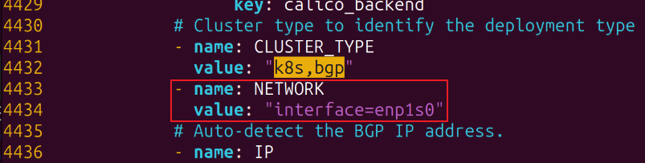

<font style="color:#000000;">在no effect下取消注释并进行以下修改，10.244.0.0为，kubA中的pods网络信息</font>

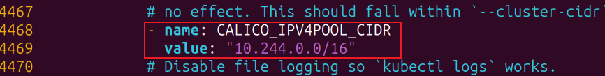

<details class="lake-collapse"><summary id="u4c4996d8"><span class="ne-text">注意！！！！</span></summary><p id="u23f936d6" class="ne-p" style="text-align: left"><span class="ne-text">23年国赛涉及的calico相关的镜像版本如下</span></p><p id="u1ceec757" class="ne-p"><span class="ne-text">cni-v3.25.0.tar</span></p><p id="u3fe37e73" class="ne-p"><span class="ne-text">kube-controllers-v3.25.0.tar</span></p><p id="u300fd71a" class="ne-p"><span class="ne-text">node-v3.25.0.tar</span></p><p id="ubaca7d27" class="ne-p"><span class="ne-text"></span></p><p id="u9488af39" class="ne-p"><span class="ne-text">若calico.yaml文件中的版本与以上不同，需要自己修改为3.25.0，arm架构的修改为3.25.0-arm</span></p></details>
<font style="color:#000000;">kubectl apply -f calico.yaml 创建网络组件脚本</font>

<font style="color:#000000;"> </font>

<font style="color:#000000;">for i in *;do ctr -n k8s.io i import $i --platform=linux/arm64 ;done #导入网络组件所需的镜像文件 </font>**<font style="color:#000000;">#所有节点</font>**

<font style="color:#000000;"></font>

<font style="color:#000000;">过一会儿后</font>

<font style="color:#000000;">kubectl get nodes #查看节点信息，可以看到所有节点就绪</font>

<font style="color:#000000;">kubectl get pods --all-namespaces #可以看到所有镜像已运行</font>

# 3小题兼1小题部分要求
## 第一步：导入nginx镜像--所有节点
ctr -n k8s.io image import nginx.tar

## 第二步：创建部署--主节点
1、kubectl create deployment web --image=nginx --replicas=2   #名称为web 映像为nginx 副本数为2

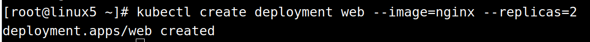2、kubectl edit deployment web #使用系统编辑器打开名为web的部署，

修改imagepullpolicy处，IfNotPresent的作用是指定优先使用本机缓存的镜像，如果本地没有在从仓库拉取

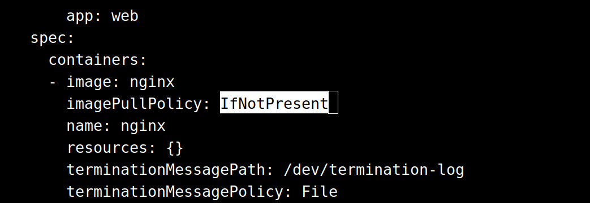3、kubectl get pod #查看pod信息

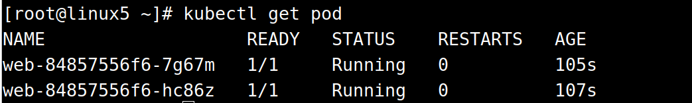

## 第三步：映射端口--主节点
vim /etc/kubernetes/manifests/kube-apiserver.yaml

添加：- --service-node-port-range=1-65535

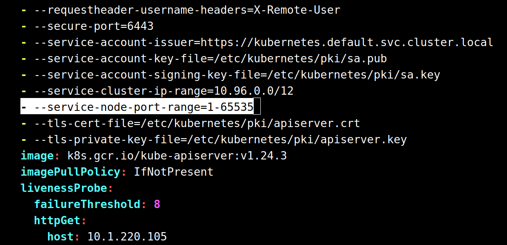systemctl restart kubelet.service #重启kubelet.service


<font style="color:#DF2A3F;">kubectl expose deployment web --port=80 --target-port=80 --type=NodePort </font>

<font style="color:#DF2A3F;"></font>

<font style="color:#DF2A3F;">kubectl edit svc web #编辑副本web的配置文件</font>

#修改以下字段

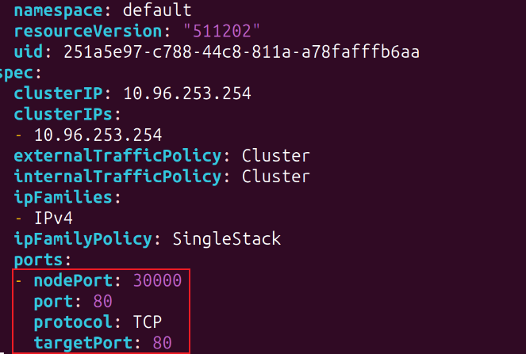

kubectl get svc #查看服务

kubectl get pod -o wide #<font style="color:rgb(77, 77, 77);">查看服务器pod详情，在哪个节点运行</font>

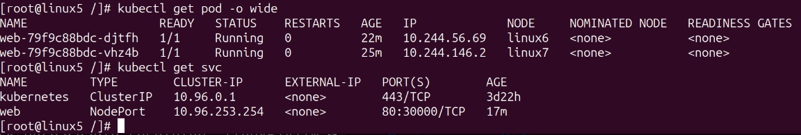

## 第四步：使用kubectl配置nginx--主节点
<font style="color:#d22d8d;">kubectl exec -it </font>web-79f9c88bdc-djtfh<font style="color:#d22d8d;"> bash #进入Linux6节点</font>

echo "HelloKubernetes" > /usr/share/nginx/html/index.html

nginx -s reload #重启nginx

curl localhost #测试访问情况

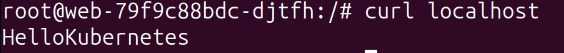


<font style="color:#d22d8d;">kubectl exec -it </font>web-79f9c88bdc-vhz4b<font style="color:#d22d8d;"> bash #进入Linux7节点</font>

echo "HelloKubernetes" > /usr/share/nginx/html/index.html

nginx -s reload #重启nginx

curl localhost #测试访问情况

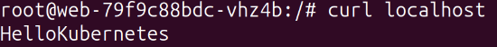

## 第五步：测试--主节点
两个节点访问都没问题后，使用主节点测试访问情况

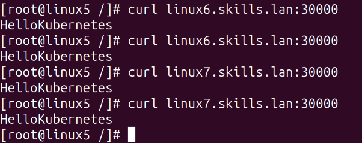


> 更新: 2024-04-23 08:27:10  
> 原文: <https://www.yuque.com/gengmouren-1f9qn/whktvz/nth83gtz2u7gh3ch>